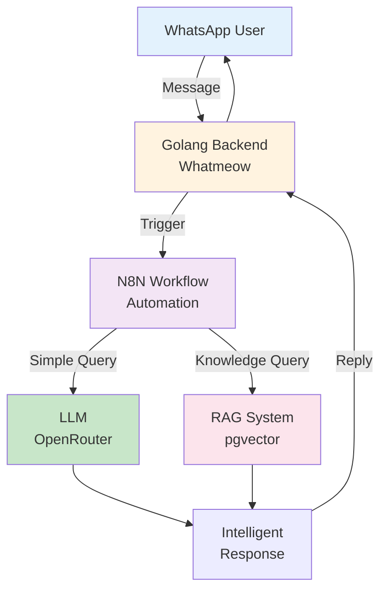

# Opening: AI → GenAI → Practical Impact
## BRIN GenAI Workshop - Phase 1.1

**Duration**: 10 minutes
**Format**: 5 min presentation + 5 min live demo

---

## 🎯 Objective

Set context and motivate learning about Generative AI in customer service automation

---

## 📊 Slide 1: Title Slide

**BRIN GenAI Workshop**
AI-Powered Customer Service Automation

Building Intelligent WhatsApp Bots with N8N, RAG, and LLM

**Target Audience**: Mid-Level Developers
**Duration**: 2.5 hours
**Focus**: Hands-on Implementation

---

## 📊 Slide 2: Traditional AI vs Generative AI

### Traditional AI Chatbots
- ❌ Rule-based responses
- ❌ Limited flexibility
- ❌ High maintenance cost
- ❌ Cannot handle unexpected queries
- ❌ Requires manual updates for new scenarios

### Generative AI Chatbots
- ✅ Natural language understanding
- ✅ Context-aware responses
- ✅ Learns from interactions
- ✅ Handles varied questions
- ✅ Adapts to new situations

---

## 📊 Slide 3: The GenAI Paradigm Shift

**From "Retrieve" to "Generate"**

**Traditional Approach**: Find matching pre-written answer
```
User Query → Database Lookup → Return Stored Response
```

**GenAI Approach**: Generate contextual answer
```
User Query → Understand Context → Generate Custom Response
```

**Key Difference**:
- Traditional: 100 questions = 100 pre-written answers
- GenAI: 100 questions = ∞ unique, contextual answers

---

## 📊 Slide 4: Real-World Impact

**Industry Benchmarks**

📉 **70% Reduction** in support tickets
⏱️ **24/7 Availability** without human intervention
💰 **60% Cost Savings** on customer service operations
📈 **85% Customer Satisfaction** with AI responses
⚡ **Instant Response Time** (vs 2-24 hour wait)

**Case Study**: Major e-commerce company
- Before: 10,000 tickets/day, 50 agents
- After: 3,000 tickets/day, 15 agents
- AI handles: FAQ, order tracking, basic troubleshooting
- Humans handle: Complex complaints, escalations

---

## 📊 Slide 5: What is Automation Workflow?

**Definition**: A series of automated tasks that execute in sequence or parallel to complete a business process

**Why Workflow Automation?**

✅ **Eliminate Repetitive Tasks**
- Automate data transfer between systems
- Reduce manual copy-paste errors

✅ **Connect Multiple Services**
- Integrate APIs without writing code
- Visual workflow design

✅ **Scale Operations**
- Handle thousands of requests automatically
- No human bottleneck

✅ **Faster Development**
- Build in hours, not weeks
- Easy to modify and test

**Example**: Customer Message → Analyze Sentiment → Route to Department → Send Response

---

## 📊 Slide 6: What We'll Build Today

**Complete AI-Powered Customer Service System**



**Key Components**:
1. **WhatsApp Integration** - Pre-built (Whatmeow)
2. **N8N Workflow** - Automation engine (Hands-on)
3. **Prompt Engineering** - LLM instructions (Theory)
4. **RAG System** - Knowledge retrieval (Hands-on)
5. **Integration** - Connect all parts (Hands-on)

---

## 📊 Slide 7: Workshop Flow

**Learning Journey (2.5 Hours)**

**Phase 1: Foundation** (30 min)
- ✅ AI → GenAI → Impact (You are here!)
- Architecture Overview
- Setup Verification

**Phase 2: Core Implementation** (90 min)
- Module 1: N8N + LLM Integration (30 min)
- Module 2: Prompt Engineering (25 min)
- Module 3: RAG Implementation (35 min)

**Phase 3: Integration** (30 min)
- End-to-End System Integration
- Live Demo
- Q&A and Next Steps

**Philosophy**: 65% Hands-on / 35% Theory

---

## 🎬 Live Demo Section (5 minutes)

**Demo: Working WhatsApp Bot**

**Scenario**: Customer Service Bot for Government Agency

**Demo Flow**:

1. **Simple FAQ**
   - User: "What are your operating hours?"
   - Bot: "Our service hours: Monday-Friday 08:00-17:00 WIB"

2. **Knowledge Base Query (RAG)**
   - User: "How do I submit a research proposal?"
   - Bot: [Retrieves from knowledge base using RAG]
   - Provides step-by-step guide with relevant links

3. **Complaint Handling**
   - User: "I have a complaint, the system has been down since yesterday"
   - Bot: [Detects complaint intent]
   - Provides empathetic response + troubleshooting steps
   - Logs complaint for human follow-up

**Key Observations**:
- Natural language understanding
- Context-aware responses
- Knowledge retrieval (RAG)
- Intent detection and routing

---

## 📊 Slide 8: Key Takeaways

**Why GenAI Matters for Customer Service**

✅ **Scalability**: Handle unlimited queries simultaneously
✅ **Consistency**: Same quality response every time
✅ **Cost-Effective**: Reduce operational costs by 60%+
✅ **Intelligence**: Understand context, not just keywords
✅ **Adaptability**: Learn and improve over time

**You Will Learn Today**:
- How to integrate LLMs into real applications
- Best practices for prompt engineering
- Implementing RAG for knowledge retrieval
- Production-ready architecture patterns
- Hands-on N8N workflow automation

---

## 📊 Slide 9: Transition to Next Section

**Up Next: Architecture Overview**

Now that you understand the "why" and "what"...

**Next 20 minutes**:
- Deep dive into system architecture
- Component breakdown
- Technology stack rationale
- Docker setup verification

**Get Ready**:
- Make sure Docker is running on your laptop
- Have the repository cloned
- Check your OpenRouter API key

---

## 🎓 Instructor Notes

**Timing Guidelines**:
- Slides 1-3: 2 minutes (quick intro, set context)
- Slide 4: 1 minute (impact with real numbers)
- Slide 5: 1 minute (explain automation workflow concept)
- Slides 6-7: 1 minute (overview of system and workshop flow)
- Live Demo: 5 minutes (MOST IMPORTANT - show real working system)

**Demo Tips**:
- Test demo environment before workshop starts
- Have backup video recording ready
- Use clear, simple test scenarios in Bahasa Indonesia
- Encourage participants to observe bot behavior patterns
- Show N8N workflow execution in real-time

**Engagement Tips**:
- Ask: "Who has used chatbots that frustrated them?" (ice breaker)
- Quick poll: "How many have integrated AI into applications?"
- Emphasize: Practical, not theoretical focus
- Highlight: N8N makes automation accessible to developers

**Key Message to Emphasize**:
GenAI + Workflow Automation = Powerful combination that's easier than you think. By the end of today, you'll build one yourself.

**Common Questions to Prepare For**:
- Q: "Do we need to know machine learning?"
  - A: No, we're using pre-trained models via APIs
- Q: "Can this work with other messaging platforms?"
  - A: Yes, architecture is platform-agnostic
- Q: "What's the cost of running this in production?"
  - A: We'll discuss cost optimization in Module 2
- Q: "Why N8N instead of coding everything?"
  - A: Faster development, visual debugging, easier to modify