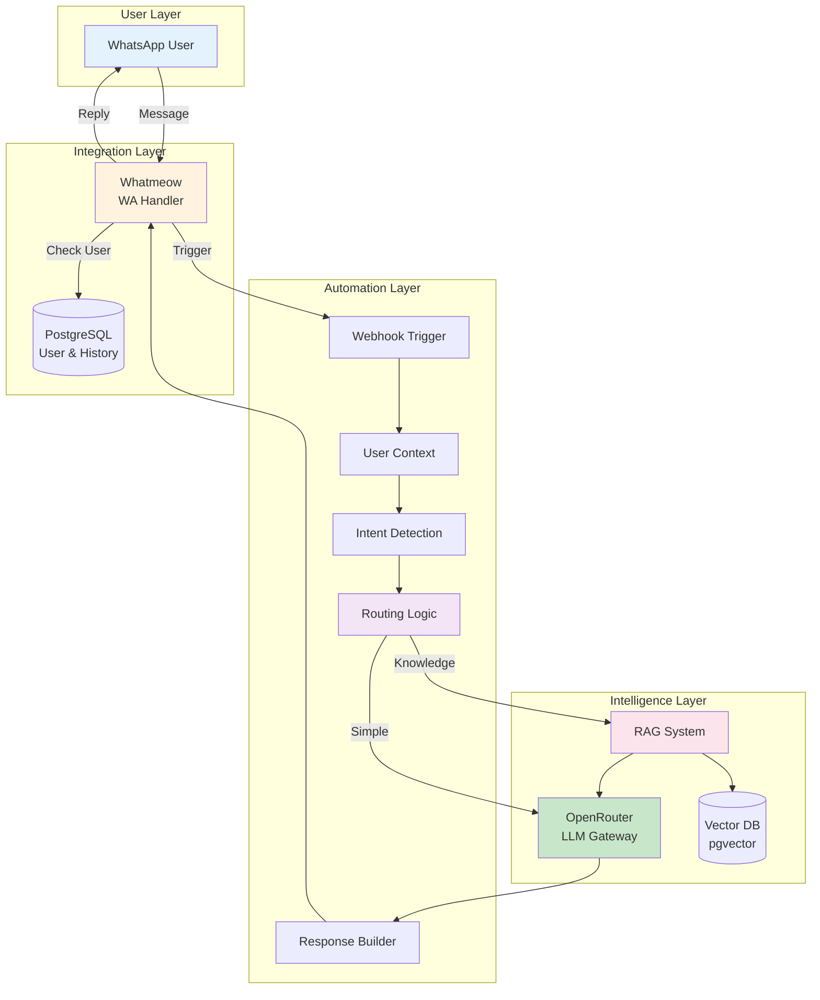
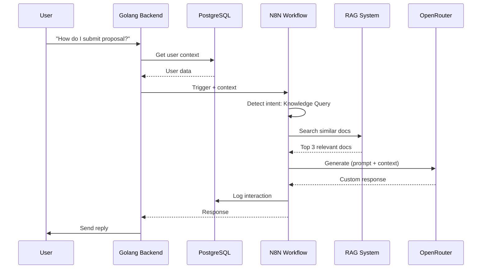
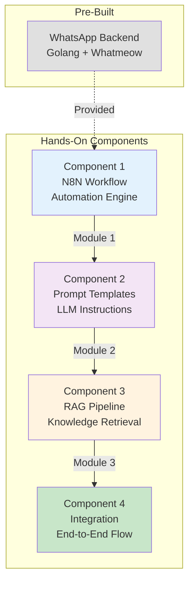
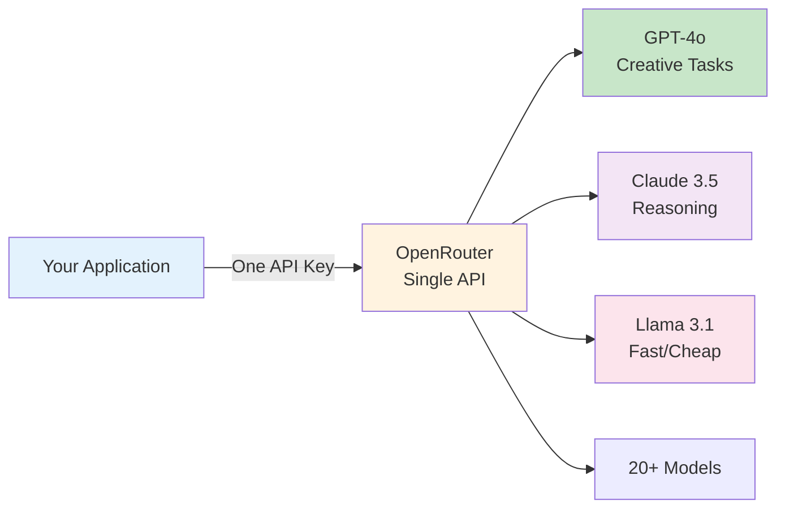
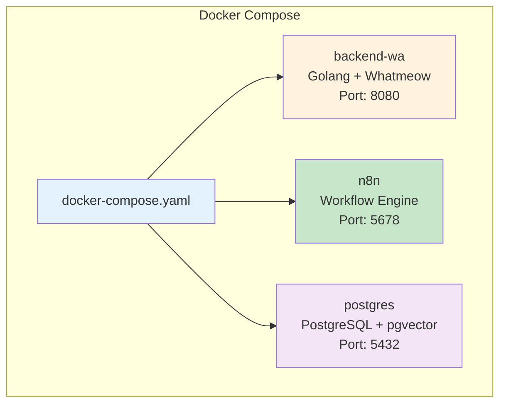

# Architecture Overview
## BRIN GenAI Workshop - Phase 1.2

**Duration**: 20 minutes
**Format**: 10 min explanation + 5 min Q&A + 5 min setup check

---

## 🎯 Objective

Understand system components, integration points, and technology stack rationale

---

## 📊 Slide 1: System Architecture Overview

**Complete System - 3 Layers**



---

## 📊 Slide 2: Data Flow Sequence

**Example: User Query with RAG**



**Key Points**:
- User context enrichment
- Intent-based routing
- RAG for knowledge retrieval
- LLM for generation
- Database logging

---

## 📊 Slide 3: Component Breakdown

**What We'll Build Today**



**Focus Areas**:
1. ✅ N8N Workflow (Module 1) - Understand pre-built template
2. ✅ Prompt Engineering (Module 2) - Theory and best practices
3. ✅ RAG Implementation (Module 3) - Use pre-built LangChain workflow
4. ✅ Integration (Phase 3) - Connect all components

---

## 📊 Slide 4: Technology Stack

**Why These Technologies?**

| Component | Technology | Reason |
|-----------|-----------|---------|
| **Messaging** | Whatmeow | Open-source, reliable WhatsApp API |
| **Workflow** | N8N | Visual automation, easy debugging |
| **Database** | PostgreSQL + pgvector | Unified DB for data + vectors |
| **LLM Gateway** | OpenRouter | Multi-model access, cost optimization |
| **Embeddings** | OpenAI | High-quality vector representations |
| **Container** | Docker | Consistent environment, easy deployment |

**All Components Run Locally** - No cloud dependencies (except LLM APIs)

---

## 📊 Slide 5: Why N8N over Custom Code?

**Decision Rationale**

### ✅ Benefits of N8N
- **Visual Workflow**: See data flow in real-time
- **Rapid Development**: Build in hours vs days
- **Easy Debugging**: Step through execution logs
- **No Code Changes**: Modify workflows without deployment
- **Production Ready**: Used by thousands of companies
- **LangChain Integration**: Built-in RAG nodes

### ⚠️ Trade-offs
- Additional infrastructure dependency
- Less control over low-level implementation

### 💡 When to Use Custom Code Instead
- Need millisecond-level performance
- Complex custom logic
- Already have existing codebase

**For this workshop**: N8N is perfect for learning and prototyping

---

## 📊 Slide 6: Why OpenRouter?

**Multi-Model LLM Gateway**



**Advantages**:
- ✅ Single API for multiple models
- ✅ Automatic fallback if one provider down
- ✅ Cost optimization (route to cheapest model)
- ✅ Easy A/B testing between models
- ✅ No vendor lock-in

---

## 📊 Slide 7: Why RAG with pgvector?

**PostgreSQL + pgvector vs Dedicated Vector DB**

### ✅ Why pgvector?
- **Unified Database**: User data + vectors in same DB
- **Simplified Architecture**: One less service to manage
- **Zero Additional Cost**: No separate subscription
- **Familiar Technology**: BRIN team knows PostgreSQL
- **Docker Ready**: Single container with pgvector

### 🔍 When to Use Dedicated Vector DB (Pinecone/Weaviate)?
- Millions of vectors (100M+)
- Sub-10ms query requirements
- Complex vector operations

**For CS automation**: pgvector is perfect (< 100K vectors)

---

## 📊 Slide 8: Docker-Based Development

**One-Command Setup Philosophy**

```bash
# Clone repository
git clone <repo-url>
cd workshop-brin

# Start entire stack
docker-compose up -d

# Verify services
docker-compose ps
```

**All Services in Containers**:


**Benefits**:
- ✅ Zero OS dependencies (only Docker)
- ✅ Identical environment across Windows/Mac/Linux
- ✅ Easy teardown: `docker-compose down`
- ✅ Take home and continue learning

---

## 📊 Slide 9: Project Structure

**Repository Organization**

```
workshop-brin/
├── backend/              # Golang WhatsApp service (pre-built)
│   ├── main.go
│   ├── handlers/
│   └── Dockerfile
├── docs/                 # Documentation
│   └── setup-guide.md
├── n8n-workflows/       # Importable N8N workflows
│   ├── 01-basic-llm.json
│   ├── 02-rag-ingestion.json
│   └── 03-rag-query.json
├── scripts/             # Database initialization
│   ├── init-db.sql
│   ├── setup-pgvector.sql
│   └── seed-data.sql
├── knowledge-base/      # Sample documents
│   ├── sample-faqs.txt
│   └── policies.txt
├── docker-compose.yaml  # Complete stack
└── .env.example        # Environment variables
```

**Everything Pre-Configured** - Just import and run!

---

## 📊 Slide 10: Workshop Timeline Recap

**What Happens Next (90 minutes)**

```mermaid
gantt
    title Workshop Phase 2 & 3
    dateFormat mm
    axisFormat %M min

    section Module 1
    N8N + LLM (Template)    :00, 30m

    section Module 2
    Prompt Engineering (Theory)   :30, 25m

    section Module 3
    RAG Implementation (Template)  :55, 35m

    section Phase 3
    Integration & Demo             :90, 30m
```



**Approach**:
- Module 1: Import pre-built N8N workflow, understand concepts
- Module 2: Learn prompt engineering (no hands-on, theory + examples)
- Module 3: Import RAG workflow with LangChain, test with queries
- Phase 3: Connect all components, test end-to-end

---

## 📊 Slide 11: Q&A

**Common Questions**

**Q**: Do I need to know machine learning?
**A**: No! We use pre-trained models via APIs

**Q**: Can this work with Telegram/Slack?
**A**: Yes, architecture is platform-agnostic. Change Whatmeow to other integrations.

**Q**: What about costs in production?
**A**: We'll cover cost optimization in Module 2 (model selection)

**Q**: Is this production-ready?
**A**: Yes! N8N + OpenRouter + pgvector is used in production by many companies

**Q**: Can I use local LLMs instead of OpenRouter?
**A**: Yes! Ollama integration is possible (not covered today)

---

## 📊 Slide 12: Pre-Workshop Setup Check

**Verify Your Environment** (5 minutes)

### ✅ Checklist:

1. **Docker Running**
   ```bash
   docker ps  # Should return without error
   ```

2. **Repository Cloned**
   ```bash
   cd workshop-brin
   ls  # Should see docker-compose.yaml
   ```

3. **Environment Variables**
   ```bash
   cp .env.example .env
   # Add your OpenRouter API key
   ```

4. **Start Services**
   ```bash
   docker-compose up -d
   docker-compose ps  # All services should be "Up"
   ```

5. **Verify N8N**
   - Open browser: `http://localhost:5678`
   - Should see N8N login screen

**Teaching Assistants**: Please help participants who encounter issues!

---

## 📊 Slide 13: Transition to Module 1

**Up Next: N8N Workflow + LLM Integration**

**What You'll Do** (30 minutes):
- Import pre-built N8N workflow
- Understand webhook triggers
- Learn OpenRouter API integration
- Observe workflow execution
- See LLM request/response patterns

**Get Ready**:
- Open N8N: `http://localhost:5678`
- Have your OpenRouter API key ready
- Follow along with instructor

**Let's Build!** 🚀

---

## 🎓 Instructor Notes

**Timing Guidelines**:
- Slides 1-3: 5 minutes (architecture overview)
- Slides 4-7: 5 minutes (technology decisions)
- Slides 8-10: 3 minutes (Docker setup and project structure)
- Slide 11: 5 minutes (Q&A - be flexible)
- Slides 12-13: 2 minutes (setup verification and transition)

**Key Points to Emphasize**:
1. **Architecture is modular** - each component can be swapped
2. **N8N makes automation accessible** - visual debugging is powerful
3. **Docker ensures consistency** - no "works on my machine" problems
4. **OpenRouter provides flexibility** - switch models easily
5. **pgvector is practical** - no need for complex vector DB setup

**Demo During Q&A**:
- Show N8N interface briefly
- Show docker-compose.yaml
- Show how to check Docker logs

**Watch For**:
- Participants struggling with Docker setup
- Missing .env file configuration
- Firewall blocking localhost ports
- Teaching assistants should help during setup check

**Transition Smoothly**:
- "Now that you understand the architecture, let's build it!"
- "Module 1 starts with N8N - the brain of our automation"
- Ensure all participants have N8N running before proceeding