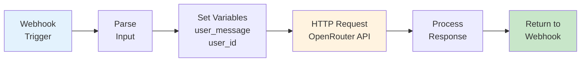

# Module 1: N8N Workflow + LLM Integration
## BRIN GenAI Workshop - Phase 2.1

**Duration**: 30 minutes
**Format**: 5 min setup + 15 min concept explanation + 10 min testing & demo

---

## 🎯 Learning Outcomes

- Understand N8N workflow components
- Learn OpenRouter API integration patterns
- Comprehend webhook triggers and data flow
- Understand LLM request/response patterns

---

## 📊 Slide 1: Module Overview

**What We'll Cover**

✅ Import pre-built N8N workflow
✅ Understand workflow architecture
✅ Learn each node's purpose
✅ Observe LLM API integration
✅ Test with real requests

**Approach**: Template-based learning
- Instructor provides complete workflow
- We explain each component
- You observe and test

**No coding required** - Focus on understanding!

---

## 📊 Slide 2: N8N Workflow Architecture

**Complete Workflow Flow**



**6 Key Nodes**:
1. Webhook Trigger
2. Parse Input
3. Set Variables
4. HTTP Request (LLM)
5. Process Response
6. Return Response

---

## 📊 Slide 3: Node 1 - Webhook Trigger

**Entry Point for External Requests**

**Purpose**: Receive HTTP POST requests from external services

**Key Concepts**:
- Generates unique webhook URL automatically
- Receives JSON payload from WhatsApp backend
- Triggers workflow execution

**Example Webhook URL**:
```
http://localhost:5678/webhook/chat-handler
```

**Incoming Payload**:
```json
{
  "user_id": "628123456789",
  "message": "What are your operating hours?",
  "timestamp": "2025-11-30T10:30:00Z"
}
```

**N8N Advantage**: Auto-generates URL, handles authentication

---

## 📊 Slide 4: LLM API Integration

**HTTP Request to OpenRouter**

**Request Configuration**:
```json
{
  "method": "POST",
  "url": "https://openrouter.ai/api/v1/chat/completions",
  "headers": {
    "Authorization": "Bearer {{$env.OPENROUTER_API_KEY}}",
    "Content-Type": "application/json"
  },
  "body": {
    "model": "meta-llama/llama-3.1-8b-instruct",
    "messages": [
      {
        "role": "system",
        "content": "You are a helpful customer service agent"
      },
      {
        "role": "user",
        "content": "{{$node['Set Variables'].json['user_message']}}"
      }
    ],
    "temperature": 0.7,
    "max_tokens": 150
  }
}
```

**Key Parameters**:
- `model`: Which LLM to use
- `temperature`: 0.3-0.5 for consistent CS responses
- `max_tokens`: Response length limit

---

## 📊 Slide 5: Process Response

**Extract LLM Output**

**OpenRouter Response**:
```json
{
  "choices": [
    {
      "message": {
        "role": "assistant",
        "content": "Our operating hours are Monday-Friday, 8AM-5PM."
      }
    }
  ],
  "usage": {
    "total_tokens": 37
  }
}
```

**Extract Content**:
```javascript
{{$json.choices[0].message.content}}
```

**Return Formatted Response**:
```json
{
  "user_id": "628123456789",
  "response": "Our operating hours are Monday-Friday, 8AM-5PM.",
  "tokens_used": 37
}
```

---

## 📊 Slide 6: N8N Key Concepts

**Why N8N is Powerful**

✅ **Visual Debugging**
- See data at each step
- Click any node to inspect output
- Real-time execution logs

✅ **Expression System**
- Access previous node data: `{{$node['NodeName'].json['field']}}`
- Use environment variables: `{{$env.API_KEY}}`
- JavaScript expressions: `{{new Date().toISOString()}}`

✅ **No Deployment Needed**
- Modify workflow in UI
- Changes take effect immediately
- Version control with JSON export

---

## 📊 Slide 7: Testing the Workflow

**Live Demo - Instructor**

**Test with curl**:
```bash
curl -X POST http://localhost:5678/webhook/chat-handler \
  -H "Content-Type: application/json" \
  -d '{
    "user_id": "628123456789",
    "message": "What are your operating hours?"
  }'
```

**Observe in N8N**:
1. Open N8N UI → "Executions" tab
2. Click latest execution
3. See data flow through each node
4. Inspect input/output at each step

---

## 📊 Slide 8: Hands-On Activity (10 minutes)

**What Participants Will Do**

### Step 1: Import Workflow (2 min)
1. Open N8N: `http://localhost:5678`
2. Click "Workflows" → "Import"
3. Select: `n8n-workflows/01-basic-llm.json`

### Step 2: Configure API Key (1 min)
1. Open workflow
2. Click on "HTTP Request" node
3. Verify API key: `{{$env.OPENROUTER_API_KEY}}`

### Step 3: Activate Workflow (1 min)
1. Click "Active" toggle (top right)
2. Copy webhook URL

### Step 4: Test with Postman/curl (5 min)
1. Send POST request to webhook
2. Observe execution in N8N
3. Check response

### Step 5: Observe Data Flow (1 min)
- Click through each node
- See how data transforms

**Teaching Assistants**: Help participants!

---

## 📊 Slide 9: Key Takeaways

**What You Learned**

✅ **N8N Workflow Structure**
- Webhook triggers
- Data transformation nodes
- HTTP requests to external APIs

✅ **LLM API Integration**
- OpenRouter request format
- Authentication with Bearer token
- Parameter configuration

✅ **Visual Debugging**
- Real-time execution logs
- Node-by-node inspection
- Error tracing

**Next Module**: Prompt Engineering
- How to craft effective prompts
- Model selection strategies
- Parameter tuning for CS use cases

---

## 📊 Slide 10: Transition to Module 2

**Up Next: Prompt Engineering (25 minutes)**

**What We'll Cover**:
- Prompt structure framework
- Scenario walkthroughs
- Advanced techniques
- Common FAQ

**Format**: Theory + Examples (No hands-on)

**Take a 2-minute break** ☕

---

## 🎓 Instructor Notes

**Timing Breakdown**:
- Slides 1-3: 5 minutes (overview and webhook)
- Slides 4-5: 5 minutes (API integration and response)
- Slides 6-7: 3 minutes (N8N concepts)
- Slide 8: 5 minutes (live demo - CRITICAL)
- Slide 9: 10 minutes (hands-on activity)
- Slides 10-11: 2 minutes (wrap-up)

**Live Demo Tips**:
- Pre-test workflow before session
- Show execution in real-time
- Point out data transformations
- Zoom in for visibility

**Common Issues**:
1. Workflow import fails → Check JSON
2. API key not set → Verify .env
3. Webhook not responding → Check "Active"
4. Connection timeout → Check internet
5. N8N not accessible → Restart Docker

**Key Messages**:
- N8N makes complex workflows simple
- Visual debugging is powerful
- Production-ready tool