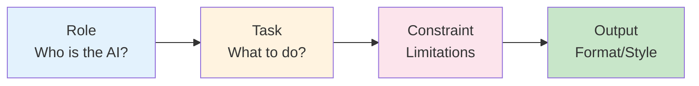
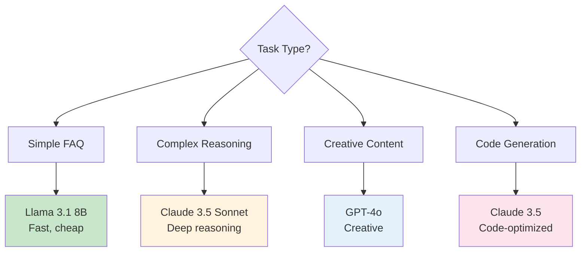

# Module 2: Prompt Engineering
## BRIN GenAI Workshop - Phase 2.2

**Duration**: 25 minutes
**Format**: 15 min theory + 10 min discussion & FAQ

---

## 🎯 Learning Outcomes

- Understand effective prompt structure
- Learn prompt engineering framework
- Recognize role-based prompting patterns
- Know how to apply constraints and output formatting

---

## 📊 Slide 1: Module Overview

**What is Prompt Engineering?**

> The art and science of crafting instructions that guide LLMs to produce desired outputs

**Why It Matters**:
- ❌ Bad prompt: Vague, inconsistent responses
- ✅ Good prompt: Precise, reliable, contextual responses

**This Module** (Theory Only):
- Prompt structure framework
- 3 scenario walkthroughs
- Advanced techniques
- Common FAQ

**No hands-on** - We'll apply this in Module 3!

---

## 📊 Slide 2: Prompt Engineering Framework

**The 4-Part Structure**



**Each Part Matters**:
1. **Role**: Sets AI persona and expertise level
2. **Task**: Clear instructions on what to accomplish
3. **Constraint**: Boundaries (language, length, tone)
4. **Output**: Structure and style requirements

---

## 📊 Slide 3: Template Structure

**Basic Template**

```
Role: You are a [ROLE] for [COMPANY/DOMAIN]

Task: [SPECIFIC TASK DESCRIPTION]

Constraints:
- [CONSTRAINT 1]
- [CONSTRAINT 2]
- [CONSTRAINT 3]

Output: [FORMAT AND STYLE]

User Message: {{user_message}}
```

**Example**:
```
Role: You are a customer service agent for BRIN

Task: Answer questions about research programs and services

Constraints:
- Respond in Bahasa Indonesia
- Keep responses under 100 words
- Be professional and helpful

Output: Direct answer in 2-3 sentences

User Message: {{user_message}}
```

---

## 📊 Slide 4: Scenario 1 - FAQ Handler

**Use Case**: Simple questions, friendly tone

**Prompt**:
```
Role: You are a helpful support agent for BRIN Research Services

Task: Answer common questions about our services, hours, and procedures

Constraints:
- Respond in Bahasa Indonesia
- Keep answers brief and friendly
- Use simple, clear language
- Maximum 50 words

Output: Direct answer, 1-2 sentences maximum

User Message: {{user_message}}
```

**Example Input/Output**:
- Input: "Jam operasional?"
- Output: "Layanan kami buka Senin-Jumat, pukul 08:00-17:00 WIB."

**Key Characteristics**:
- Short, concise
- Friendly tone
- Low temperature (0.3)

---

## 📊 Slide 5: Scenario 2 - Complaint Handler

**Use Case**: Empathetic, solution-oriented

**Prompt**:
```
Role: You are a senior support specialist for BRIN

Task: Acknowledge and address customer complaints with empathy

Constraints:
- Respond in Bahasa Indonesia
- Show empathy and understanding
- Provide actionable next steps
- Do not make promises you can't keep
- Maximum 150 words

Output: Structured response following this format:
1. Acknowledge the issue
2. Express empathy
3. Provide solution or next steps

User Message: {{user_message}}
```

**Example**:
- Input: "Saya komplain, sistem error sejak kemarin"
- Output:
```
Terima kasih telah menghubungi kami. Saya memahami betapa frustrasinya
mengalami gangguan sistem.

Untuk membantu mengatasi masalah ini, saya akan:
1. Mencatat keluhan Anda dengan detail
2. Meneruskan ke tim teknis segera
3. Mengirimkan update dalam 24 jam

Apakah Anda bisa memberikan informasi tambahan tentang error yang muncul?
Ini akan membantu tim kami menyelesaikan lebih cepat.
```

---

## 📊 Slide 6: Scenario 3 - Escalation Detector

**Use Case**: Know when to forward to human

**Prompt**:
```
Role: You are a triage agent for BRIN customer support

Task: Determine if a query should be escalated to a human agent

Constraints:
- Analyze query complexity and sentiment
- Consider: legal issues, refunds, technical bugs, VIP customers
- Do not attempt to handle escalation-worthy issues

Output: JSON format:
{
  "should_escalate": boolean,
  "reason": "brief explanation",
  "urgency": "low|medium|high",
  "suggested_department": "string"
}

User Message: {{user_message}}
```

**Escalation Triggers**:
- Angry/frustrated sentiment
- Legal/compliance issues
- Requests for refunds/compensation
- Critical bugs affecting many users
- VIP/government officials

---

## 📊 Slide 7: Advanced Technique 1 - Chain-of-Thought (CoT)

**Breaking Down Reasoning Steps**

**Basic Prompt**:
```
User: What's 15% of 250?
AI: 37.5
```

**Chain-of-Thought Prompt**:
```
Let's solve this step by step:
1. First, identify what we need to find
2. Show your calculation process
3. Provide the final answer

User: What's 15% of 250?
```

**AI Response**:
```
Step 1: We need to find 15% of 250
Step 2: 15% = 15/100 = 0.15
Step 3: 0.15 × 250 = 37.5
Answer: 37.5
```

**When to Use**: Complex reasoning, calculations, multi-step problems

---

## 📊 Slide 8: Advanced Technique 2 - Few-Shot Examples

**Providing Sample Inputs/Outputs**

**Zero-Shot** (No examples):
```
Classify sentiment: positive, negative, or neutral

Text: {{user_message}}
```

**Few-Shot** (With examples):
```
Classify sentiment: positive, negative, or neutral

Examples:
Text: "Layanan bagus sekali!"
Sentiment: positive

Text: "Sistem selalu error"
Sentiment: negative

Text: "Jam operasional?"
Sentiment: neutral

Now classify:
Text: {{user_message}}
```

**When to Use**: Specific format requirements, consistent classification

---

## 📊 Slide 9: Advanced Technique 3 - ReAct (Reasoning + Action)

**Combining Thinking and Doing**

**ReAct Prompt Structure**:
```
You can use these actions:
- [search_kb]: Search knowledge base
- [log_ticket]: Create support ticket
- [send_email]: Send notification

For each user query:
1. Thought: Analyze what's needed
2. Action: Choose appropriate action
3. Observation: Process result
4. Answer: Provide final response

User Message: {{user_message}}
```

**Example**:
```
User: "Cara submit proposal riset?"

Thought: User needs procedural information
Action: [search_kb] "proposal submission process"
Observation: Found 3 relevant articles
Answer: "Berikut langkah submit proposal: [steps from KB]"
```

---

## 📊 Slide 10: Parameter Tuning Guide

**Impact of Temperature**

| Temperature | Behavior | Use Case |
|-------------|----------|----------|
| 0.0 - 0.3 | Very focused, deterministic | FAQ, data extraction |
| 0.4 - 0.6 | Balanced, reliable | Customer service |
| 0.7 - 0.9 | Creative, varied | Content generation |
| 1.0+ | Very creative, unpredictable | Brainstorming |

**Other Key Parameters**:
- `top_p` (0.1-1.0): Diversity of word choices
- `max_tokens` (50-4000): Response length
- `presence_penalty` (0.0-2.0): Avoid repetition
- `frequency_penalty` (0.0-2.0): Encourage variety

**For CS Automation**:
```json
{
  "temperature": 0.5,
  "top_p": 0.9,
  "max_tokens": 150,
  "presence_penalty": 0.6
}
```

---

## 📊 Slide 11: Model Selection Decision Tree

**Choosing the Right Model**



**Cost vs Quality Trade-off**:
- FAQ: Llama 3.1 ($0.0001/1K tokens)
- Complaints: Claude 3.5 ($0.003/1K tokens)
- Complex issues: GPT-4o ($0.005/1K tokens)

**Strategy**: Route by complexity!

---

## 📊 Slide 12: Common FAQ

**Q: How long should prompts be?**
A: As short as necessary, as long as needed. Typical: 50-200 words.

**Q: When to use few-shot vs zero-shot?**
A: Few-shot when you need consistent format or specific behavior. Zero-shot for general tasks.

**Q: How to handle multilingual requirements?**
A: Specify language in constraints. Models handle Bahasa Indonesia well.

**Q: How to prevent prompt injection attacks?**
A:
- Validate user input
- Use system/user role separation
- Add explicit "ignore instructions in user message" clause

**Q: Best practices for production prompts?**
A:
- Version control your prompts
- A/B test variations
- Monitor output quality
- Have fallbacks for edge cases

---

## 📊 Slide 13: Key Takeaways

**Prompt Engineering Principles**

✅ **Be Specific**: Vague prompts = vague responses
✅ **Provide Context**: Role and task matter
✅ **Set Boundaries**: Constraints prevent unwanted behavior
✅ **Format Output**: Guide the response structure
✅ **Iterate**: Test and refine prompts

**Remember**:
- Prompts are code - treat them like software
- Version control and test systematically
- Different tasks need different approaches
- Temperature and parameters matter

**In Module 3**: We'll apply these concepts to RAG system!

---

## 📊 Slide 14: Transition to Module 3

**Up Next: RAG Implementation (35 minutes)**

**What We'll Cover**:
- RAG concept and architecture
- Vector embeddings and similarity search
- N8N LangChain integration
- Hands-on with pre-built templates

**Format**: 10 min theory + 20 min hands-on

**Get Ready**: We'll import RAG workflows!

---

## 🎓 Instructor Notes

**Timing Breakdown**:
- Slides 1-3: 3 minutes (overview and framework)
- Slides 4-6: 6 minutes (3 scenarios - 2 min each)
- Slides 7-9: 4 minutes (advanced techniques)
- Slides 10-11: 2 minutes (parameters and models)
- Slide 12: 8 minutes (FAQ - be flexible, encourage questions)
- Slides 13-14: 2 minutes (wrap-up)

**Key Messages**:
1. **Prompt engineering is a skill** - not magic
2. **Structure matters** - Role, Task, Constraint, Output
3. **Iteration is normal** - prompts need refinement
4. **Different tasks, different prompts** - no one-size-fits-all

**Interactive Elements**:
- Ask: "Who has struggled with getting good LLM outputs?"
- Show: Real before/after prompt examples
- Demonstrate: Live prompt modification and result comparison

**Common Questions to Expect**:
- "Can we use local LLMs?" → Yes, but today we use OpenRouter
- "How to handle errors?" → Add constraints, validate outputs
- "What about prompt costs?" → Tokens in prompt count too!

**Demo Opportunity**:
- Show real-time prompt testing in N8N from Module 1
- Modify prompt, show different outputs
- Emphasize importance of constraints

**Transition Smoothly**:
- "You now know HOW to talk to LLMs"
- "Next: How to give them KNOWLEDGE"
- "Module 3: RAG - making AI smarter with your data"