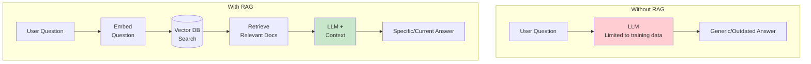
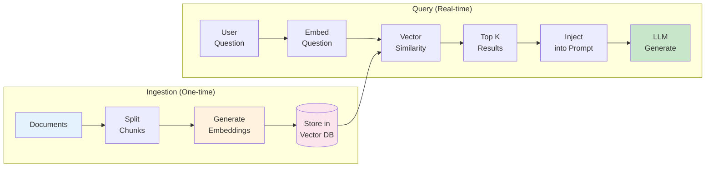
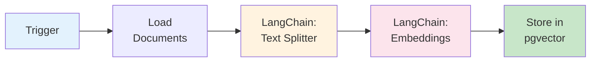
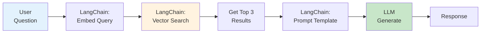

# Module 3: RAG Implementation
## BRIN GenAI Workshop - Phase 2.3

**Duration**: 35 minutes
**Format**: 10 min theory + 20 min hands-on + 5 min testing

---

## 🎯 Learning Outcomes

- Understand RAG concept and architecture
- Learn vector embeddings and similarity search
- Comprehend N8N LangChain integration
- Implement RAG workflow using pre-built templates

---

## 📊 Slide 1: What is RAG?

**Retrieval-Augmented Generation**



**Problem**: LLMs don't know your company-specific information
**Solution**: Give them relevant context from your knowledge base

---

## 📊 Slide 2: Why RAG?

**Key Benefits**

✅ **Company-Specific Knowledge**
- Policies, procedures, product information
- Not in LLM's training data

✅ **Up-to-Date Information**
- LLM training cutoff: months/years ago
- Your KB: updated today

✅ **Grounded Responses**
- Reduces hallucination
- Answers based on facts

✅ **Cost-Effective**
- Smaller models + retrieval
- vs expensive large context windows

**Example**: "What's our refund policy?" → Retrieve policy doc → Generate answer based on actual policy

---

## 📊 Slide 3: How RAG Works

**The RAG Pipeline**



**Two Phases**:
1. **Ingestion**: Convert docs to vectors (setup once)
2. **Query**: Find relevant docs + generate answer (real-time)

---

## 📊 Slide 4: Vector Embeddings Explained

**What are Embeddings?**

Text → Numbers that capture meaning

**Example**:
```
"refund policy"        → [0.2, 0.8, 0.1, ...]  (768 dimensions)
"return guidelines"    → [0.3, 0.7, 0.2, ...]  (similar!)
"operating hours"      → [0.9, 0.1, 0.5, ...]  (different!)
```

**Similarity Search**:
- Calculate distance between vectors
- Closer vectors = more similar meaning
- Find top-k most relevant documents

**Embedding Model**: OpenAI `text-embedding-3-small`
- Fast, affordable
- 768 dimensions
- Good for most use cases

---

## 📊 Slide 5: N8N LangChain Integration

**Why LangChain in N8N?**

✅ **Native RAG Nodes**
- Document loaders
- Text splitters
- Vector store connectors
- Embedding generators

✅ **Simplified Workflow**
- No coding required
- Visual debugging
- Built-in error handling

✅ **Supported Vector DBs**
- pgvector (PostgreSQL)
- Pinecone
- Qdrant
- Weaviate

**Today**: We use **pgvector** (unified with PostgreSQL)

---

## 📊 Slide 6: RAG Ingestion Workflow

**Phase A: Loading Documents into Vector DB**



**Workflow Steps**:
1. **Load Documents**: Read from `knowledge-base/*.txt`
2. **Text Splitter**:
   - Chunk size: 500 tokens
   - Overlap: 50 tokens (maintain context)
3. **Generate Embeddings**: OpenAI API
4. **Store**: PostgreSQL with pgvector extension

**Run Once**: Populate knowledge base

---

## 📊 Slide 7: Text Chunking Strategy

**Why Split Documents?**

❌ **Whole Document** (2000 tokens):
- Contains irrelevant information
- Dilutes relevance score
- Wastes context window

✅ **Chunked** (500 tokens each):
- Precise retrieval
- Higher relevance
  - Efficient context usage

**Chunking Parameters**:
```javascript
{
  "chunkSize": 500,      // tokens per chunk
  "chunkOverlap": 50,    // overlap between chunks
  "separator": "\n\n"    // split on paragraphs
}
```

**Overlap Purpose**: Maintain context across chunk boundaries

---

## 📊 Slide 8: RAG Query Workflow

**Phase B: Querying with RAG**



**Workflow Steps**:
1. **Embed Question**: Convert to vector (same model as docs)
2. **Vector Search**: Find top-k similar chunks (k=3)
3. **Retrieve Results**: Get original text from chunks
4. **Inject Context**: Add to LLM prompt
5. **Generate**: LLM produces answer based on context

---

## 📊 Slide 9: RAG Prompt Template

**Combining Query + Context**

**Standard Prompt** (No RAG):
```
User: What's the refund policy?
AI: [Generic answer based on training data]
```

**RAG Prompt**:
```
Role: You are a customer service agent

Task: Answer the user's question based on the context provided

Context:
"""
{{retrieved_documents}}
"""

Important:
- Only use information from the context above
- If context doesn't contain the answer, say "I don't have that information"
- Be specific and cite relevant details

User Question: {{user_question}}
```

**Key**: LLM grounded in factual context

---

## 📊 Slide 10: Similarity Search in Action

**Example Query Flow**

**User Question**: "Apa kebijakan refund produk rusak?"

**Step 1: Embed Question**
```
[0.25, 0.73, 0.18, 0.92, ...]  (768 dimensions)
```

**Step 2: Vector Search** (Top 3 results)
```
1. Similarity: 0.89 - "Kebijakan Refund.txt" (chunk 2)
2. Similarity: 0.76 - "Panduan Layanan.txt" (chunk 5)
3. Similarity: 0.64 - "FAQ Umum.txt" (chunk 12)
```

**Step 3: Retrieve Text**
```
Chunk 1: "Produk rusak dapat dikembalikan dalam 14 hari..."
Chunk 2: "Untuk refund, hubungi customer service..."
Chunk 3: "Syarat refund: bukti pembelian dan kondisi..."
```

**Step 4: Generate with Context**
```
AI: "Berdasarkan kebijakan kami, produk rusak dapat
dikembalikan dalam 14 hari dengan syarat..."
```

---

## 📊 Slide 11: Hands-On Activity - Part A (10 minutes)

**Ingest Documents into Vector DB**

### Step 1: Review Sample Documents (2 min)
```bash
cd knowledge-base/
cat sample-faqs.txt
cat policies.txt
```

### Step 2: Import Ingestion Workflow (2 min)
1. Open N8N: `http://localhost:5678`
2. Import: `n8n-workflows/02-rag-ingestion.json`

### Step 3: Configure Workflow (2 min)
1. Check **Document Loader** node → points to `knowledge-base/`
2. Check **Embeddings** node → OpenAI API key
3. Check **Vector Store** node → pgvector connection

### Step 4: Execute Workflow (2 min)
1. Click "Execute Workflow"
2. Observe each node execution
3. Verify documents are chunked and embedded

### Step 5: Verify in Database (2 min)
```sql
SELECT COUNT(*) FROM document_embeddings;
-- Should see number of chunks created
```

---

## 📊 Slide 12: Hands-On Activity - Part B (10 minutes)

**Query with RAG**

### Step 1: Import Query Workflow (2 min)
1. Import: `n8n-workflows/03-rag-query.json`

### Step 2: Understand Workflow (2 min)
- Webhook trigger
- Embed question node
- Vector search node (top-k=3)
- Prompt template node
- LLM generation node

### Step 3: Activate Workflow (1 min)
1. Toggle "Active"
2. Copy webhook URL

### Step 4: Test Queries (4 min)

**Test 1: Knowledge in KB**
```bash
curl -X POST http://localhost:5678/webhook/rag-query \
  -H "Content-Type: application/json" \
  -d '{"question": "Apa kebijakan refund produk rusak?"}'
```

**Test 2: Not in KB**
```bash
curl -X POST http://localhost:5678/webhook/rag-query \
  -H "Content-Type: application/json" \
  -d '{"question": "What is quantum computing?"}'
```

### Step 5: Compare Results (1 min)
- Test 1: Specific answer from KB
- Test 2: "I don't have that information"

---

## 📊 Slide 13: Testing & Validation (5 minutes)

**Verify RAG System Quality**

**Test Scenarios**:

1. **Exact Match**
   - Question: "Jam operasional?"
   - Expected: Direct answer from FAQ

2. **Semantic Match**
   - Question: "Kapan saya bisa hubungi support?"
   - Expected: Operating hours (semantic similarity)

3. **Out of Scope**
   - Question: "What's the weather today?"
   - Expected: "I don't have that information"

4. **Multi-Document**
   - Question: "Cara refund dan berapa lama prosesnya?"
   - Expected: Answer combining multiple chunks

**Validation Checklist**:
- ✅ Retrieves correct documents
- ✅ Top-k similarity scores > 0.7
- ✅ LLM uses context, doesn't hallucinate
- ✅ Handles out-of-scope gracefully

---

## 📊 Slide 14: RAG Best Practices

**Optimizing RAG Performance**

✅ **Document Preparation**
- Clean, well-structured text
- Remove boilerplate/headers
- Consistent formatting

✅ **Chunking Strategy**
- Chunk size: 300-700 tokens (sweet spot)
- Overlap: 10-20% of chunk size
- Split on natural boundaries (paragraphs)

✅ **Embedding Quality**
- Use same model for docs and queries
- Choose appropriate embedding size
- Consider domain-specific models

✅ **Retrieval Tuning**
- Adjust k (top-k results): 3-5 typical
- Set similarity threshold: > 0.6
- Implement re-ranking for better results

✅ **Prompt Engineering**
- Clear instructions to use context
- Explicit handling of missing info
- Format control

---

## 📊 Slide 15: Common RAG Pitfalls

**Watch Out For**

❌ **Chunk Size Too Large**
- Dilutes relevance
- Wastes context window
→ Fix: Reduce to 400-600 tokens

❌ **No Similarity Threshold**
- Returns irrelevant docs
- LLM gets confused
→ Fix: Filter results < 0.6 similarity

❌ **Weak Prompt**
- LLM ignores context
- Hallucinates anyway
→ Fix: Explicit "use only context" instruction

❌ **Stale Knowledge Base**
- RAG returns outdated info
→ Fix: Regular KB updates, version tracking

❌ **Poor Document Quality**
- Unclear, inconsistent docs
→ Fix: Curate and clean knowledge base

---

## 📊 Slide 16: Key Takeaways

**What You Learned**

✅ **RAG Concept**
- Retrieval + Generation
- Grounds LLM in facts
- Enables company-specific knowledge

✅ **Technical Implementation**
- Vector embeddings for semantic search
- N8N LangChain nodes
- pgvector for storage

✅ **Two-Phase Process**
- Ingestion: One-time setup
- Query: Real-time retrieval

✅ **Best Practices**
- Proper chunking
- Similarity thresholds
- Clear prompt instructions

**Next**: Integrate everything into complete system!

---

## 📊 Slide 17: Transition to Phase 3

**Up Next: End-to-End Integration (30 minutes)**

**What We'll Do**:
- Connect N8N workflow + RAG
- Add intent detection
- Route queries (simple vs knowledge)
- Test complete system
- See Golang backend integration

**Components We'll Integrate**:
1. WhatsApp → Golang Backend
2. Backend → N8N Workflow
3. N8N → LLM or RAG (based on intent)
4. Response → Back to WhatsApp

**Take a 5-minute break** ☕

---

## 🎓 Instructor Notes

**Timing Breakdown**:
- Slides 1-5: 5 minutes (RAG concept and theory)
- Slides 6-10: 5 minutes (workflow architecture)
- Slides 11-12: 20 minutes (hands-on - CRITICAL)
- Slide 13: 5 minutes (testing and validation)
- Slides 14-17: 3 minutes (best practices and transition)

**Hands-On Priority**:
- **Part A (Ingestion)**: Must complete successfully
- **Part B (Query)**: Core learning activity
- If time runs short: Skip validation, proceed to integration

**Common Issues**:
1. **Embeddings fail** → Check OpenAI API key
2. **pgvector not found** → Restart PostgreSQL container
3. **Empty results** → Check documents loaded successfully
4. **Low similarity scores** → Normal for test data, explain threshold

**Key Demonstrations**:
- Show vector similarity scores in N8N execution log
- Compare RAG vs non-RAG responses side-by-side
- Demonstrate what happens with out-of-scope questions

**Interactive Elements**:
- Ask: "Who has used vector databases before?"
- Show: Real similarity scores from vector search
- Explain: Why semantic search > keyword search

**Success Criteria**:
- Participants successfully ingest documents
- Participants query RAG system
- Participants see difference between in-scope and out-of-scope
- Participants understand RAG value proposition

**Transition Preparation**:
- Ensure all participants have working RAG workflow
- Preview integration module briefly
- Emphasize: "Now we put it all together!"