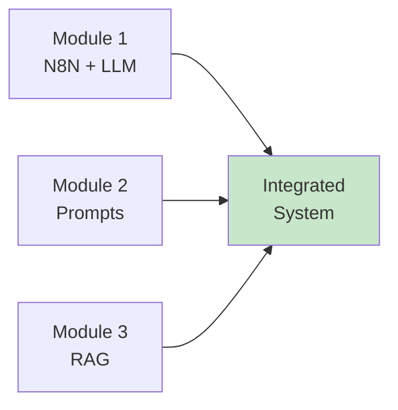
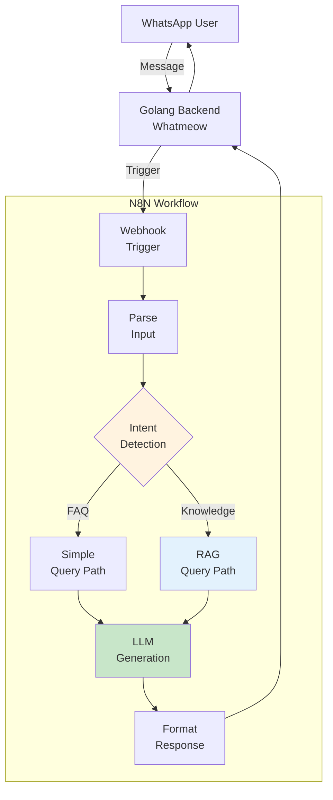
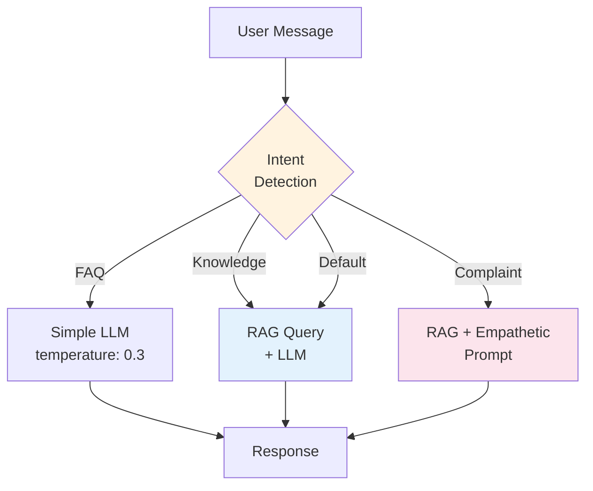

# Phase 3: End-to-End Integration & Demo
## BRIN GenAI Workshop - Phase 3

**Duration**: 30 minutes
**Format**: 20 min hands-on integration + 10 min demo & closing

---

## 🎯 Objective

Connect all components into a working end-to-end AI customer service system

---

## 📊 Slide 1: What We've Built So Far

**Components Ready**

✅ **Module 1**: N8N Workflow + LLM Integration
✅ **Module 2**: Prompt Engineering (Theory)
✅ **Module 3**: RAG System (Ingestion + Query)

**Now**: Connect everything together!



---

## 📊 Slide 2: Integration Architecture

**Complete System Flow**



---

## 📊 Slide 3: Intent Detection Logic

**Routing Queries Intelligently**

**Simple Keywords** → Direct LLM:
- "jam", "waktu", "operasional", "hours"
- "halo", "hello", "hai"
- "terima kasih", "thank you"

**Knowledge Keywords** → RAG Path:
- "cara", "how to", "bagaimana"
- "prosedur", "procedure", "process"
- "kebijakan", "policy", "aturan"
- "refund", "pengembalian"

**Complaint Keywords** → Enhanced Prompt:
- "komplain", "complaint", "masalah"
- "error", "bug", "tidak berfungsi"
- "kecewa", "disappointed"

**Default**: RAG path (safe fallback)

---

## 📊 Slide 4: Intent Detection Implementation

**N8N Switch Node**

```javascript
// Pseudo-code in N8N Function node
const message = $json.user_message.toLowerCase();

// Simple FAQ
if (message.includes('jam') ||
    message.includes('operasional') ||
    message.includes('hours')) {
    return { intent: 'faq' };
}

// Knowledge query
if (message.includes('cara') ||
    message.includes('bagaimana') ||
    message.includes('kebijakan')) {
    return { intent: 'knowledge' };
}

// Complaint
if (message.includes('komplain') ||
    message.includes('error') ||
    message.includes('masalah')) {
    return { intent: 'complaint' };
}

// Default
return { intent: 'knowledge' };
```

---

## 📊 Slide 5: Routing Workflow

**Switch Node Configuration**



**Different Paths, Different Parameters**:
- FAQ: Low temperature, short tokens
- Knowledge: RAG retrieval + balanced params
- Complaint: RAG + empathetic prompt

---

## 📊 Slide 6: Hands-On Integration (15 minutes)

**Build Complete Workflow**

### Step 1: Import Integration Workflow (2 min)
1. Import: `n8n-workflows/04-integrated-flow.json`
2. Review workflow structure

### Step 2: Configure Intent Detection (3 min)
1. Open "Intent Detection" Function node
2. Review keyword logic
3. Modify/add keywords if needed

### Step 3: Connect RAG Workflow (3 min)
1. Link to RAG query workflow from Module 3
2. Verify vector search configuration
3. Check prompt template includes context

### Step 4: Test Complete Flow (7 min)
```bash
# Test 1: Simple FAQ
curl -X POST http://localhost:5678/webhook/integrated \
  -d '{"user_id": "test123", "message": "Jam operasional?"}'

# Test 2: Knowledge query
curl -X POST http://localhost:5678/webhook/integrated \
  -d '{"user_id": "test123", "message": "Cara submit proposal riset?"}'

# Test 3: Complaint
curl -X POST http://localhost:5678/webhook/integrated \
  -d '{"user_id": "test123", "message": "Saya komplain, sistem error"}'
```

---

## 📊 Slide 7: Test Scenarios

**Validation Checklist**

**Scenario 1: FAQ (Simple Path)**
- Input: "Jam buka?"
- Expected: Direct answer, no RAG, fast response
- Verify: Check execution log, no vector search

**Scenario 2: Knowledge Query (RAG Path)**
- Input: "Cara refund produk rusak?"
- Expected: Answer from KB, includes policy details
- Verify: Check vector search results, similarity scores

**Scenario 3: Complaint (Enhanced Path)**
- Input: "Saya komplain, layanan error"
- Expected: Empathetic response
- Verify: Check prompt includes empathy instructions

**Scenario 4: Out of Scope**
- Input: "What's the weather?"
- Expected: "I don't have that information"
- Verify: RAG returns low similarity, LLM declines

---

## 📊 Slide 8: Troubleshooting Common Issues

**Issue Resolution**

| Issue | Symptom | Solution |
|-------|---------|----------|
| **Intent misclassification** | Wrong path taken | Adjust keywords, add more patterns |
| **RAG not retrieving** | Empty context | Check vector DB populated |
| **Low similarity scores** | Generic responses | Improve KB quality, adjust threshold |
| **Slow responses** | Timeout errors | Optimize chunk size, reduce top-k |
| **Workflow errors** | Execution fails | Check all nodes connected properly |

**Debug Tips**:
- Use N8N execution logs
- Check each node output
- Verify API keys and connections
- Test components individually first

---

## 📊 Slide 9: Live Demo - Golang Backend Integration

**Complete End-to-End System**

**Demo Flow** (Instructor shows):

1. **Send WhatsApp Message**
   - Real WhatsApp → Golang Backend
   - Backend receives via Whatmeow

2. **Backend Triggers N8N**
   - HTTP POST to N8N webhook
   - Payload: user_id, message, timestamp

3. **N8N Processing**
   - Intent detection
   - Route to appropriate path
   - LLM/RAG processing
   - Format response

4. **Response Back to WhatsApp**
   - N8N returns to Backend
   - Backend sends via Whatmeow
   - User receives on WhatsApp

**Observe**:
- Real-time workflow execution
- Response latency (~2-4 seconds)
- Different paths for different intents

---

## 📊 Slide 10: Performance Metrics

**System Characteristics**

| Metric | Value |
|--------|-------|
| **Average Response Time** | 2-4 seconds |
| **FAQ Query** | 1-2 seconds |
| **RAG Query** | 3-5 seconds |
| **Concurrent Users** | 100+ (N8N handles well) |
| **Cost per Query** | $0.0001 - $0.001 |
| **Accuracy** | 85-90% (with good KB) |

**Bottlenecks**:
- LLM API latency (external)
- Vector search (optimize with indexing)

**Optimization**:
- Cache frequent queries
- Use faster models for simple queries
- Implement request queuing

---

## 📊 Slide 11: Production Deployment Considerations

**From Workshop to Production**

✅ **Security**:
- API key rotation
- Rate limiting
- Input validation

✅ **Scalability**:
- N8N clustering
- PostgreSQL replication
- Load balancing
- Caching layer

✅ **Monitoring**:
- Response time tracking
- Error rate monitoring
- Cost tracking
- User satisfaction metrics

✅ **Maintenance**:
- Regular KB updates
- Prompt refinement
- Model version updates
- Performance tuning

---

## 📊 Slide 12: Key Takeaways

**What You've Accomplished Today**

✅ **Built Complete AI CS System**
- WhatsApp integration
- N8N workflow automation
- LLM and RAG integration
- Intent-based routing

✅ **Learned Core Concepts**
- GenAI vs Traditional AI
- Workflow automation with N8N
- Prompt engineering principles
- RAG architecture

✅ **Production-Ready Skills**
- Visual debugging
- Error handling
- Intent routing
- System integration

**You can now**: Build, deploy, and maintain AI-powered customer service systems!

---

## 📊 Slide 13: What's Next?

**Extending Your System**

🚀 **Advanced Features**:
- Multi-language support
- Voice message handling
- Image/document processing
- Sentiment analysis
- Escalation workflows

🔧 **Optimization**:
- Fine-tuning prompts
- A/B testing models
- Custom embeddings
- Performance monitoring

📚 **Learning Resources**:
- N8N GenAI Cookbook
- OpenAI Prompt Engineering Guide
- RAG Best Practices
- LangChain Documentation

**Repository**: Take it home, continue building!

---

## 📊 Slide 14: Transition to Closing

**Final Section: Wrap-Up & Q&A (10 minutes)**

**What's Coming**:
- Workshop summary
- Resources for continued learning
- Production deployment guide
- Open Q&A

**Thank you for participating!** 👏

---

## 🎓 Instructor Notes

**Timing Breakdown**:
- Slides 1-5: 5 minutes (overview and architecture)
- Slide 6: 15 minutes (hands-on integration - CRITICAL)
- Slides 7-8: 3 minutes (testing and troubleshooting)
- Slide 9: 5 minutes (live demo - SHOWPIECE)
- Slides 10-14: 2 minutes (metrics and transition)

**Hands-On Priority**:
- Integration workflow MUST work for all participants
- If time runs short: Skip troubleshooting, proceed to demo
- Teaching assistants help with individual issues

**Live Demo Requirements**:
- Working WhatsApp account
- Golang backend running
- All N8N workflows active
- Test several scenarios live
- Show execution logs in real-time

**Key Messages**:
- "This is production-ready code"
- "You can deploy this today"
- "N8N makes complex systems manageable"
- "RAG solves the knowledge problem"

**Common Issues**:
1. **Intent not detected** → Check keyword matching
2. **RAG not called** → Verify routing logic
3. **Workflow timeout** → Increase timeout settings
4. **Connection errors** → Check all nodes linked

**Success Criteria**:
- All 3 test scenarios work
- Participants see complete flow
- Participants understand integration

**Engagement**:
- Celebrate successful integration!
- Encourage participants to test edge cases
- Ask: "What would you add to this system?"
- Collect feedback for improvements

**Smooth Transition**:
- "You've built something amazing today"
- "Let's wrap up with resources and Q&A"
- Prepare for questions about production deployment