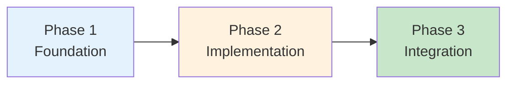

# Closing & Next Steps
## BRIN GenAI Workshop - Wrap-Up

**Duration**: 10 minutes
**Format**: 5 min summary + 5 min Q&A

---

## 🎯 Objective

Recap learning, provide resources, and guide next steps for continued development

---

## 📊 Slide 1: Workshop Journey Recap

**What We Accomplished in 2.5 Hours**



✅ **Phase 1**: Understanding GenAI and System Architecture
✅ **Phase 2**: Building Core Components (N8N, Prompts, RAG)
✅ **Phase 3**: Integrating Everything into Working System

**Result**: Production-ready AI-powered customer service automation!

---

## 📊 Slide 2: Key Learnings

**Technical Skills Acquired**

**Workflow Automation**:
- N8N visual workflow design
- Webhook integration
- Error handling and debugging

**GenAI Integration**:
- OpenRouter multi-model API
- Prompt engineering framework
- Parameter tuning strategies

**RAG Implementation**:
- Vector embeddings concept
- Similarity search with pgvector
- LangChain integration in N8N

**System Design**:
- Intent-based routing
- Modular architecture
- Production considerations

---

## 📊 Slide 3: What You Can Build Now

**Immediate Applications**

🏢 **Internal Operations**:
- HR FAQ bot
- IT helpdesk automation
- Facility management queries

🔬 **Research Support**:
- Grant application assistance
- Publication information bot
- Research inquiry automation

🏛️ **Public Services**:
- Citizen inquiry automation
- Multilingual support bot
- 24/7 information access

💼 **Business Automation**:
- Customer support bot
- Sales inquiry handling
- Order tracking automation

---

## 📊 Slide 4: Your Complete System

**What's in the Repository**

```
workshop-brin/
├── backend/              # WhatsApp integration (Golang)
├── n8n-workflows/        # All workflow templates
│   ├── 01-basic-llm.json
│   ├── 02-rag-ingestion.json
│   ├── 03-rag-query.json
│   └── 04-integrated-flow.json
├── knowledge-base/       # Sample documents
├── scripts/              # Database setup
├── docs/                 # Documentation
└── docker-compose.yaml   # Complete stack
```

**You Have**:
- Fully functional system
- Reusable templates
- Complete documentation
- Production-ready code

**Take it home, customize, deploy!**

---

## 📊 Slide 5: Next Steps - Immediate Actions

**This Week**

1. **Customize for Your Use Case** (2-4 hours)
   - Replace sample knowledge base with your data
   - Adjust prompts for your domain
   - Modify intent detection keywords

2. **Test with Real Users** (1 week)
   - Internal team testing
   - Gather feedback
   - Refine responses

3. **Monitor and Iterate** (Ongoing)
   - Track response quality
   - Identify gaps in knowledge base
   - Optimize prompts

**Goal**: Launch internal pilot within 2 weeks

---

## 📊 Slide 6: Next Steps - Advanced Features

**Next Month**

🚀 **Enhance Capabilities**:
- Add multilingual support (English + Bahasa)
- Implement sentiment analysis
- Create escalation workflows
- Add conversation memory

📊 **Improve Intelligence**:
- Fine-tune prompt templates
- A/B test different models
- Implement custom embeddings
- Add re-ranking for better RAG

🔧 **Optimize Performance**:
- Implement caching
- Optimize chunk sizes
- Add request queuing
- Monitor costs and usage

---

## 📊 Slide 7: Production Deployment Checklist

**Before Going Live**

**Security** ✅:
- [ ] Rotate API keys
- [ ] Implement rate limiting
- [ ] Add input validation
- [ ] Enable audit logging

**Performance** ✅:
- [ ] Load testing (simulate 100+ users)
- [ ] Optimize database queries
- [ ] Implement caching strategy
- [ ] Set up monitoring

**Quality** ✅:
- [ ] Test edge cases
- [ ] Validate KB completeness
- [ ] A/B test prompts
- [ ] Prepare fallback responses

**Operations** ✅:
- [ ] Set up alerting
- [ ] Document runbooks
- [ ] Train support team
- [ ] Establish SLAs

---

## 📊 Slide 8: Learning Resources

**Continue Your GenAI Journey**

**Official Documentation**:
- 📘 [N8N GenAI Cookbook](https://docs.n8n.io/integrations/builtin/cluster-nodes/root-nodes/n8n-nodes-langchain/)
- 📗 [OpenAI Prompt Engineering Guide](https://platform.openai.com/docs/guides/prompt-engineering)
- 📙 [LangChain Documentation](https://python.langchain.com/docs/get_started/introduction)
- 📕 [RAG Best Practices](https://www.pinecone.io/learn/retrieval-augmented-generation/)

**Community & Forums**:
- N8N Community Forum
- OpenRouter Discord
- LangChain Discord
- Reddit r/PromptEngineering

**Video Tutorials**:
- N8N YouTube Channel
- LangChain Academy
- OpenAI Developer Sessions

---

## 📊 Slide 9: Cost Optimization Tips

**Managing Production Costs**

**Model Selection Strategy**:
```
Simple FAQ (70% of queries)     → Llama 3.1 8B   ($0.0001/1K tokens)
Knowledge Queries (20%)         → Claude Haiku   ($0.0003/1K tokens)
Complex Reasoning (10%)         → Claude Sonnet  ($0.003/1K tokens)
```

**Optimization Techniques**:
- ✅ Cache frequent queries (saves 50-60% cost)
- ✅ Implement request deduplication
- ✅ Use streaming for long responses
- ✅ Set appropriate max_tokens limits
- ✅ Monitor and alert on cost spikes

**Expected Costs** (1000 queries/day):
- Low estimate: $3-5/month
- Average: $15-25/month
- High (complex queries): $50-100/month

---

## 📊 Slide 10: Common Pitfalls to Avoid

**Learn from Others' Mistakes**

❌ **Don't**:
- Deploy without testing edge cases
- Use single model for all tasks (cost inefficient)
- Ignore prompt injection security
- Skip monitoring and logging
- Hardcode prompts (use version control)

✅ **Do**:
- Start small, iterate quickly
- Monitor quality metrics
- Version control everything
- Test with real users early
- Plan for prompt refinement
- Document decision rationale

**Remember**: GenAI systems need continuous improvement!

---

## 📊 Slide 11: Support & Community

**Getting Help**

**Workshop Materials**:
- Repository: `github.com/[org]/brin-genai-workshop`
- Documentation: See `docs/` folder
- Troubleshooting: See `docs/troubleshooting.md`

**Technical Support**:
- Workshop Slack: `#brin-workshop-2025`
- Email: [instructor-email]
- Office hours: [schedule]

**BRIN Community**:
- Internal AI working group
- Monthly knowledge sharing sessions
- Collaboration opportunities

**Stay Connected**: Continue learning together!

---

## 📊 Slide 12: Success Stories to Inspire

**What Others Have Built**

**Case Study 1**: E-commerce Company
- Reduced support tickets by 70%
- 24/7 availability
- ROI: 6 months

**Case Study 2**: Government Agency
- Multilingual citizen support
- 85% satisfaction rate
- Cost savings: 60%

**Case Study 3**: Research Institution
- Automated grant inquiries
- 90% accurate responses
- Time saved: 20 hours/week

**Your Turn**: What will you build?

---

## 📊 Slide 13: Final Thoughts

**Key Takeaways**

💡 **GenAI is Accessible**:
- You don't need to be an ML expert
- Visual tools like N8N make it simple
- Pre-trained models via APIs work well

🚀 **Start Small, Scale Up**:
- Begin with FAQ automation
- Add RAG for knowledge
- Expand to complex use cases

🔄 **Iterate Continuously**:
- Monitor performance
- Refine prompts
- Update knowledge base
- Listen to users

**Most Important**: You now have the skills and tools to build AI-powered solutions!

---

## 📊 Slide 14: Q&A Session

**Open Discussion**

**Common Topics**:
- Deployment strategies
- Scaling considerations
- Integration with existing systems
- Cost management
- Security and compliance

**Ask Anything**:
- Technical questions
- Implementation advice
- Best practices
- Real-world scenarios

**Time for Questions** 🙋

---

## 📊 Slide 15: Thank You!

**Workshop Complete** 🎉

**What You've Achieved**:
✅ Built production-ready AI CS system
✅ Learned GenAI core concepts
✅ Hands-on with N8N, RAG, LLM
✅ Ready to deploy and scale

**Next Steps**:
1. Take repository home
2. Customize for your use case
3. Deploy and iterate
4. Share your success!

**Stay in Touch**:
- Slack: `#brin-workshop-2025`
- GitHub: Star the repository
- LinkedIn: Connect and share

**Thank you for your participation!**

**Questions? Let's connect!**

---

## 🎓 Instructor Notes

**Timing Breakdown**:
- Slides 1-3: 2 minutes (recap and applications)
- Slides 4-6: 2 minutes (resources and next steps)
- Slides 7-10: 2 minutes (production tips)
- Slides 11-13: 1 minute (community and final thoughts)
- Slides 14-15: 5 minutes (Q&A and closing)

**Key Messages to Emphasize**:
1. **You can do this** - technology is accessible
2. **Start now** - don't wait for perfect
3. **Iterate** - continuous improvement is key
4. **Share** - help others learn from your experience

**Q&A Preparation**:

**Expected Questions**:
- "How to handle non-English languages?" → Multi-model, specify in prompt
- "What about data privacy?" → On-premise deployment, data encryption
- "Can we use free/open-source LLMs?" → Yes, Ollama integration possible
- "How to measure success?" → Track resolution rate, satisfaction, cost
- "What if LLM hallucinates?" → RAG reduces this, add validation layer

**Closing Activities**:
- Group photo (if appropriate)
- Feedback form distribution
- Certificate of completion (if applicable)
- Thank teaching assistants

**Post-Workshop**:
- Share slides and recordings
- Send follow-up email with resources
- Schedule optional office hours
- Create feedback summary

**Final Message**:
"You've learned more in 2.5 hours than most people learn in weeks of self-study. The hard part is done. Now go build something amazing for BRIN and Indonesia!"

**End on High Note**:
- Celebrate achievements
- Encourage immediate action
- Offer continued support
- Express gratitude