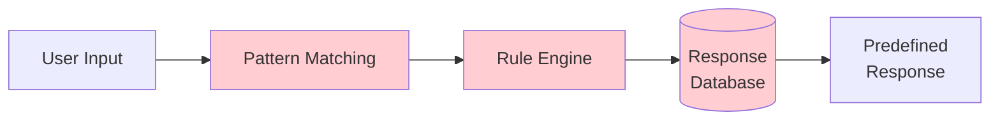
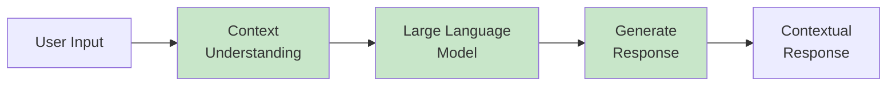
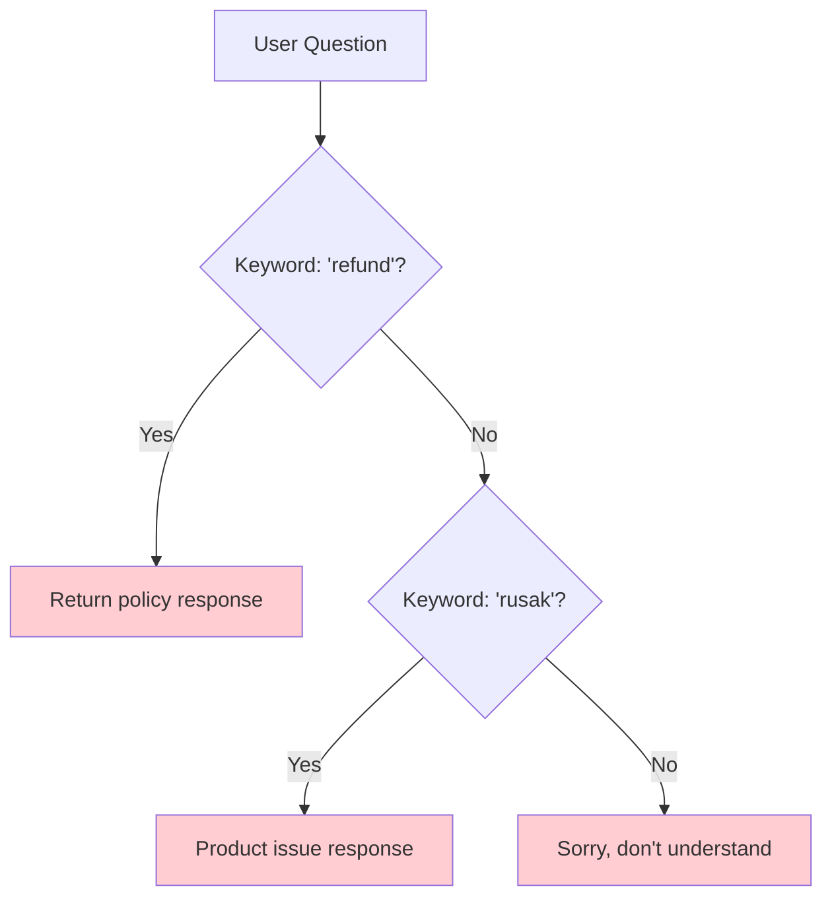
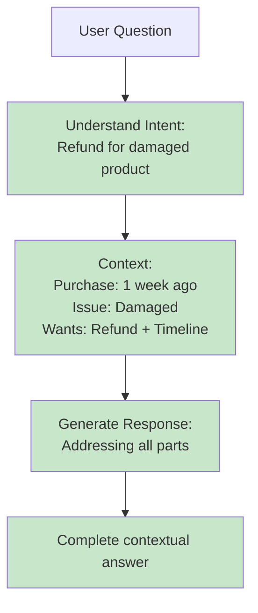

# GenAI Fundamentals: Traditional AI vs Generative AI

**Target Audience**: Mid-Level Developers
**Duration**: 10 minutes reading
**Purpose**: Understand the paradigm shift from traditional AI to Generative AI

---

## Table of Contents

- [Overview](#overview)
- [Traditional AI Paradigm](#traditional-ai-paradigm)
- [Generative AI Paradigm](#generative-ai-paradigm)
- [Key Differences](#key-differences)
- [Impact on Customer Service Automation](#impact-on-customer-service-automation)
- [Practical Implications](#practical-implications)

---

## Overview

The shift from Traditional AI to Generative AI represents a fundamental change in how we build intelligent systems. This document explains the differences and why they matter for practical applications like customer service automation.

**Key Insight**: Traditional AI retrieves pre-programmed responses. Generative AI creates contextual responses on-demand.

---

## Traditional AI Paradigm

### How Traditional AI Works



**Core Mechanism**: **Retrieval-Based**

### Characteristics

1. **Rule-Based**: Uses if-then logic
   ```
   IF user_input.contains("jam buka")
      THEN return "Kami buka pukul 08:00-17:00 WIB"
   ```

2. **Pattern Matching**: Keyword detection
   - Limited to exact or close matches
   - Breaks down with variations
   - Requires exhaustive rule creation

3. **Static Responses**: Pre-written answers
   - Cannot adapt to context
   - Same question → Same answer always
   - No understanding of nuance

### Example: Traditional Chatbot

**User Question 1**: "Jam operasional?"
**Bot Response**: "Kami buka Senin-Jumat, 08:00-17:00 WIB"

**User Question 2**: "Apa kalian buka hari Sabtu pagi jam 9?"
**Bot Response**: ❌ "Maaf, saya tidak mengerti" (keyword "Sabtu" not in rules)

**User Question 3**: "Kemarin saya komplain tapi belum ada jawaban, gimana?"
**Bot Response**: ❌ Generic fallback or no response

### Limitations

❌ **Cannot handle variations**:
- "Jam buka?" ✅ (matches keyword)
- "Kapan kalian beroperasi?" ❌ (different phrasing)
- "Bisakah saya datang jam 6 sore?" ❌ (requires reasoning)

❌ **No contextual understanding**:
- Cannot remember previous conversation
- Cannot infer intent from complex questions
- Cannot adapt tone to user sentiment

❌ **High maintenance cost**:
- Every new question → New rule needed
- Exponential growth in rules
- Constant updates required

❌ **Poor user experience**:
- Robotic, scripted interactions
- Frustrating when not matching keywords
- No empathy or nuance

---

## Generative AI Paradigm

### How Generative AI Works



**Core Mechanism**: **Generation-Based**

### Characteristics

1. **Language Understanding**: Comprehends meaning, not just keywords
   ```
   Input: "Bisakah saya datang jam 6 sore?"
   Understanding: User asking about availability at 18:00
   Generation: "Mohon maaf, kami tutup pukul 17:00 WIB. Apakah Anda
                bisa datang lebih awal, misalnya jam 16:00?"
   ```

2. **Contextual Generation**: Creates responses based on understanding
   - Adapts to phrasing variations
   - Considers conversation history
   - Adjusts tone and style

3. **Dynamic Responses**: No pre-written scripts
   - Same question in different contexts → Different answers
   - Handles edge cases naturally
   - Can reason and infer

### Example: Generative AI Chatbot

**User Question 1**: "Jam operasional?"
**Bot Response**: "Kami buka Senin-Jumat, pukul 08:00-17:00 WIB."

**User Question 2**: "Apa kalian buka hari Sabtu pagi jam 9?"
**Bot Response**: ✅ "Kami tidak beroperasi pada hari Sabtu. Layanan kami tersedia Senin-Jumat, pukul 08:00-17:00 WIB. Apakah Anda ingin kami hubungi pada hari Senin?"

**User Question 3**: "Kemarin saya komplain tapi belum ada jawaban, gimana?"
**Bot Response**: ✅ "Saya mohon maaf atas keterlambatan respons terhadap komplain Anda. Saya akan segera meneruskan keluhan ini ke tim yang berwenang. Bisakah Anda memberikan nomor tiket atau detail komplain Anda agar saya bisa bantu lacak?"

### Capabilities

✅ **Handles variations naturally**:
- Understands semantic meaning
- Works with paraphrasing
- No need for exact keyword match

✅ **Contextual awareness**:
- Remembers conversation flow
- Adapts to user sentiment
- Provides personalized responses

✅ **Low maintenance**:
- No rule updates needed
- Adapts to new questions automatically
- Self-improving with context

✅ **Better user experience**:
- Natural, human-like conversations
- Empathetic and contextual
- Handles complex multi-part questions

---

## Key Differences

### Comparison Table

| Aspect | Traditional AI | Generative AI |
|--------|---------------|---------------|
| **Mechanism** | Pattern matching + retrieval | Language understanding + generation |
| **Responses** | Pre-written, static | Generated on-demand, dynamic |
| **Flexibility** | Rigid (keyword-dependent) | Flexible (semantic understanding) |
| **Conversation** | Turn-by-turn (no memory) | Contextual (remembers flow) |
| **Maintenance** | High (constant rule updates) | Low (adapts automatically) |
| **Edge Cases** | Fails (no matching rule) | Handles (infers intent) |
| **Tone** | Robotic, scripted | Natural, adaptive |
| **Setup Effort** | Manual rule creation | Prompt engineering + training |
| **Cost** | Infrastructure + dev time | API calls + compute |

### Visual Comparison: Handling Complex Question

**Question**: "Saya beli produk minggu lalu tapi rusak, apa bisa refund? Berapa lama prosesnya?"

#### Traditional AI Approach:


**Result**: Partial answer or generic fallback (doesn't address both refund + timeline)

#### Generative AI Approach:


**Result**:
```
Tentu, produk yang rusak dapat dikembalikan untuk refund. Berikut prosedurnya:

1. Kirim foto produk yang rusak
2. Kami akan verifikasi (1-2 hari kerja)
3. Setelah disetujui, refund diproses dalam 5-7 hari kerja

Karena Anda baru membeli minggu lalu, masih dalam periode 14 hari jadi bisa
langsung diproses. Apakah Anda sudah punya foto produk yang rusak?
```

---

## Impact on Customer Service Automation

### Traditional AI Customer Service

**Strengths**:
- ✅ Predictable behavior
- ✅ Fast for exact matches
- ✅ Easy to audit and control

**Weaknesses**:
- ❌ Poor customer satisfaction (robotic)
- ❌ High escalation rate to human agents
- ❌ Expensive to maintain (constant updates)
- ❌ Limited to simple FAQ

### Generative AI Customer Service

**Strengths**:
- ✅ Natural conversations
- ✅ Handles complexity and edge cases
- ✅ Lower escalation rate (70% reduction typical)
- ✅ 24/7 availability with quality
- ✅ Adapts to new scenarios without reprogramming

**Weaknesses**:
- ⚠️ Requires prompt engineering
- ⚠️ Can hallucinate (needs grounding with RAG)
- ⚠️ API costs (though decreasing rapidly)
- ⚠️ Less predictable (needs monitoring)

### Real-World Impact Metrics

**Industry Benchmarks**:
- **Ticket Reduction**: 60-70% handled by AI
- **Response Time**: Instant (vs hours for human agents)
- **Availability**: 24/7 (vs business hours)
- **Cost Savings**: 50-80% operational cost reduction
- **Customer Satisfaction**: 80-85% (with well-tuned systems)

---

## Practical Implications

### What This Means for Development

**Traditional AI Development**:
1. Map all possible user inputs
2. Create rules for each pattern
3. Write responses for each rule
4. Test exhaustively
5. Update constantly

**Generative AI Development**:
1. Define system role and constraints (prompts)
2. Provide knowledge base (RAG)
3. Test and refine prompts
4. Monitor and iterate

### Shift in Skills Required

**From**:
- Rule engineering
- Pattern matching logic
- Response database management

**To**:
- Prompt engineering
- Context design
- Quality monitoring

### Cost Considerations

**Traditional AI**:
- High upfront dev cost
- High ongoing maintenance
- Low runtime cost (just server)

**Generative AI**:
- Lower upfront cost (prompts vs rules)
- Low maintenance (no rule updates)
- Runtime cost (API calls, but decreasing)

**Break-even**: Typically 3-6 months for customer service use cases

---

## Key Takeaways

1. **Paradigm Shift**: Retrieval → Generation
   - Traditional AI retrieves pre-written answers
   - Generative AI creates contextual responses

2. **Better UX**: Natural conversations vs robotic scripts
   - Higher satisfaction
   - Lower escalation
   - 24/7 quality support

3. **Lower Maintenance**: Adapts vs constant updates
   - No rule engineering
   - Knowledge base updates (RAG)
   - Prompt refinement

4. **Practical Applications**: Scalable, adaptable systems
   - Serves diverse users
   - Integrates with existing systems
   - Future-proof architecture

5. **Not Magic**: Requires proper implementation
   - Prompt engineering
   - RAG for grounding
   - Monitoring and iteration

---

## Next Steps

After understanding these fundamentals, you're ready to:
1. **Explore Architecture**: Learn how GenAI systems are built
2. **Hands-On Implementation**: Build N8N workflows with LLM
3. **Prompt Engineering**: Craft effective AI instructions
4. **RAG Implementation**: Ground AI in your knowledge base

**Remember**: Generative AI is a tool, not a magic solution. Success requires thoughtful design, proper implementation, and continuous refinement.

---

**Further Reading**:
- OpenAI's GPT Documentation
- Anthropic's Claude Guide
- Google's PaLM Research
- Industry case studies on AI customer service