# System Architecture Principles for GenAI Applications

**Target Audience**: Mid-Level Developers
**Duration**: 15 minutes reading
**Purpose**: Understand architectural patterns and design principles for production GenAI systems

---

## Table of Contents

- [Overview](#overview)
- [Core Architectural Principles](#core-architectural-principles)
- [Layered Architecture Pattern](#layered-architecture-pattern)
- [Component Breakdown](#component-breakdown)
- [Data Flow Design](#data-flow-design)
- [Production Best Practices](#production-best-practices)

---

## Overview

Building production-ready GenAI applications requires thoughtful architecture. This document covers the fundamental principles and patterns used in our WhatsApp customer service automation system.

**Key Principle**: Separation of Concerns - Each layer has a specific responsibility

---

## Core Architectural Principles

### 1. Modularity

**Principle**: Build independent, replaceable components

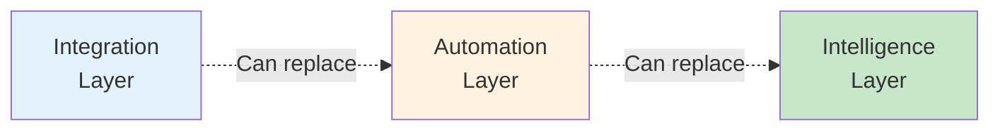

**Benefits**:
- Easy to test components individually
- Can swap implementations without affecting others
- Parallel development possible

**Example**:
- Integration Layer: WhatsApp today → Telegram tomorrow
- Intelligence Layer: OpenRouter → Direct OpenAI → Local LLM

### 2. Loose Coupling

**Principle**: Components communicate through well-defined interfaces

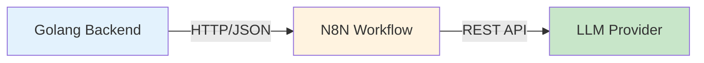

**Benefits**:
- Components don't need to know internal implementation
- Easy to modify one component without breaking others
- Better error isolation

**Anti-Pattern** (Tight Coupling):
```go
// BAD: Backend directly calls LLM
llmResponse := openai.Complete(userMessage)
```

**Good Pattern** (Loose Coupling):
```go
// GOOD: Backend triggers workflow, N8N handles LLM
workflowResponse := n8n.TriggerWebhook(userMessage)
```

### 3. Single Responsibility

**Principle**: Each component does one thing well

| Component | Responsibility |
|-----------|---------------|
| **Golang Backend** | WhatsApp integration ONLY |
| **N8N Workflow** | Orchestration and routing ONLY |
| **LLM Provider** | Text generation ONLY |
| **PostgreSQL** | Data persistence ONLY |
| **Vector DB** | Similarity search ONLY |

**Benefits**:
- Easier to understand
- Easier to test
- Easier to maintain

### 4. Fail Gracefully

**Principle**: System continues operating even when components fail

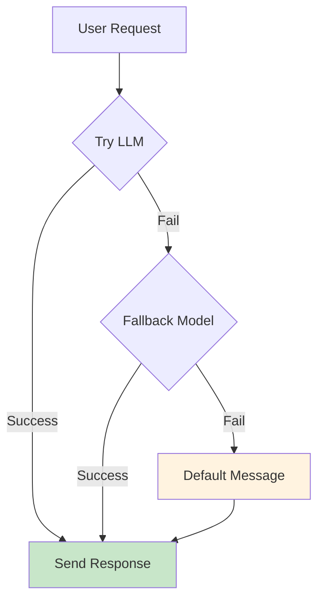

**Implementation**:
- Retry logic with exponential backoff
- Fallback to simpler models
- Default responses when all fails
- Error logging for analysis

### 5. Observability

**Principle**: System behavior should be visible and measurable

**What to Monitor**:
- Request/response latency
- Error rates by component
- LLM token usage and costs
- User satisfaction metrics
- Vector search relevance scores

**Implementation**:
- Structured logging
- Metrics collection
- Execution traces
- Health checks

---

## Layered Architecture Pattern

### Four-Layer Architecture

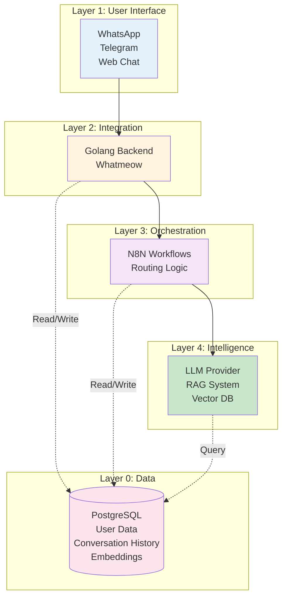

### Layer Responsibilities

#### Layer 1: User Interface
**Purpose**: User interaction touchpoints

**Responsibilities**:
- Receive user messages
- Display responses
- Handle media (images, voice, documents)

**Technologies**:
- WhatsApp Business API
- Telegram Bot API
- Web chat widgets

**Key Consideration**: UI layer should be thin - no business logic

---

#### Layer 2: Integration
**Purpose**: Connect external systems to internal workflows

**Responsibilities**:
- Authentication and session management
- Protocol translation (WhatsApp → HTTP/JSON)
- Rate limiting and throttling
- Basic input validation

**Technologies**:
- Golang with Whatmeow (WhatsApp)
- Express.js / FastAPI for web hooks
- Redis for session storage

**Design Pattern**: Adapter Pattern
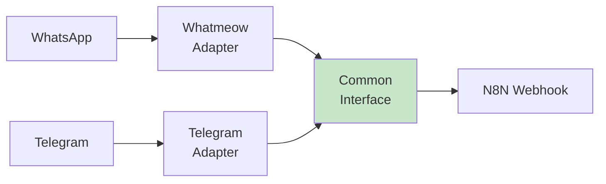

---

#### Layer 3: Orchestration
**Purpose**: Business logic and workflow management

**Responsibilities**:
- Intent detection and routing
- Context enrichment (user history, preferences)
- Decide: RAG vs Direct LLM
- Decide: Which model to use
- Error handling and retries
- Response formatting

**Technologies**:
- N8N (visual workflow engine)
- Apache Airflow (code-based alternative)
- Temporal (complex workflows)

**Why N8N for This Layer?**
- ✅ Visual debugging
- ✅ Easy to modify workflows without code deployment
- ✅ Built-in integrations with LLM providers
- ✅ Production-ready with clustering support

**Design Pattern**: Strategy Pattern
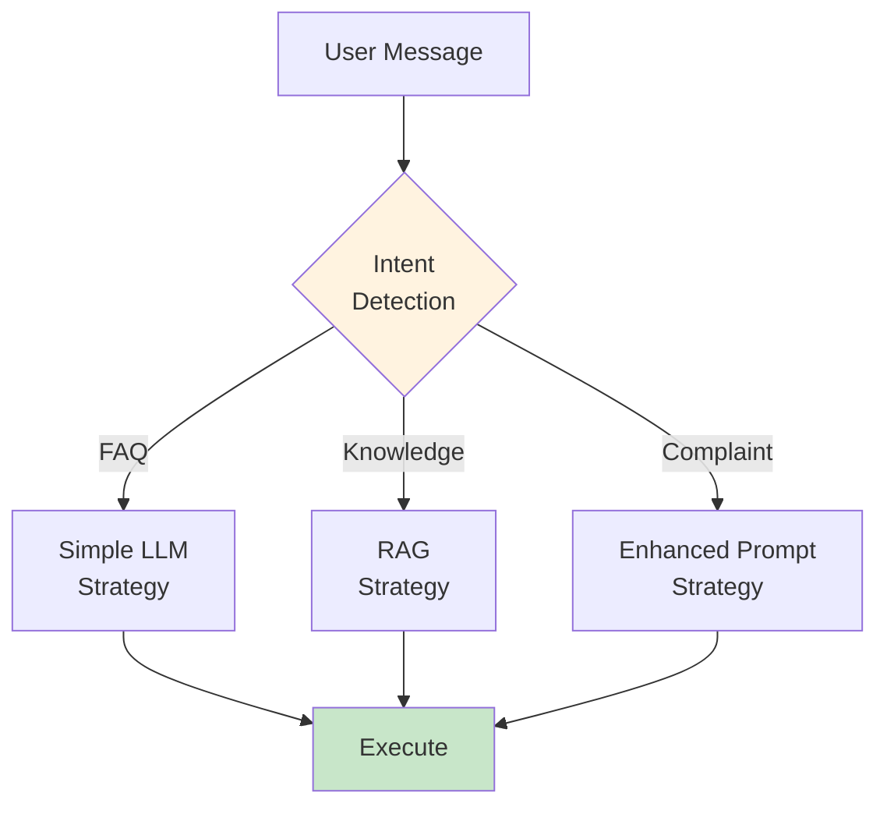

---

#### Layer 4: Intelligence
**Purpose**: AI/ML capabilities

**Responsibilities**:
- Text generation (LLM)
- Semantic search (Vector DB)
- Embedding generation
- Context retrieval (RAG)

**Technologies**:
- OpenRouter (multi-model gateway)
- OpenAI API (direct)
- pgvector (embeddings storage)
- LangChain (RAG orchestration)

**Design Pattern**: Facade Pattern
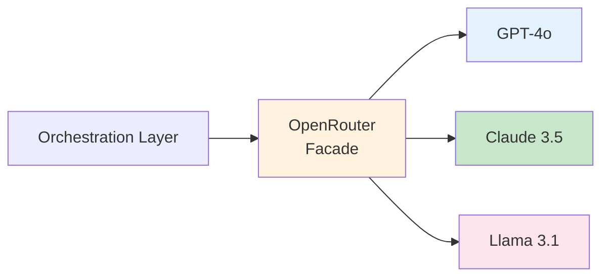

**Benefits of Facade**:
- Single interface to multiple LLM providers
- Easy to add new providers
- Centralized error handling
- Cost routing logic in one place

---

#### Layer 0: Data
**Purpose**: Persistent storage

**Responsibilities**:
- User profiles and preferences
- Conversation history
- Vector embeddings (knowledge base)
- Analytics and logs

**Technologies**:
- PostgreSQL (relational data + vectors)
- Redis (sessions, cache)
- S3 (file attachments)

**Schema Design Principles**:
- Separate transactional data from analytical data
- Index frequently queried fields
- Use partitioning for large tables (conversation history)

---

## Component Breakdown

### Golang Backend (Whatmeow)

**Purpose**: WhatsApp integration bridge

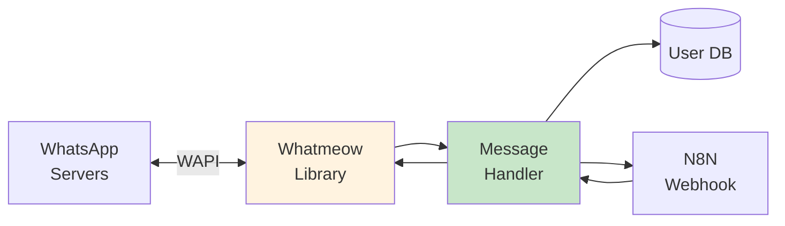

**Key Responsibilities**:
1. Maintain WhatsApp connection
2. Handle incoming messages
3. Validate user sessions
4. Trigger N8N workflows
5. Send responses back to WhatsApp

**Why Golang?**
- ✅ High performance (thousands concurrent connections)
- ✅ Low memory footprint
- ✅ Great concurrency model (goroutines)
- ✅ Whatmeow library maturity

---

### N8N Workflow Engine

**Purpose**: Visual workflow orchestration

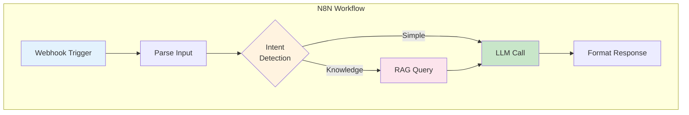

**Advantages**:
- No-code/low-code workflow design
- Built-in LangChain nodes for RAG
- Visual debugging (see data flow)
- Version control (export JSON)
- Webhook support (easy integrations)

**When to Use N8N vs Custom Code**:
- ✅ Use N8N: Workflow logic, integrations, rapid prototyping
- ❌ Avoid N8N: Complex algorithms, high-frequency operations, low-latency requirements

---

### OpenRouter Gateway

**Purpose**: Unified LLM access

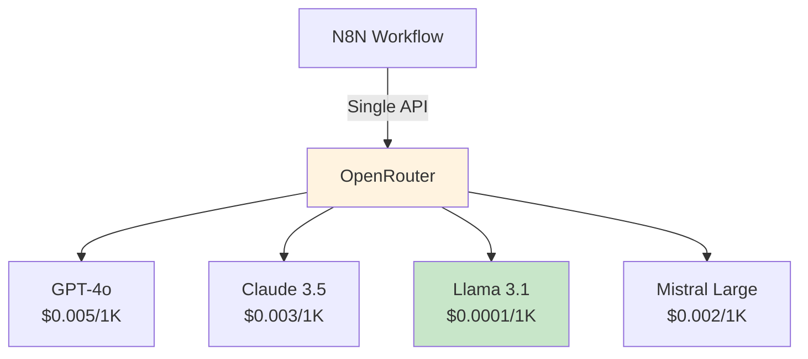

**Benefits**:
- **Cost Optimization**: Route simple queries to cheap models
- **Fallback**: Auto-retry with different model if one fails
- **No Vendor Lock-in**: Switch models anytime
- **Single API Key**: Manage one key instead of multiple

**Routing Strategy Example**:
```
FAQ (70% of queries)       → Llama 3.1 8B   ($0.0001/1K)
Knowledge (20%)            → Claude Haiku   ($0.0003/1K)
Complex Reasoning (10%)    → Claude Sonnet  ($0.003/1K)
```

**Cost Savings**: ~60-70% vs using GPT-4 for everything

---

### PostgreSQL + pgvector

**Purpose**: Unified database for structured data and embeddings

```mermaid
graph TB
    subgraph "PostgreSQL"
        subgraph "Relational Tables"
            Users[users]
            Conversations[conversations]
            Messages[messages]
        end

        subgraph "Vector Extension"
            Embeddings[document_embeddings<br/>vector(768)]
        end
    end

    Backend[Golang Backend] -->|CRUD| Users
    Backend -->|Log| Conversations
    N8N[N8N] -->|RAG Query| Embeddings
    N8N -->|Store| Messages

    style Users fill:#e3f2fd
    style Embeddings fill:#fce4ec
```

**Why pgvector over Dedicated Vector DB?**
- ✅ One database instead of two
- ✅ No additional infrastructure
- ✅ Sufficient performance for most use cases
- ✅ ACID guarantees for embeddings + metadata
- ✅ Familiar SQL interface

**When to Migrate to Dedicated Vector DB**:
- > 1M vectors
- Need advanced re-ranking
- Require distributed search
- Sub-10ms latency requirements

---

## Data Flow Design

### End-to-End Message Flow

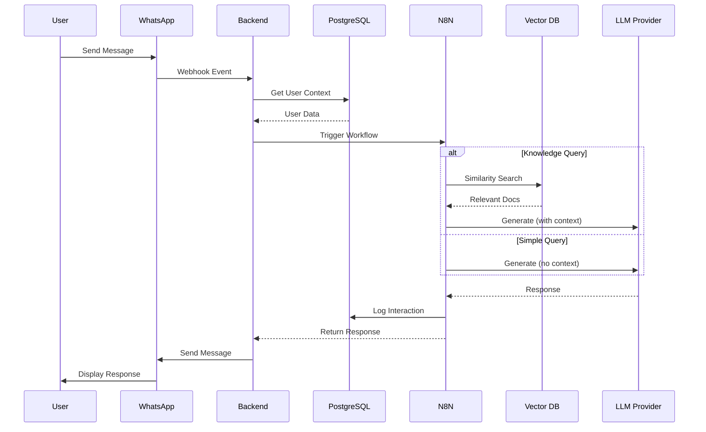

### Data Flow Principles

1. **Enrich Early**: Load user context at integration layer
2. **Log Everything**: Track all interactions for analysis
3. **Fail Fast**: Validate inputs before expensive operations
4. **Cache Aggressively**: Reduce repeated LLM calls

---

## Production Best Practices

### 1. Monitoring and Alerting

**What to Monitor**:
```yaml
metrics:
  - response_latency_p95  # 95th percentile
  - error_rate_per_minute
  - llm_token_usage_daily
  - vector_search_accuracy
  - user_satisfaction_score

alerts:
  - error_rate > 5%
  - latency_p95 > 10s
  - daily_cost > $100
```

### 2. Cost Management

**Strategies**:
- Route by complexity (cheap models for simple queries)
- Cache frequent questions
- Set max_tokens limits
- Monitor and alert on spend

### 3. Security

**Checklist**:
- ✅ API key rotation (monthly)
- ✅ Input validation (prevent prompt injection)
- ✅ Rate limiting (per user)
- ✅ Audit logging (GDPR compliance)
- ✅ Encrypt PII in database

### 4. Error Handling

**Strategy**:
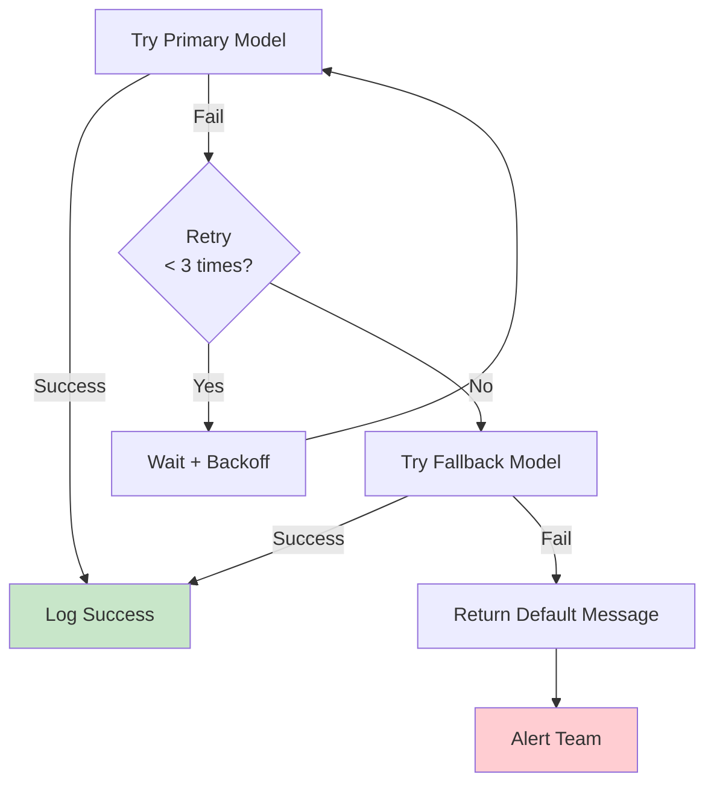

### 5. Testing Strategy

**Levels**:
1. **Unit Tests**: Test components individually
2. **Integration Tests**: Test N8N workflows
3. **End-to-End Tests**: Simulate user journeys
4. **Load Tests**: Verify scalability (100+ concurrent users)
5. **A/B Tests**: Compare prompt variations

---

## Key Takeaways

1. **Layered Architecture**: Separation of concerns for maintainability
2. **Loose Coupling**: Components communicate through interfaces
3. **Modularity**: Easy to replace/upgrade components
4. **Observability**: Monitor everything for production readiness
5. **Fail Gracefully**: Design for failure scenarios

**Remember**: Good architecture enables rapid iteration while maintaining stability.

---

**Further Reading**:
- Martin Fowler's Architecture Patterns
- Microservices Design Patterns
- N8N Production Best Practices
- PostgreSQL Performance Tuning