# N8N Architecture and Concepts

**Module**: Phase 2 - Module 1
**Duration**: 10 minutes reading
**Purpose**: Understand N8N workflow engine architecture, node types, and data flow

---

## Table of Contents

- [What is N8N?](#what-is-n8n)
- [Why N8N for Workflow Automation?](#why-n8n-for-workflow-automation)
- [Core Concepts](#core-concepts)
- [Node Types](#node-types)
- [Data Flow and Execution](#data-flow-and-execution)
- [Workflow Design Patterns](#workflow-design-patterns)
- [Best Practices](#best-practices)

---

## What is N8N?

**N8N** (n8n.io) is an open-source workflow automation tool that allows you to connect different services and automate tasks without writing code.

**Key Characteristics**:
- **Self-hosted**: Run on your own infrastructure
- **Open-source**: Free and customizable
- **Visual**: Node-based workflow designer
- **Extensible**: 300+ integrations, custom nodes possible

###

 Comparison

| Feature | N8N | Zapier | Airflow |
|---------|-----|--------|---------|
| **Deployment** | Self-hosted | Cloud only | Self-hosted |
| **Cost** | Free (open-source) | Subscription | Free (open-source) |
| **Interface** | Visual UI | Visual UI | Code-first |
| **AI/LLM Support** | ✅ Native (LangChain) | Limited | Requires custom |
| **Learning Curve** | Low | Very Low | High |

**For This Workshop**: N8N is ideal because it's visual, supports LLM integrations natively, and can be self-hosted.

---

## Why N8N for Workflow Automation?

### Use Cases

**1. API Integration**
- Connect WhatsApp → LLM → Database
- No need to write API client code
- Built-in error handling

**2. Data Transformation**
- Parse JSON, XML, CSV
- Filter and manipulate data
- Format responses

**3. Conditional Logic**
- Route based on conditions
- Implement business rules
- Handle different scenarios

**4. AI/ML Workflows**
- LangChain integration (RAG)
- Prompt templates
- Multi-model routing

### Benefits for GenAI Development

✅ **Rapid Prototyping**:
- Build workflows in minutes
- Test immediately
- Iterate quickly

✅ **Visual Debugging**:
- See data at each step
- Identify issues easily
- Trace execution flow

✅ **No Deployment Overhead**:
- Modify workflows without code deployment
- Version control (export/import JSON)
- Rollback easily

✅ **Built-in Integrations**:
- OpenAI, Anthropic, Cohere APIs
- Vector databases
- LangChain nodes

---

## Core Concepts

### 1. Workflows

**Definition**: A sequence of connected nodes that automate a task

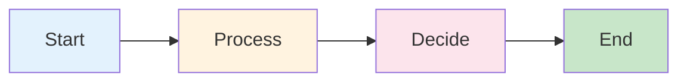

**Characteristics**:
- Can be triggered manually, on schedule, or via webhook
- Execute nodes sequentially or in parallel
- Can have multiple branches (conditional logic)

### 2. Nodes

**Definition**: Individual units of work in a workflow

**Analogy**: Like functions in programming
- Input: Data from previous node
- Process: Perform specific task
- Output: Data to next node

### 3. Connections

**Definition**: Links between nodes that define execution order and data flow

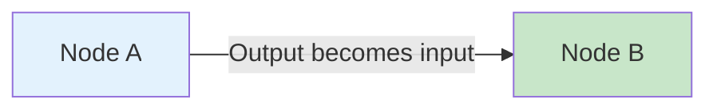

### 4. Executions

**Definition**: A single run of a workflow

**Execution Modes**:
- **Manual**: Click "Execute Workflow" button
- **Trigger**: Webhook, schedule, file change
- **Test**: Run with sample data

**Execution Log**:
- See input/output of each node
- Identify errors
- Debug data transformations

---

## Node Types

### 1. Trigger Nodes

**Purpose**: Start a workflow

**Common Trigger Types**:

#### Webhook Trigger
```
POST http://localhost:5678/webhook/my-workflow
Body: { "message": "Hello" }
```

**Use Case**: Receive data from external systems (e.g., Golang backend)

#### Schedule Trigger
```
Cron: 0 9 * * *  (Every day at 9 AM)
```

**Use Case**: Daily reports, batch processing

#### Manual Trigger
- Click button to start
- Good for testing

**Example**:
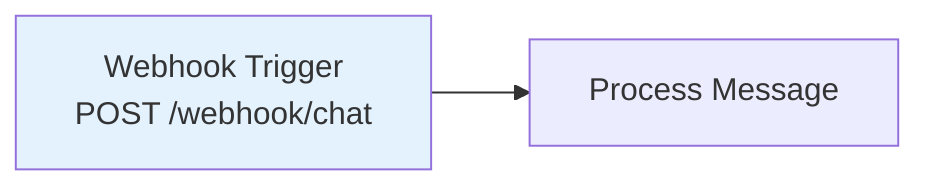

---

### 2. Action Nodes

**Purpose**: Perform operations

#### HTTP Request Node
- Call external APIs
- Common for LLM integrations

**Example Configuration**:
```json
{
  "method": "POST",
  "url": "https://openrouter.ai/api/v1/chat/completions",
  "headers": {
    "Authorization": "Bearer {{$env.OPENROUTER_API_KEY}}"
  },
  "body": {
    "model": "meta-llama/llama-3.1-8b-instruct",
    "messages": [
      {"role": "user", "content": "{{$json.message}}"}
    ]
  }
}
```

#### Set Node
- Create or modify data
- Prepare data for next node

**Example**:
```javascript
// Extract and format data
return {
  user_id: $json.from,
  message: $json.body.toLowerCase(),
  timestamp: new Date().toISOString()
};
```

#### Code Node
- Execute custom JavaScript
- Complex transformations

**Example**:
```javascript
// Intent detection logic
const message = $json.message.toLowerCase();

if (message.includes('jam') || message.includes('operasional')) {
  return { intent: 'faq', route: 'simple' };
}

if (message.includes('cara') || message.includes('kebijakan')) {
  return { intent: 'knowledge', route: 'rag' };
}

return { intent: 'general', route: 'rag' };
```

---

### 3. Logic Nodes

**Purpose**: Control flow

#### IF Node
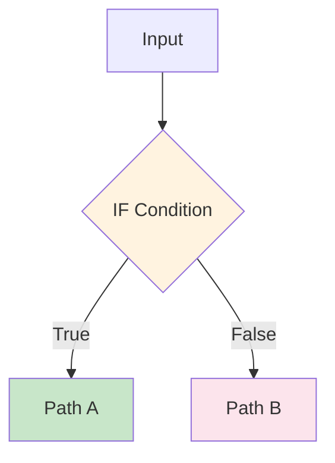

**Example Condition**:
```
{{ $json.intent }} == "faq"
```

#### Switch Node
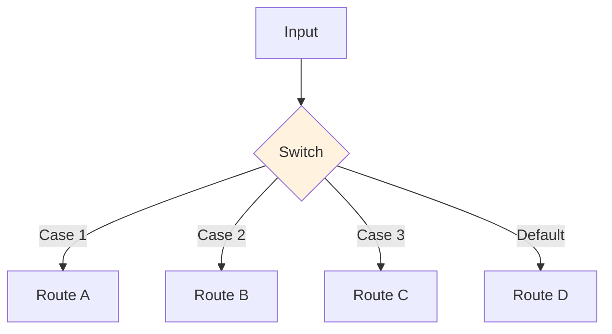

**Use Case**: Route to different LLM strategies based on intent

#### Merge Node
- Combine outputs from multiple branches
- Wait for all inputs before proceeding

---

### 4. LangChain Nodes (AI-Specific)

#### LangChain Chat Model
- Direct LLM integration
- Supports prompt templates
- Built-in retry logic

#### Vector Store Nodes
- pgvector, Pinecone, Qdrant
- Insert and query embeddings

#### Document Loader
- Load text files, PDFs, web pages
- Prepare data for RAG

#### Text Splitter
- Chunk documents
- Preserve context with overlap

**Example RAG Workflow**:
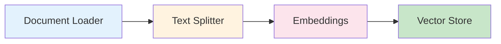

---

## Data Flow and Execution

### How Data Flows Through Nodes

**Key Concept**: Each node receives data from the previous node and outputs data to the next

#### Single Item Flow
```mermaid
graph LR
    N1[Node 1<br/>Output: {'{'}name: 'Alice'{'}'}] --> N2[Node 2<br/>Input: {'{'}name: 'Alice'{'}'}]

    style N1 fill:#e3f2fd
    style N2 fill:#c8e6c9
```

#### Multiple Items Flow
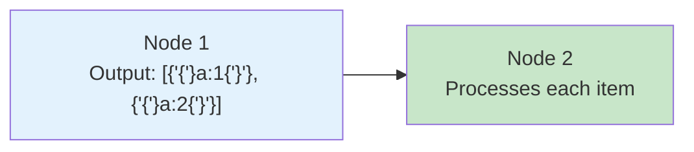

**Note**: By default, nodes process all items sequentially

### Accessing Data in Nodes

**Syntax**: `$json` and `$node`

#### Current Node Data: `$json`
```javascript
// Access current item
const message = $json.user_message;
const userId = $json.user_id;
```

#### Previous Node Data: `$node`
```javascript
// Access specific node output
const llmResponse = $node["LLM Call"].json.choices[0].message.content;
const searchResults = $node["Vector Search"].json.results;
```

#### Environment Variables: `$env`
```javascript
const apiKey = $env.OPENROUTER_API_KEY;
```

#### Expressions: `{{ }}`
```
URL: https://api.example.com/user/{{ $json.user_id }}
Header: Bearer {{ $env.API_KEY }}
```

---

### Execution Modes

#### Sequential Execution
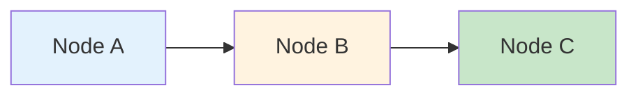

**Default**: Nodes execute one after another

#### Parallel Execution
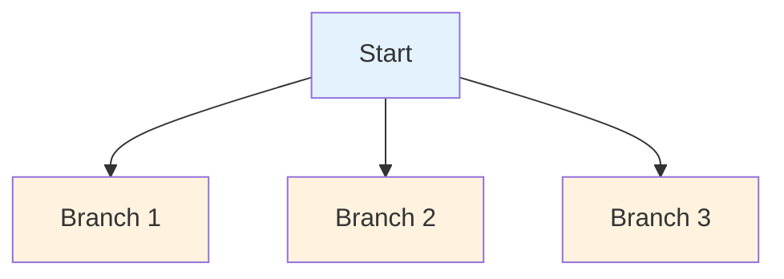

**Use Case**: Call multiple APIs simultaneously

#### Conditional Branching
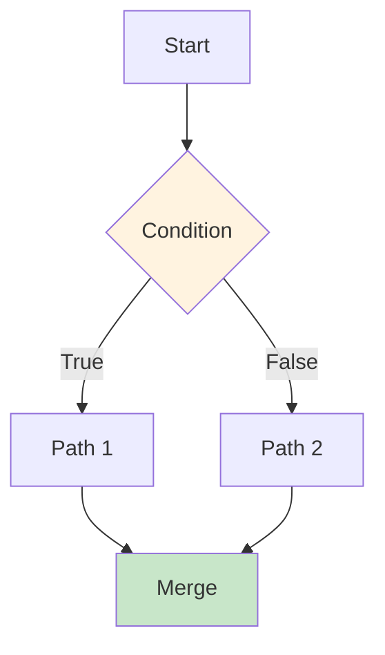

---

## Workflow Design Patterns

### Pattern 1: Simple Linear Workflow

**Use Case**: Direct API call

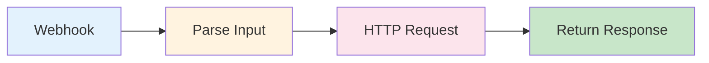

**Characteristics**:
- Simple, straightforward
- No branching
- Good for basic integrations

---

### Pattern 2: Conditional Routing

**Use Case**: Different processing based on input

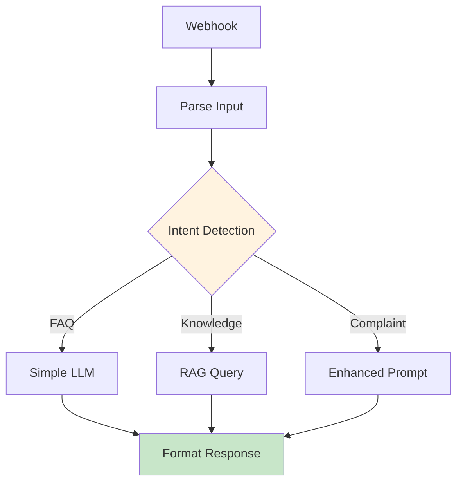

**Characteristics**:
- Multiple execution paths
- Routing logic
- Converges at the end

---

### Pattern 3: Error Handling with Fallback

**Use Case**: Resilient API calls

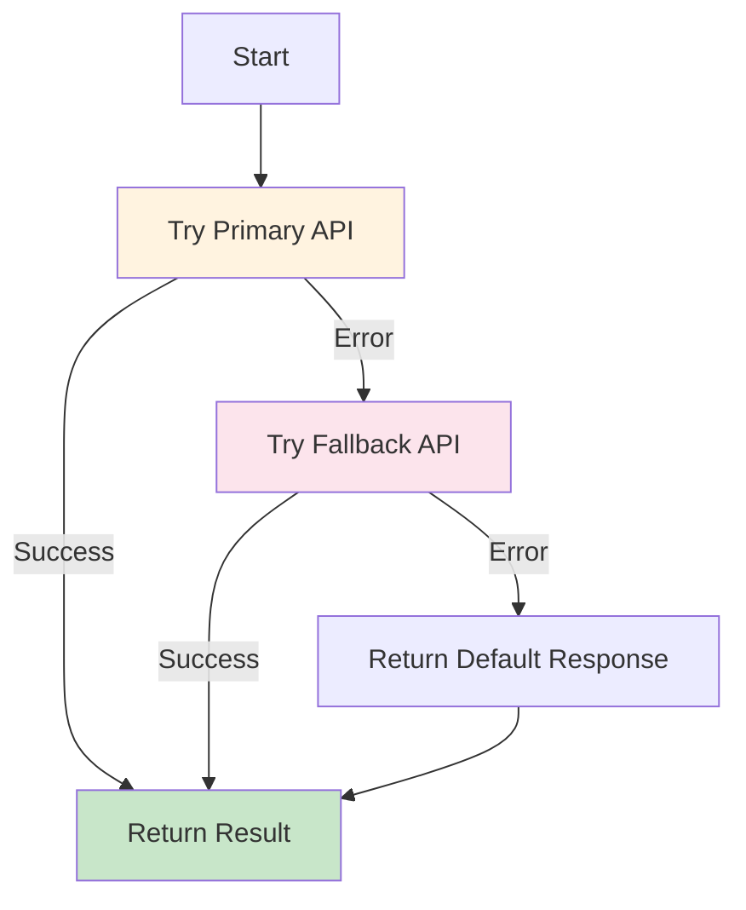

**Implementation**:
- Use "Continue On Fail" setting
- IF node checks for errors
- Provide graceful degradation

---

## Best Practices

### 1. Naming Conventions

✅ **Good**:
- "Parse User Input"
- "LLM Call - GPT-4"
- "Vector Search - Knowledge Base"

❌ **Bad**:
- "HTTP Request 1"
- "Code"
- "IF"

**Why**: Clear names make debugging easier

---

### 2. Error Handling

✅ **Do**:
- Set "Continue On Fail" for non-critical nodes
- Check for errors with IF node
- Log errors for analysis
- Provide fallback responses

**Example**:
```javascript
// Check if LLM call succeeded
if ($node["LLM Call"].json.error) {
  return { response: "Sorry, I'm experiencing issues. Please try again." };
}
```

---

### 3. Data Validation

✅ **Validate early**:
```javascript
// Validate input at start of workflow
if (!$json.message || $json.message.trim() === '') {
  throw new Error('Message is required');
}
```

---

### 4. Testing

✅ **Test incrementally**:
1. Build workflow node by node
2. Test each node individually
3. Use "Execute Node" instead of full workflow
4. Check data structure at each step

---

### 5. Performance

✅ **Optimize**:
- Minimize HTTP requests (batch when possible)
- Use caching for repeated queries
- Set appropriate timeouts
- Limit LLM max_tokens

---

### 6. Version Control

✅ **Export workflows**:
- Export as JSON regularly
- Commit to Git
- Document changes
- Tag versions

**Command**:
```bash
# Export workflow
n8n export:workflow --id=1 --output=workflow.json

# Import workflow
n8n import:workflow --input=workflow.json
```

---

## Key Takeaways

1. **N8N is Visual**: Build workflows without code (mostly)
2. **Nodes are Modular**: Each node has a specific purpose
3. **Data Flows Through**: Understand `$json`, `$node`, `$env`
4. **Built for AI**: LangChain integration makes GenAI easy
5. **Production-Ready**: Self-hosted, scalable, version-controlled

**Remember**: N8N is a tool - understanding data flow and node types is key to building effective workflows.

---

## Next Steps

- Explore N8N UI hands-on
- Build simple workflows
- Learn LLM integration patterns
- Implement RAG workflows

**Further Reading**:
- [N8N Official Documentation](https://docs.n8n.io/)
- [N8N LangChain Integration](https://docs.n8n.io/integrations/builtin/cluster-nodes/root-nodes/n8n-nodes-langchain/)
- [N8N Community Workflows](https://n8n.io/workflows)