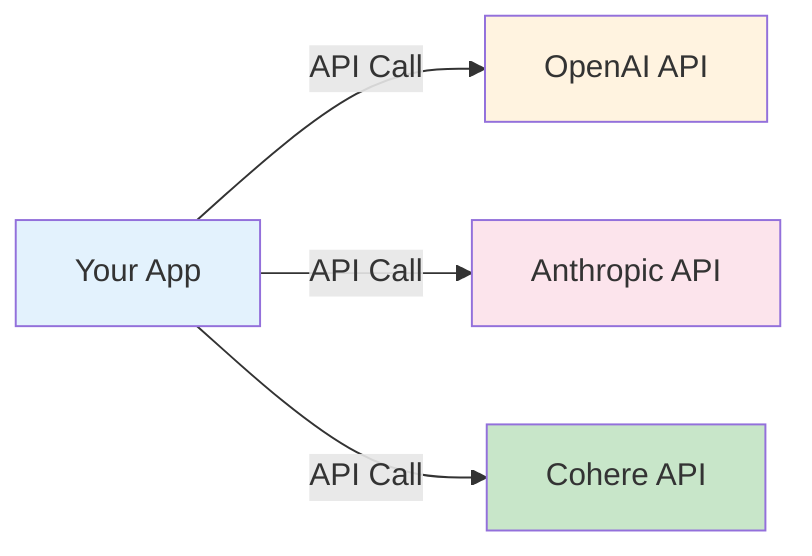
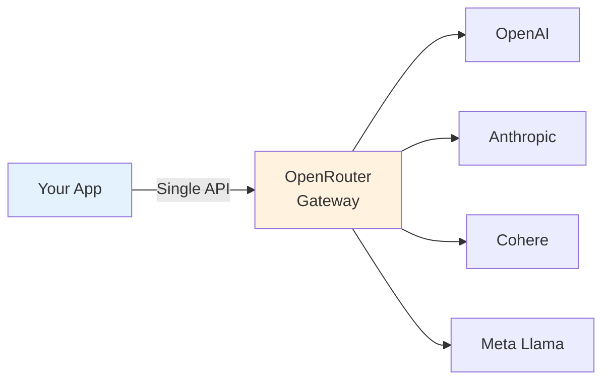
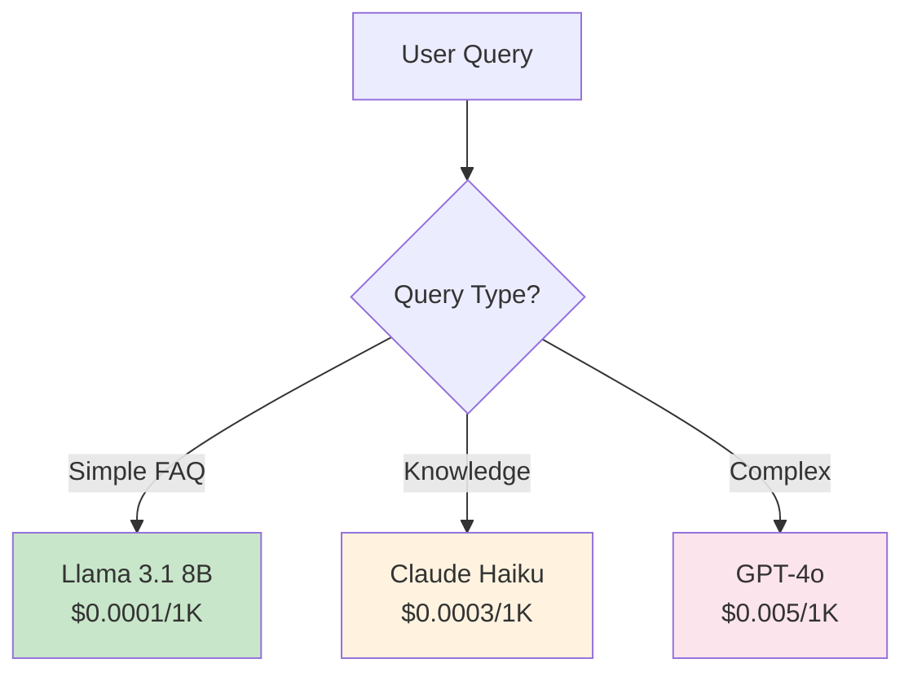

# LLM Integration Patterns

**Module**: Phase 2 - Module 1
**Duration**: 10 minutes reading
**Purpose**: Understand LLM API integration, OpenRouter architecture, and authentication patterns

---

## Table of Contents

- [What is LLM API Integration?](#what-is-llm-api-integration)
- [OpenRouter: Multi-Model Gateway](#openrouter-multi-model-gateway)
- [API Request Structure](#api-request-structure)

---

## What is LLM API Integration?

**Definition**: Connecting your application to Large Language Model providers via HTTP APIs

### Direct Integration vs Gateway

#### Direct Integration


**Challenges**:
- Multiple API keys to manage
- Different request formats
- Different error codes
- Vendor lock-in

#### Gateway Integration (OpenRouter)


**Benefits**:
- ✅ Single API key
- ✅ Unified request format
- ✅ Easy model switching
- ✅ Automatic fallback
- ✅ Cost tracking

---

## OpenRouter: Multi-Model Gateway

### What is OpenRouter?

**OpenRouter** (openrouter.ai) is a unified API gateway that provides access to multiple LLM providers through a single interface.

**Key Features**:
- 50+ models from 10+ providers
- OpenAI-compatible API format
- Automatic fallback and routing
- Cost tracking and limits
- No vendor lock-in

### Supported Models

| Provider | Models | Cost (per 1K tokens) |
|----------|--------|---------------------|
| **Meta** | Llama 3.1 8B, 70B, 405B | $0.0001 - $0.003 |
| **OpenAI** | GPT-4o, GPT-4-turbo | $0.005 - $0.01 |
| **Anthropic** | Claude 3.5 Sonnet, Opus | $0.003 - $0.015 |
| **Google** | Gemini Pro, Flash | $0.0001 - $0.001 |
| **Mistral** | Mistral Large, Medium | $0.001 - $0.002 |

### Why OpenRouter for This Workshop?

✅ **Simplicity**: One API for all models
✅ **Flexibility**: Easy to compare models
✅ **Cost-Effective**: Choose cheap models for simple tasks
✅ **Learning**: Understand model differences hands-on

---

## API Request Structure

### Standard Request Format

OpenRouter uses **OpenAI-compatible** API format:

```http
POST https://openrouter.ai/api/v1/chat/completions
Content-Type: application/json
Authorization: Bearer YOUR_API_KEY
HTTP-Referer: https://yourapp.com
X-Title: Your App Name

{
  "model": "meta-llama/llama-3.1-8b-instruct",
  "messages": [
    {
      "role": "system",
      "content": "You are a helpful customer service agent."
    },
    {
      "role": "user",
      "content": "Jam operasional?"
    }
  ],
  "temperature": 0.5,
  "max_tokens": 150
}
```

### Request Components

#### 1. Endpoint
```
https://openrouter.ai/api/v1/chat/completions
```

**Fixed URL** - same for all models

#### 2. Headers

| Header | Purpose | Required |
|--------|---------|----------|
| `Content-Type` | Specify JSON format | Yes |
| `Authorization` | API key authentication | Yes |
| `HTTP-Referer` | Track usage by app | Recommended |
| `X-Title` | App name for dashboard | Optional |

**Example**:
```http
Authorization: Bearer sk-or-v1-abc123...
HTTP-Referer: https://workshop-brin.com
X-Title: BRIN CS Automation
```

#### 3. Model Selection

**Format**: `provider/model-name`

```json
{
  "model": "meta-llama/llama-3.1-8b-instruct"
}
```

**Common Models**:
```
meta-llama/llama-3.1-8b-instruct       (Fast, cheap)
anthropic/claude-3.5-sonnet           (Reasoning)
openai/gpt-4o                         (General purpose)
google/gemini-pro                     (Google's model)
```

**Model Selection Strategy**:


#### 4. Messages Array

**Roles**:
- `system`: Sets behavior and constraints
- `user`: User's input
- `assistant`: Previous AI responses (for conversation history)

**Example Conversation**:
```json
{
  "messages": [
    {
      "role": "system",
      "content": "You are a customer service agent. Be helpful and concise."
    },
    {
      "role": "user",
      "content": "Jam operasional?"
    },
    {
      "role": "assistant",
      "content": "Kami buka Senin-Jumat, 08:00-17:00 WIB."
    },
    {
      "role": "user",
      "content": "Sabtu buka?"
    }
  ]
}
```

**Why This Format?**
- Maintains conversation context
- LLM understands multi-turn dialogues
- Can reference previous messages

#### 5. Parameters

**Common Parameters**:

```json
{
  "temperature": 0.5,        // Creativity (0-1)
  "max_tokens": 150,         // Response length limit
  "top_p": 0.9,              // Diversity
  "frequency_penalty": 0.0,  // Reduce repetition
  "presence_penalty": 0.0    // Encourage new topics
}
```

**Parameter Guide**:

| Parameter | Range | FAQ Setting | Creative Setting |
|-----------|-------|-------------|-----------------|
| **temperature** | 0-1 | 0.3 | 0.8 |
| **max_tokens** | 1-4096 | 100 | 1000 |
| **top_p** | 0-1 | 0.5 | 0.9 |

---

## Authentication and Security

### API Key Management

#### Getting an API Key

1. Sign up at https://openrouter.ai
2. Navigate to **API Keys** section
3. Click **Create New Key**
4. Copy key (starts with `sk-or-v1-`)

**Example Key**:
```
sk-or-v1-1234567890abcdefghijklmnopqrstuvwxyz
```

## Key Takeaways

1. **OpenRouter Simplifies**: One API for multiple models
2. **Authentication Matters**: Secure API key management

**Remember**: LLM APIs are powerful but require thoughtful integration for production use.

---

## Next Steps

- Get OpenRouter API key
- Test API calls in N8N
- Implement error handling
- Set up cost monitoring

**Further Reading**:
- [OpenRouter Documentation](https://openrouter.ai/docs)
- [OpenAI API Reference](https://platform.openai.com/docs/api-reference)
- [Anthropic API Docs](https://docs.anthropic.com/)