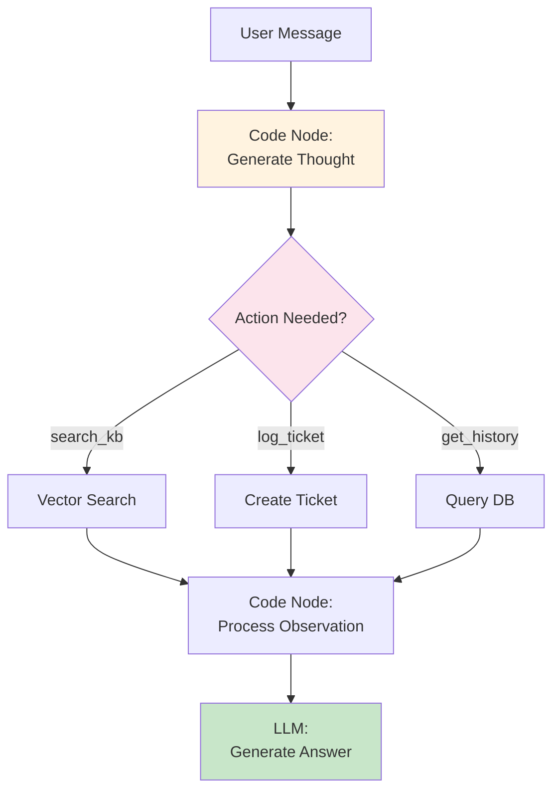

# Advanced Prompting Techniques

**Module**: Phase 2 - Module 2 (Advanced)
**Duration**: 10 minutes reading
**Purpose**: Learn advanced prompting patterns: Chain-of-Thought, Few-Shot, and ReAct

---

## Table of Contents

- [Overview](#overview)
- [Chain-of-Thought (CoT) Prompting](#chain-of-thought-cot-prompting)
- [Few-Shot Learning](#few-shot-learning)
- [ReAct: Reasoning + Acting](#react-reasoning--acting)
- [When to Use Each Technique](#when-to-use-each-technique)
- [Combining Techniques](#combining-techniques)

---

## Overview

Advanced prompting techniques improve LLM performance on complex tasks by:
- Breaking down reasoning steps (CoT)
- Providing examples (Few-Shot)
- Combining thinking and action (ReAct)

**When to Use**:
- Complex multi-step problems
- Specific output format required
- Need transparent reasoning
- High-stakes decisions

---

## Chain-of-Thought (CoT) Prompting

### What is CoT?

**Definition**: Prompting the LLM to show its reasoning process step-by-step before giving the final answer

### Basic vs CoT Comparison

#### Without CoT (Direct Answer)

**Prompt**:
```
User: What's 15% of 250?
```

**Response**:
```
37.5
```

**Problem**: No transparency, hard to verify, may be wrong

---

#### With CoT (Step-by-Step Reasoning)

**Prompt**:
```
Solve this step by step:
1. First, identify what we need to find
2. Show your calculation process
3. Provide the final answer

User: What's 15% of 250?
```

**Response**:
```
Step 1: We need to find 15% of 250
Step 2: 15% = 15/100 = 0.15
Step 3: 0.15 × 250 = 37.5
Answer: 37.5
```

**Benefits**: Transparent, verifiable, builds trust

---

### CoT for Customer Service

**Use Case**: Complex refund eligibility

**Prompt**:
```
Role: Customer service agent

Task: Determine if user is eligible for refund. Think through the criteria step-by-step.

Refund Policy:
- Product must be purchased within 14 days
- Product must be damaged or defective
- User must have proof of purchase

Process:
1. Check purchase date
2. Check product condition reason
3. Verify proof of purchase
4. Make decision with reasoning

User Message: {{user_message}}
```

**Example**:

**Input**: "Saya beli minggu lalu, produk rusak, ada nota pembelian"

**Output**:
```
Mari saya periksa kelayakan refund Anda:

1. Purchase Date: "Minggu lalu" (7 hari) → ✓ Dalam 14 hari
2. Product Condition: "Produk rusak" → ✓ Memenuhi kriteria
3. Proof of Purchase: "Ada nota pembelian" → ✓ Ada bukti

Keputusan: ELIGIBLE untuk refund

Langkah selanjutnya: Silakan kirim foto produk rusak dan nota pembelian untuk proses verifikasi.
```

---

### Zero-Shot CoT

**Trick**: Add "Let's think step by step" to any prompt

**Prompt**:
```
Answer the following question. Let's think step by step.

Question: If a store has 1000 customers/month and customer service handles 30% of queries via automation, saving $2 per query, what's the monthly savings?
```

**Response**:
```
Let's think step by step:

1. Total customers per month = 1000
2. Queries handled by automation = 30% of 1000 = 300 queries
3. Savings per query = $2
4. Total monthly savings = 300 × $2 = $600

Answer: $600 per month
```

**Magic Phrase**: "Let's think step by step" triggers CoT behavior

---

## Few-Shot Learning

### What is Few-Shot?

**Definition**: Providing examples of desired input-output pairs to guide the LLM

### Zero-Shot vs Few-Shot

#### Zero-Shot (No Examples)

**Prompt**:
```
Classify sentiment: positive, negative, or neutral

Text: {{user_message}}
```

**Problem**: May be inconsistent or misunderstand task

---

#### Few-Shot (With Examples)

**Prompt**:
```
Classify sentiment: positive, negative, or neutral

Examples:
Text: "Layanan bagus sekali!"
Sentiment: positive

Text: "Sistem selalu error"
Sentiment: negative

Text: "Jam operasional?"
Sentiment: neutral

Now classify:
Text: {{user_message}}
Sentiment:
```

**Benefits**: More consistent, understands exact format wanted

---

### How Many Examples?

| Shots | When to Use |
|-------|-------------|
| **Zero-Shot** | Simple, well-defined tasks |
| **One-Shot** | When format is unusual |
| **Few-Shot (3-5)** | Complex or ambiguous tasks |
| **Many-Shot (10+)** | Very specific styles or formats |

**Rule of Thumb**: Start with 3 examples, add more if needed

---

### Few-Shot for Intent Classification

**Prompt**:
```
Classify user intent into: faq, knowledge, complaint, or escalation

Examples:

Input: "Jam buka?"
Intent: faq
Reason: Simple question about hours

Input: "Cara submit proposal riset?"
Intent: knowledge
Reason: Requires knowledge base lookup

Input: "Saya komplain, sistem error terus"
Intent: complaint
Reason: User reporting problem with frustration

Input: "Saya butuh kompensasi, ini masalah serius"
Intent: escalation
Reason: Requesting compensation, needs human agent

Now classify:
Input: {{user_message}}
Intent:
Reason:
```

**Benefits**:
- Clear format
- Consistent classification
- Shows reasoning

---

### Few-Shot for Specific Tone

**Use Case**: Match company's communication style

**Prompt**:
```
Respond to customer questions in our company style.

Example 1:
Q: "Jam operasional?"
A: "Hai! Kami buka Senin-Jumat, 08:00-17:00 WIB. Ada yang bisa kami bantu? 😊"

Example 2:
Q: "Bisakah saya reschedule appointment?"
A: "Tentu bisa! Silakan beri tahu jadwal yang lebih cocok, dan kami akan atur ulang. Kapan waktu yang nyaman untuk Anda?"

Example 3:
Q: "Berapa biaya layanan ini?"
A: "Biaya layanan dimulai dari Rp 100.000. Untuk paket spesifik sesuai kebutuhan Anda, boleh saya tahu detail lebih lanjut?"

Now respond:
Q: {{user_message}}
A:
```

**Characteristics Learned**:
- Friendly tone ("Hai!", "😊")
- Confirmation ("Tentu bisa!")
- Follow-up questions
- Specific details when available

---

## ReAct: Reasoning + Acting

### What is ReAct?

**Definition**: A pattern where the LLM alternates between reasoning (thinking) and acting (using tools/taking actions)

### ReAct Pattern Structure

```
Thought: Analyze the situation
Action: Choose what to do
Observation: See the result
Answer: Provide final response
```

---

### ReAct Example: Customer Service with Tools

**Available Actions**:
- `[search_kb]`: Search knowledge base
- `[log_ticket]`: Create support ticket
- `[send_email]`: Send notification
- `[get_user_history]`: Retrieve user's past interactions

**Prompt**:
```
You are a customer service agent with access to these actions:
- [search_kb <query>]: Search knowledge base
- [log_ticket <issue>]: Create support ticket
- [get_user_history <user_id>]: Get user's interaction history

For each user query, use this format:
Thought: Analyze what's needed
Action: Choose appropriate action
Observation: Result from action
Answer: Final response to user

User ID: {{user_id}}
User Message: {{user_message}}
```

---

**Example 1: Knowledge Query**

**Input**: "Cara submit proposal riset?"

**Output**:
```
Thought: User needs procedural information about research proposal submission. This likely requires knowledge base lookup.

Action: [search_kb "research proposal submission process"]

Observation: Found 3 relevant articles:
1. "Panduan Submit Proposal Riset 2025"
2. "Syarat dan Dokumen yang Diperlukan"
3. "Timeline Evaluasi Proposal"

Answer: Berikut cara submit proposal riset:

1. Persiapkan dokumen: proposal lengkap (max 20 halaman), CV peneliti, RAB (Rencana Anggaran Biaya)
2. Login ke portal: https://research.example.com
3. Upload dokumen dalam format PDF
4. Submit sebelum deadline (akhir bulan)
5. Timeline evaluasi: 2-3 bulan

Apakah ada tahap spesifik yang perlu saya jelaskan lebih detail?
```

---

**Example 2: Recurring Complaint**

**Input**: "Sistem error lagi, ini sudah ketiga kalinya!"

**Output**:
```
Thought: User is frustrated about recurring error. Should check if this is a known issue by looking at their history and then escalate.

Action: [get_user_history user_123]

Observation: User complained about system errors on:
- 2025-11-25: "Error saat upload"
- 2025-11-28: "Sistem crash lagi"
- 2025-11-30: Current complaint

Thought: This is indeed a recurring issue (3rd time). Need to escalate and create ticket.

Action: [log_ticket "Recurring system error - user_123 - 3rd occurrence in 5 days"]

Observation: Ticket #45678 created, assigned to Tech Team

Answer: Terima kasih telah melaporkan. Saya melihat ini adalah kali ketiga Anda mengalami masalah ini dalam 5 hari terakhir - saya sangat memahami frustrasi Anda.

Saya telah membuat tiket prioritas (#45678) dan meneruskan langsung ke tim teknis senior. Tim kami akan menghubungi Anda dalam 4 jam untuk investigasi mendalam.

Sebagai kompensasi, kami akan berikan perpanjangan akses 7 hari gratis. Mohon maaf atas ketidaknyamanan ini.
```

---

### ReAct Benefits

✅ **Transparency**: Shows decision-making process
✅ **Tool Use**: Can call external functions
✅ **Debugging**: Easy to see where logic fails
✅ **Adaptive**: Can adjust based on observations

---

### ReAct in N8N Workflow

**Implementation**:



---

## When to Use Each Technique

### Decision Matrix

| Technique | Use When | Example Use Case |
|-----------|----------|-----------------|
| **Chain-of-Thought** | Need transparent reasoning | Refund eligibility, complex calculations |
| **Few-Shot** | Need specific format/style | Intent classification, tone matching |
| **ReAct** | Need tool integration | Multi-step workflows, database queries |

---

### Task-Based Selection

**Simple FAQ**:
```
Technique: None (basic prompt sufficient)
Why: Direct answers, no complexity
```

**Complaint Classification**:
```
Technique: Few-Shot
Why: Need consistent classification format
```

**Refund Decision**:
```
Technique: Chain-of-Thought
Why: Transparent reasoning for business rule
```

**Multi-Step Support**:
```
Technique: ReAct
Why: May need to search KB, check history, create ticket
```

---

## Combining Techniques

### CoT + Few-Shot

**Use Case**: Complex classification with reasoning

**Prompt**:
```
Classify complaint urgency with step-by-step reasoning.

Examples:

Input: "Sistem down, semua user terkena dampak"
Thought: Affects all users, system-wide issue
Urgency: HIGH
Reason: System-wide outage requires immediate attention

Input: "Saya lupa password"
Thought: Individual issue, self-service available
Urgency: LOW
Reason: Can be self-solved with password reset

Now classify:
Input: {{user_message}}
Thought:
Urgency:
Reason:
```

---

### Few-Shot + ReAct

**Use Case**: Tool usage with examples

**Prompt**:
```
You have access to: [search_kb], [create_ticket], [get_history]

Examples of correct tool usage:

Q: "Cara refund?"
Thought: Need policy information
Action: [search_kb "refund policy"]
Answer: Based on KB results

Q: "Error terus, tolong eskalasi"
Thought: User requesting escalation
Action: [create_ticket "User requests escalation for recurring error"]
Answer: Ticket created, team notified

Now handle:
Q: {{user_message}}
```

---

## Key Takeaways

1. **Chain-of-Thought**: Show reasoning steps
   - Improves accuracy
   - Builds trust
   - Easy to verify

2. **Few-Shot**: Provide examples
   - Ensures consistency
   - Matches desired format
   - Reduces ambiguity

3. **ReAct**: Combine thinking and acting
   - Enables tool use
   - Transparent decisions
   - Multi-step workflows

4. **Combine Strategically**: Use multiple techniques when needed

5. **Start Simple**: Only add complexity if basic prompting fails

**Remember**: Advanced techniques add token cost - use only when value justifies cost.

---

## Next Steps

- Identify tasks that benefit from advanced techniques
- Test CoT for complex decisions
- Build few-shot example libraries
- Design ReAct workflows for multi-step processes

**Further Reading**:
- [Chain-of-Thought Prompting Paper](https://arxiv.org/abs/2201.11903)
- [ReAct: Reasoning and Acting Paper](https://arxiv.org/abs/2210.03629)
- [Few-Shot Learning Guide](https://www.promptingguide.ai/techniques/fewshot)