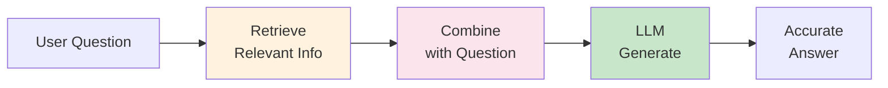
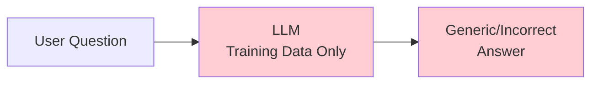
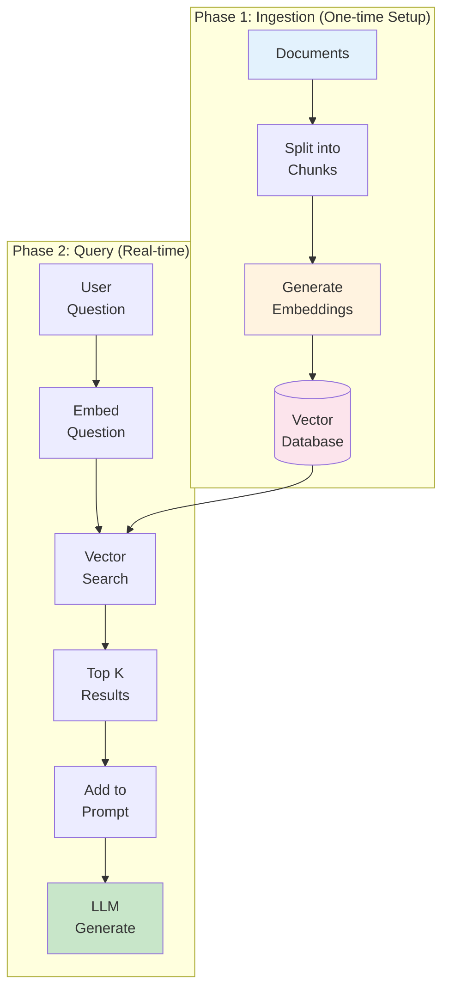
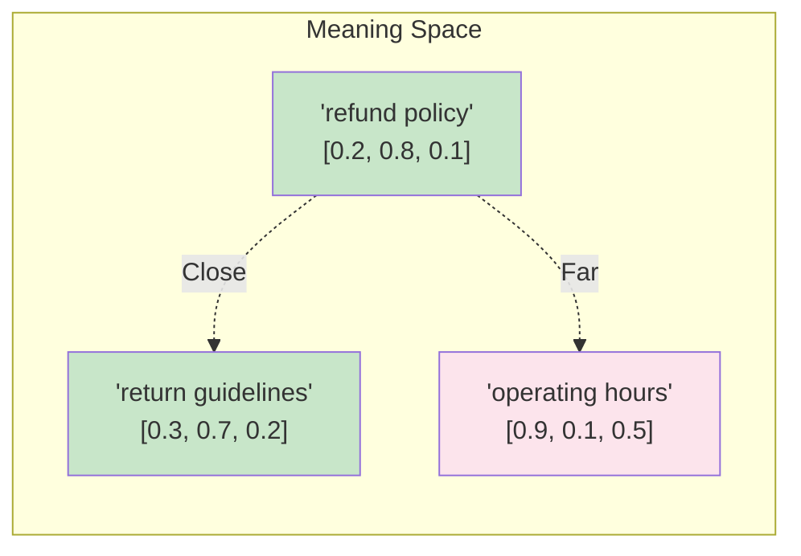
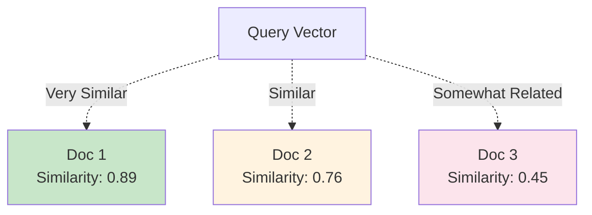
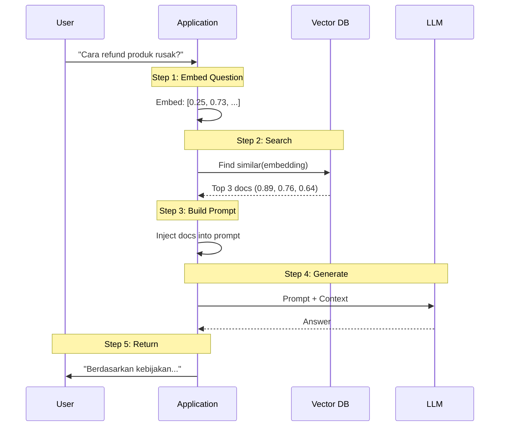
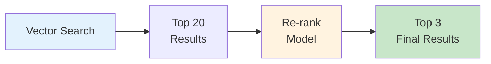

# RAG (Retrieval-Augmented Generation) Concepts

**Module**: Phase 2 - Module 3
**Duration**: 15 minutes reading
**Purpose**: Understand RAG architecture, vector embeddings, and similarity search

---

## Table of Contents

- [What is RAG?](#what-is-rag)
- [Why RAG is Necessary](#why-rag-is-necessary)
- [RAG Architecture](#rag-architecture)
- [Vector Embeddings Explained](#vector-embeddings-explained)
- [Similarity Search](#similarity-search)
- [The RAG Pipeline](#the-rag-pipeline)
- [Best Practices](#best-practices)

---

## What is RAG?

**RAG** = **Retrieval-Augmented Generation**

**Simple Definition**: Combining information retrieval with LLM generation to produce accurate, grounded responses

### The Concept



**Key Idea**: Give the LLM relevant context before asking it to answer

---

## Why RAG is Necessary

### Problem: LLM Limitations

**LLMs don't know**:
- ❌ Your company-specific information
- ❌ Recent events (after training cutoff)
- ❌ Private/proprietary data
- ❌ Frequently updated policies

**Example**:

**Question**: "Apa kebijakan refund kami untuk produk rusak?"

**Without RAG**:
```
LLM Response: "Kebijakan refund umumnya memperbolehkan pengembalian dalam 30 hari..."
```

**Problem**: Generic answer, not your actual policy

**With RAG**:
```
1. Retrieve: Your actual refund policy document
2. Context: "Produk rusak dapat dikembalikan dalam 14 hari..."
3. LLM Response: "Berdasarkan kebijakan kami, produk rusak dapat dikembalikan dalam 14 hari dengan bukti pembelian..."
```

**Result**: Accurate, company-specific answer

---

### Without RAG vs With RAG

#### Scenario: Company Policy Question

**Question**: "Berapa lama proses refund?"

#### Without RAG



**Response**: "Biasanya 7-14 hari kerja" (Guessing based on common practices)

**Problems**:
- ❌ Not specific to your company
- ❌ May be incorrect
- ❌ No source/verification

---

#### With RAG

```mermaid
graph LR
    Q[User Question] --> VDB[(Vector DB<br/>Your Policies)]
    VDB --> CTX[Retrieved:<br/>"Refund 5-7 days"]
    CTX --> LLM[LLM +<br/>Context]
    LLM --> A[Accurate<br/>Answer]

    style VDB fill:#fff3e0
    style CTX fill:#fce4ec
    style LLM fill:#c8e6c9
    style A fill:#c8e6c9
```

**Response**: "Berdasarkan kebijakan kami, proses refund memakan waktu 5-7 hari kerja setelah verifikasi."

**Benefits**:
- ✅ Specific to your company
- ✅ Accurate
- ✅ Grounded in actual documents

---

## RAG Architecture

### Two-Phase Architecture



---

### Phase 1: Ingestion (Setup)

**Goal**: Prepare knowledge base for search

**Steps**:

1. **Load Documents**
   - Text files, PDFs, web pages
   - Company policies, FAQs, procedures

2. **Split into Chunks**
   - Break long documents into smaller pieces
   - Typical size: 300-700 tokens
   - Overlap: 50-100 tokens (maintain context)

3. **Generate Embeddings**
   - Convert text to numerical vectors
   - Use embedding model (OpenAI, etc.)
   - Each chunk → 768-1536 dimensional vector

4. **Store in Vector Database**
   - Save vectors with metadata
   - Enable fast similarity search

**Frequency**: Run once, update when documents change

---

### Phase 2: Query (Real-time)

**Goal**: Find relevant info and generate answer

**Steps**:

1. **Embed Question**
   - Convert user question to vector
   - Use same embedding model as documents

2. **Similarity Search**
   - Find chunks with similar meaning
   - Return top-k most relevant (k=3-5)

3. **Inject into Prompt**
   - Add retrieved chunks to LLM prompt
   - Provide context for generation

4. **Generate Answer**
   - LLM uses context to answer
   - Grounded in retrieved documents

**Frequency**: Every user query

---

## Vector Embeddings Explained

### What are Embeddings?

**Definition**: Numerical representations of text that capture semantic meaning

**Analogy**: Like GPS coordinates for words/sentences in "meaning space"

---

### Text → Numbers

**Example**:

```
Text: "refund policy"
Embedding: [0.023, -0.145, 0.892, 0.334, ..., 0.112]
           ↑ 768 dimensions
```

**Key Property**: Similar meaning = Similar vectors

---

### Semantic Similarity

```python
"refund policy"        → [0.2, 0.8, 0.1, ...]
"return guidelines"    → [0.3, 0.7, 0.2, ...]  # Similar!
"operating hours"      → [0.9, 0.1, 0.5, ...]  # Different!
```

**Distance**: Closer vectors = More similar meaning



---

### Embedding Models

**Common Models**:

| Model | Dimensions | Cost | Quality |
|-------|-----------|------|---------|
| **OpenAI text-embedding-3-small** | 1536 | $ | High |
| **OpenAI text-embedding-3-large** | 3072 | $$ | Very High |
| **Sentence Transformers** | 384-768 | Free | Good |

**For Workshop**: OpenAI text-embedding-3-small
- Good quality
- Affordable
- Standard dimension (1536)

---

### Why Embeddings Work

**Traditional Keyword Search**:
```
Query: "cara refund"
Matches: Only docs containing exact words "cara" or "refund"
Misses: "prosedur pengembalian dana" (same meaning, different words!)
```

**Embedding Search**:
```
Query: "cara refund" → [0.25, 0.73, 0.18, ...]
Finds:
  - "prosedur refund" → [0.26, 0.71, 0.19, ...] ✓
  - "pengembalian dana" → [0.27, 0.69, 0.20, ...] ✓
  - "kebijakan return" → [0.24, 0.74, 0.17, ...] ✓
```

**Benefit**: Semantic search, not just keyword matching

---

## Similarity Search

### How Similarity is Measured

**Common Metric**: Cosine Similarity

```
Similarity = cos(θ) = A · B / (||A|| × ||B||)

Range: -1 to 1
  1.0 = Identical meaning
  0.0 = Unrelated
 -1.0 = Opposite meaning
```

**Visual**:



---

### Top-K Retrieval

**Process**:

1. Calculate similarity between query and all documents
2. Sort by similarity score (highest first)
3. Return top K results (K = 3-5 typically)

**Example**:

**Query**: "Apa kebijakan refund produk rusak?"

**Results**:
```
1. Similarity: 0.89 - "Kebijakan Refund.txt" (chunk 2)
   "Produk rusak dapat dikembalikan dalam 14 hari dengan bukti..."

2. Similarity: 0.76 - "Panduan Layanan.txt" (chunk 5)
   "Untuk refund, hubungi customer service dengan nomor order..."

3. Similarity: 0.64 - "FAQ Umum.txt" (chunk 12)
   "Refund diproses dalam 5-7 hari kerja setelah verifikasi..."
```

**Choice**: Take top 3, inject into prompt

---

### Setting Similarity Threshold

**Problem**: Low-similarity results may be irrelevant

**Solution**: Set minimum threshold

```javascript
const threshold = 0.7;

const relevantDocs = searchResults.filter(doc => doc.similarity >= threshold);

if (relevantDocs.length === 0) {
  return "Saya tidak memiliki informasi tersebut dalam basis pengetahuan kami.";
}
```

**Guidelines**:
- **> 0.8**: Very relevant
- **0.6 - 0.8**: Relevant
- **< 0.6**: Possibly irrelevant (filter out)

---

## The RAG Pipeline

### Complete Flow



---

### Prompt Template with RAG

```
Role: You are a customer service agent

Task: Answer the user's question based on the provided context

Context:
"""
{{retrieved_document_1}}

{{retrieved_document_2}}

{{retrieved_document_3}}
"""

Important:
- ONLY use information from the context above
- If the context doesn't contain the answer, say "Saya tidak memiliki informasi tersebut"
- Be specific and cite relevant details
- Respond in Bahasa Indonesia

User Question: {{user_question}}
```

**Example**:

**Retrieved Context**:
```
Kebijakan Refund: Produk rusak dapat dikembalikan dalam 14 hari
dengan bukti pembelian. Proses refund memakan waktu 5-7 hari kerja
setelah verifikasi.

Syarat Refund: Produk harus dalam kondisi rusak atau cacat produksi.
Kerusakan akibat pemakaian tidak sesuai tidak dapat di-refund.
```

**User Question**: "Berapa lama proses refund produk rusak?"

**LLM Response**: "Berdasarkan kebijakan kami, proses refund untuk produk rusak memakan waktu 5-7 hari kerja setelah verifikasi. Pastikan Anda memiliki bukti pembelian dan produk dikembalikan dalam 14 hari."

---

## Best Practices

### 1. Document Chunking

**Principle**: Balance between too small (loses context) and too large (dilutes relevance)

❌ **Too Small** (100 tokens):
- Loses context
- May not be self-contained

✅ **Optimal** (400-600 tokens):
- Enough context
- Focused topic

❌ **Too Large** (2000 tokens):
- Dilutes relevance score
- Wastes LLM context window

**Chunk Overlap**:
```
Chunk 1: [     Document Text     ]
                      Chunk 2: [     Document Text     ]
         ↑
      Overlap (50-100 tokens)
```

**Why Overlap**: Maintains context across boundaries

---

### 2. Metadata Filtering

**Add Metadata** to chunks:

```json
{
  "text": "Kebijakan refund...",
  "metadata": {
    "source": "RefundPolicy.pdf",
    "section": "Eligibility",
    "date_updated": "2025-11-01",
    "category": "policy",
    "language": "id"
  }
}
```

**Filter Before Search**:
```javascript
// Only search policy documents
const results = vectorDB.search(query, {
  filter: { category: "policy" },
  topK: 3
});
```

**Benefits**:
- More relevant results
- Faster search
- Can filter by date, category, etc.

---

### 3. Re-ranking

**Problem**: Top-K by embedding similarity may not be perfect

**Solution**: Re-rank with cross-encoder



**Process**:
1. Get top 20 from vector search
2. Re-rank with more sophisticated model
3. Return top 3

**When**: High-stakes applications, worth the latency

---

### 4. Hybrid Search

**Combine**: Keyword search + Semantic search

```javascript
// Keyword search
const keywordResults = searchKeywords(query);

// Semantic search
const semanticResults = vectorDB.search(embedding);

// Combine and re-rank
const finalResults = combineAndRerank(keywordResults, semanticResults);
```

**Benefit**: Best of both worlds

---

### 5. Monitor Quality

**Track Metrics**:
- Average similarity score
- User feedback (helpful/not helpful)
- Questions with no good results

**Improve**:
- Add missing documents
- Improve chunking strategy
- Adjust similarity threshold

---

## Key Takeaways

1. **RAG = Retrieval + Generation**: Give LLM relevant context
2. **Embeddings**: Numerical representations of meaning
3. **Similarity Search**: Find semantically related documents
4. **Two Phases**: Ingestion (setup) + Query (real-time)
5. **Chunking Matters**: 400-600 tokens optimal
6. **Set Threshold**: Filter out low-similarity results
7. **Monitor Quality**: Track and improve over time

**Remember**: RAG grounds LLMs in facts, reducing hallucinations.

---

## Next Steps

- Understand vector databases (pgvector)
- Learn chunking strategies
- Implement RAG pipeline in N8N
- Test with real knowledge base

**Further Reading**:
- [RAG Best Practices - Pinecone](https://www.pinecone.io/learn/retrieval-augmented-generation/)
- [Vector Embeddings Explained](https://www.pinecone.io/learn/vector-embeddings/)
- [Chunking Strategies](https://www.pinecone.io/learn/chunking-strategies/)