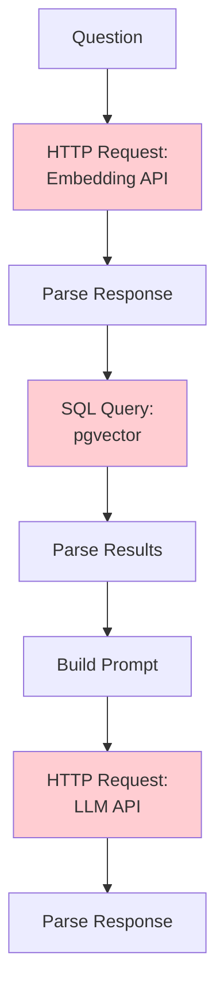
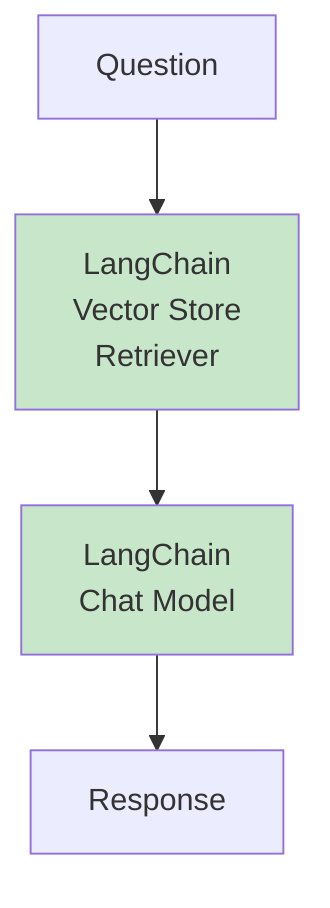
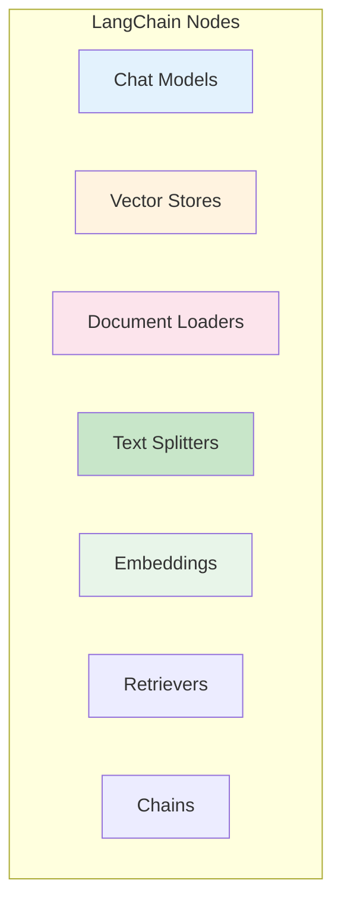
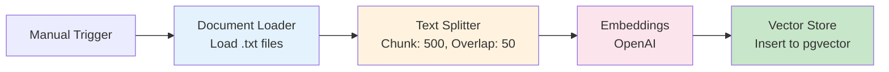
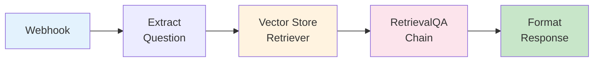
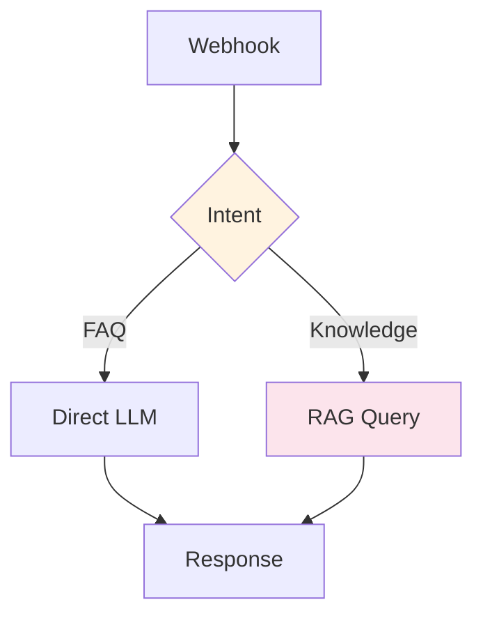
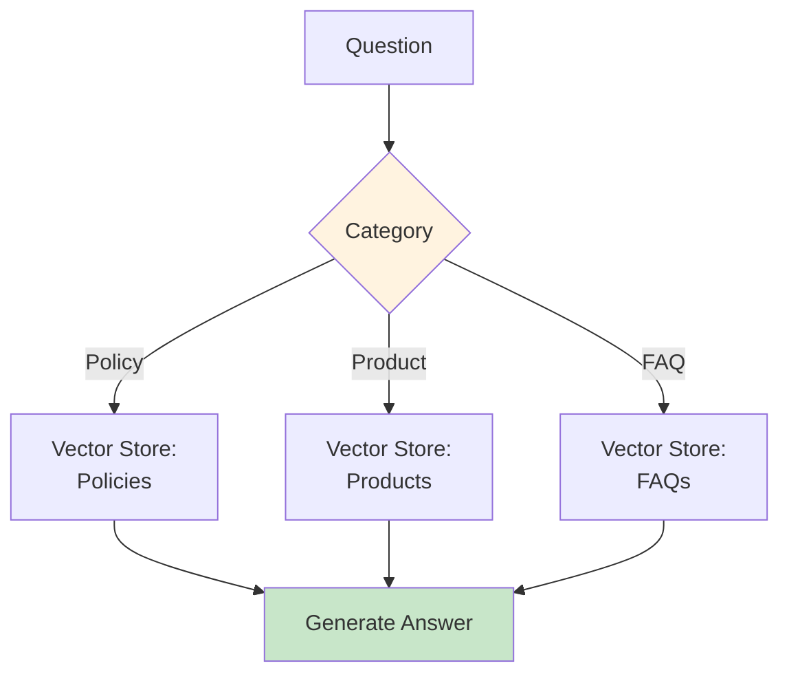

# LangChain Integration in N8N

**Module**: Phase 2 - Module 3
**Duration**: 10 minutes reading
**Purpose**: Understand how N8N integrates LangChain for RAG workflows

---

## Table of Contents

- [What is LangChain?](#what-is-langchain)
- [Why LangChain in N8N?](#why-langchain-in-n8n)
- [LangChain Nodes in N8N](#langchain-nodes-in-n8n)
- [RAG Workflow with LangChain Nodes](#rag-workflow-with-langchain-nodes)
- [Vector Store Integration](#vector-store-integration)
- [Practical Examples](#practical-examples)

---

## What is LangChain?

**LangChain** is a framework for building applications powered by LLMs

**Core Concepts**:
- **Chains**: Sequences of operations
- **Agents**: LLMs that can use tools
- **Memory**: Conversation history management
- **Retrieval**: RAG implementation helpers

**Language**: Originally Python, now has JavaScript version

**Website**: https://langchain.com

---

## Why LangChain in N8N?

### The Problem Without LangChain

**Manual RAG Implementation**:



**Problems**:
- Many manual HTTP requests
- Complex prompt building
- Error handling for each step
- Hard to maintain

---

### The Solution With LangChain

**LangChain RAG Implementation**:



**Benefits**:
- ✅ Pre-built RAG components
- ✅ Automatic error handling
- ✅ Simple configuration
- ✅ No manual API calls

---

### N8N + LangChain Integration

**N8N provides**:
- Visual LangChain node library
- Built-in vector store connectors
- Prompt template management
- Chain composition

**What You Get**:
```
Complex RAG in Python: 100+ lines of code
Same RAG in N8N: 3-5 visual nodes
```

---

## LangChain Nodes in N8N

### Node Categories



---

### 1. Chat Model Nodes

**Purpose**: LLM integration

**Supported Models**:
- OpenAI (GPT-4, GPT-3.5)
- Anthropic (Claude)
- Google (Gemini)
- Ollama (Local models)

**Configuration**:
```yaml
Model: gpt-4o
Temperature: 0.5
Max Tokens: 200
System Message: "You are a helpful assistant"
```

**vs HTTP Request**:
- ✅ No manual API formatting
- ✅ Built-in retry logic
- ✅ Streaming support
- ✅ Conversation memory

---

### 2. Vector Store Nodes

**Purpose**: Store and query embeddings

**Supported Stores**:
- **pgvector** (PostgreSQL)
- Pinecone
- Qdrant
- Chroma
- Weaviate

**Operations**:
- **Insert**: Add documents to vector store
- **Retrieve**: Search similar documents

**Configuration** (pgvector):
```yaml
Connection: PostgreSQL Credentials
Table Name: document_embeddings
Embedding Model: OpenAI text-embedding-3-small
```

---

### 3. Document Loader Nodes

**Purpose**: Load documents from various sources

**Supported Sources**:
- Text files (.txt)
- PDFs (.pdf)
- JSON files
- Web pages (URL)
- CSV files

**Example**:
```yaml
Source: File Path
Path: /knowledge-base/*.txt
Encoding: UTF-8
```

**Output**: Array of documents with content and metadata

---

### 4. Text Splitter Nodes

**Purpose**: Chunk documents for RAG

**Splitter Types**:
- **Character Text Splitter**: Split by character count
- **Recursive Character Splitter**: Tries to split on paragraphs, then sentences
- **Token Splitter**: Split by token count (best for LLMs)

**Configuration**:
```yaml
Type: Recursive Character Text Splitter
Chunk Size: 500
Chunk Overlap: 50
Separators: ["\n\n", "\n", " "]
```

**Why Overlap**: Preserves context across chunks

---

### 5. Embeddings Nodes

**Purpose**: Convert text to vectors

**Supported Models**:
- OpenAI Embeddings
- HuggingFace Embeddings
- Cohere Embeddings

**Configuration**:
```yaml
Model: text-embedding-3-small
Dimensions: 1536
```

**Note**: Use same model for documents and queries

---

### 6. Retriever Nodes

**Purpose**: Search vector store

**Configuration**:
```yaml
Vector Store: pgvector
Top K: 3
Similarity Threshold: 0.7
```

**Output**: Top-K most similar documents

---

### 7. Chain Nodes

**Purpose**: Combine multiple operations

**Common Chains**:
- **RetrievalQA Chain**: RAG query
- **Conversation Chain**: Chat with memory
- **LLM Chain**: Simple prompt → LLM

**Example** (RetrievalQA):
```yaml
Chain Type: RetrievalQA
LLM: GPT-4o
Retriever: Vector Store Retriever
Prompt Template: Custom
```

---

## RAG Workflow with LangChain Nodes

### Ingestion Workflow

**Goal**: Load documents into vector store



**Node Configurations**:

#### 1. Document Loader
```yaml
Node: LangChain Document Loader
Type: Directory Loader
Path: /knowledge-base/
Glob Pattern: **/*.txt
```

#### 2. Text Splitter
```yaml
Node: Recursive Character Text Splitter
Chunk Size: 500
Chunk Overlap: 50
```

#### 3. Embeddings + Vector Store
```yaml
Node: Vector Store Insert
Vector Store: pgvector
Embedding Model: OpenAI text-embedding-3-small
Table: document_embeddings
```

**Run Once**: Populate knowledge base

---

### Query Workflow

**Goal**: Answer questions using RAG



**Node Configurations**:

#### 1. Vector Store Retriever
```yaml
Node: Vector Store Retriever
Vector Store: pgvector
Embedding Model: OpenAI text-embedding-3-small
Top K: 3
Similarity Threshold: 0.7
```

**Output**:
```json
[
  {
    "pageContent": "Kebijakan refund...",
    "metadata": { "source": "policy.txt" },
    "similarity": 0.89
  },
  {
    "pageContent": "Syarat refund...",
    "metadata": { "source": "faq.txt" },
    "similarity": 0.76
  }
]
```

#### 2. RetrievalQA Chain
```yaml
Node: RetrievalQA Chain
LLM: GPT-4o
Retriever: [From previous node]
Prompt Template: Custom
```

**Custom Prompt**:
```
Use the following context to answer the question in Bahasa Indonesia.
If you don't know the answer, say "Saya tidak memiliki informasi tersebut".

Context: {context}

Question: {question}

Answer:
```

---

## Vector Store Integration

### pgvector Setup

**Why pgvector?**
- ✅ PostgreSQL extension (familiar)
- ✅ No separate infrastructure
- ✅ Supports metadata filtering
- ✅ Production-ready

---

### Schema

**Automatic Table Creation**:

```sql
CREATE TABLE document_embeddings (
  id SERIAL PRIMARY KEY,
  content TEXT,
  metadata JSONB,
  embedding vector(1536)  -- Dimension matches OpenAI model
);

CREATE INDEX ON document_embeddings
  USING ivfflat (embedding vector_cosine_ops);
```

**N8N handles this automatically**

---

### Querying pgvector

**Similarity Search**:

```sql
-- Manual query (for understanding)
SELECT
  content,
  metadata,
  1 - (embedding <=> $1::vector) AS similarity
FROM document_embeddings
WHERE 1 - (embedding <=> $1::vector) > 0.7  -- Threshold
ORDER BY embedding <=> $1::vector
LIMIT 3;  -- Top K
```

**N8N Vector Store Retriever does this automatically**

---

### Metadata Filtering

**Add Metadata During Ingestion**:

```yaml
Node: Vector Store Insert
Metadata:
  source: "{{ $json.metadata.source }}"
  category: "policy"
  date_updated: "2025-11-30"
  language: "id"
```

**Filter During Retrieval**:

```yaml
Node: Vector Store Retriever
Filter:
  category: "policy"
  language: "id"
```

**SQL Equivalent**:
```sql
WHERE metadata->>'category' = 'policy'
  AND metadata->>'language' = 'id'
```

---

## Practical Examples

### Example 1: Simple RAG Query

**Workflow**:

1. **Webhook** - Receives question
2. **Vector Store Retriever** - Finds top 3 docs
3. **Chat Model** - Generates answer with context
4. **Return** - Sends response

**Retriever Output**:
```json
{
  "documents": [
    "Kebijakan refund: produk rusak 14 hari...",
    "Syarat refund: bukti pembelian...",
    "Proses refund: 5-7 hari kerja..."
  ]
}
```

**Prompt to LLM**:
```
Context:
- Kebijakan refund: produk rusak 14 hari...
- Syarat refund: bukti pembelian...
- Proses refund: 5-7 hari kerja...

Question: Berapa lama proses refund?

Answer in Bahasa Indonesia based on context only.
```

---

### Example 2: Conditional RAG

**Use Case**: Only use RAG for knowledge queries



**Intent Detection** (Code Node):
```javascript
const message = $json.message.toLowerCase();

if (message.includes('cara') ||
    message.includes('kebijakan') ||
    message.includes('prosedur')) {
  return { route: 'rag' };
}

return { route: 'simple' };
```

---

### Example 3: Multi-Source RAG

**Use Case**: Different knowledge bases for different topics



**Implementation**:
- 3 separate pgvector tables
- Route based on detected category
- Each has optimized chunking for content type

---

## Key Takeaways

1. **LangChain Simplifies RAG**: Pre-built components vs manual implementation
2. **N8N LangChain Nodes**: Visual interface for complex operations
3. **pgvector Integration**: No separate vector DB needed
4. **Two Workflows**: Ingestion (setup) + Query (real-time)
5. **Metadata Filtering**: Improve relevance with filters
6. **Prompt Templates**: Control how context is injected

**Remember**: N8N + LangChain = RAG without code

---

## Next Steps

- Explore N8N LangChain nodes hands-on
- Build ingestion workflow
- Test RAG query workflow
- Experiment with different prompt templates

**Further Reading**:
- [N8N LangChain Documentation](https://docs.n8n.io/integrations/builtin/cluster-nodes/root-nodes/n8n-nodes-langchain/)
- [LangChain Official Docs](https://python.langchain.com/)
- [pgvector GitHub](https://github.com/pgvector/pgvector)