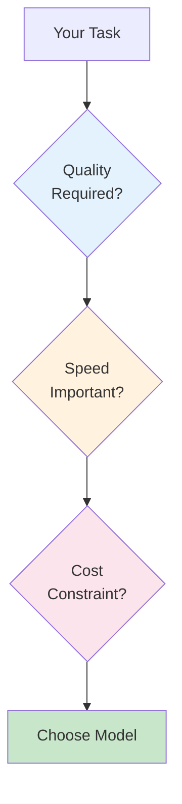
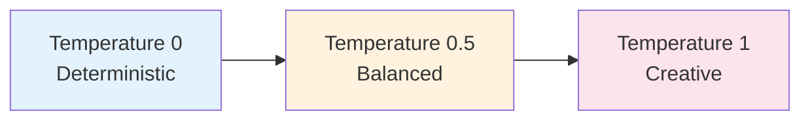
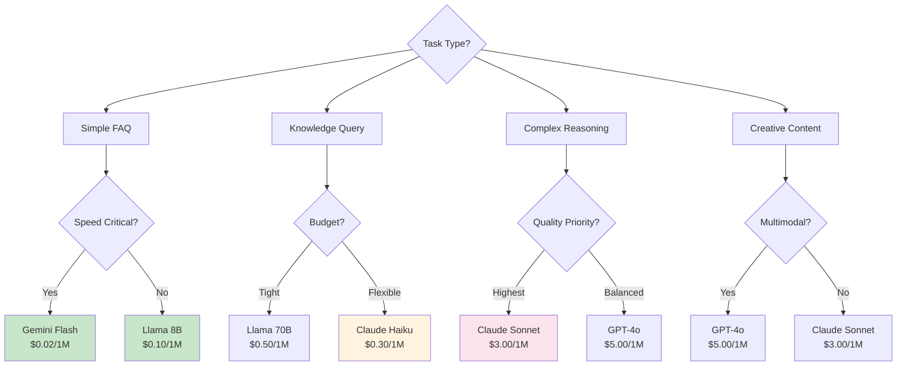
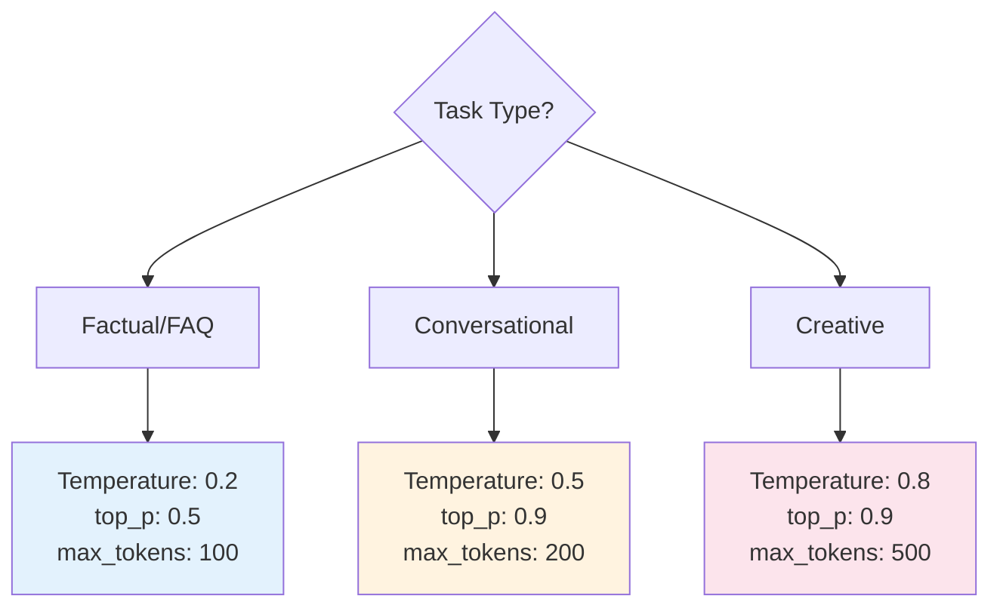

# Model Selection and Parameter Tuning Guide

**Module**: Phase 2 - Cross-Module Reference
**Duration**: 12 minutes reading
**Purpose**: Learn how to select the right LLM model and tune parameters for optimal performance and cost

---

## Table of Contents

- [Overview](#overview)
- [Model Selection Framework](#model-selection-framework)
- [Model Comparison Matrix](#model-comparison-matrix)
- [Parameter Tuning Guide](#parameter-tuning-guide)
- [Cost Optimization Strategies](#cost-optimization-strategies)
- [Decision Trees](#decision-trees)
- [Real-World Scenarios](#real-world-scenarios)

---

## Overview

**Key Questions**:
1. Which model should I use?
2. What parameters should I set?
3. How can I optimize costs?

**Answer**: It depends on the task

**Principle**: Use the simplest (cheapest) model that meets requirements

---

## Model Selection Framework

### The Three Factors



---

### Factor 1: Quality Requirements

**Low Quality Needs** (Simple FAQ):
- Correct but may be generic
- Consistency more important than creativity
- Basic understanding sufficient

**High Quality Needs** (Complex Analysis):
- Deep reasoning required
- Nuanced understanding
- Creative or empathetic responses

---

### Factor 2: Speed Requirements

**Latency Targets**:
- **< 1 second**: Smaller models (Llama 8B, Haiku)
- **1-3 seconds**: Mid-size models (GPT-3.5, Gemini)
- **3-10 seconds**: Large models acceptable (GPT-4, Claude Sonnet)

**Factors Affecting Speed**:
- Model size (8B vs 70B vs 405B parameters)
- Provider infrastructure
- Request queue length

---

### Factor 3: Cost Constraints

**Daily Budget Examples**:
```
$1/day   → ~200K tokens with Llama 8B
$10/day  → ~2M tokens with Llama or 200K with Claude
$100/day → No constraints for most use cases
```

**Volume Considerations**:
```
100 queries/day   → Cost not a major factor
1,000 queries/day → Consider routing strategy
10,000+ queries/day → Cost optimization critical
```

---

## Model Comparison Matrix

### Popular Models

| Model | Provider | Size | Speed | Quality | Cost/1M tokens | Best For |
|-------|----------|------|-------|---------|---------------|----------|
| **Llama 3.1 8B** | Meta (via OpenRouter) | Small | ⚡⚡⚡ | ⭐⭐⭐ | $0.10 | FAQ, simple tasks |
| **Llama 3.1 70B** | Meta (via OpenRouter) | Large | ⚡⚡ | ⭐⭐⭐⭐ | $0.50 | Balanced tasks |
| **GPT-3.5 Turbo** | OpenAI | Medium | ⚡⚡⚡ | ⭐⭐⭐⭐ | $0.50 | General purpose |
| **GPT-4o** | OpenAI | Large | ⚡⚡ | ⭐⭐⭐⭐⭐ | $5.00 | Complex reasoning |
| **Claude 3 Haiku** | Anthropic | Small | ⚡⚡⚡ | ⭐⭐⭐⭐ | $0.30 | Fast + quality |
| **Claude 3.5 Sonnet** | Anthropic | Large | ⚡⚡ | ⭐⭐⭐⭐⭐ | $3.00 | Reasoning, empathy |
| **Gemini Pro** | Google | Medium | ⚡⚡⚡ | ⭐⭐⭐⭐ | $0.10 | Cost-effective |
| **Gemini Flash** | Google | Small | ⚡⚡⚡ | ⭐⭐⭐ | $0.02 | Cheapest option |

**Note**: Prices as of Nov 2025, may vary

---

### Model Strengths

#### Llama 3.1 8B
✅ **Strengths**:
- Extremely fast
- Very cheap
- Good for Indonesian/Bahasa
- Open source (can self-host)

❌ **Weaknesses**:
- Limited reasoning
- May struggle with complex prompts
- Less creative

**Use For**: FAQ, simple classification, keyword extraction

---

#### Claude 3.5 Sonnet
✅ **Strengths**:
- Excellent reasoning
- Empathetic responses
- Follows instructions well
- Great for long context

❌ **Weaknesses**:
- More expensive
- Slightly slower

**Use For**: Complaints, complex analysis, content generation

---

#### GPT-4o
✅ **Strengths**:
- Versatile (good at everything)
- Multimodal (images, audio)
- Large context window
- Creative

❌ **Weaknesses**:
- Expensive
- Can be verbose

**Use For**: General purpose, when quality is critical

---

#### Gemini Flash
✅ **Strengths**:
- Cheapest option
- Very fast
- Good enough for simple tasks

❌ **Weaknesses**:
- Lower quality than competitors
- Limited reasoning

**Use For**: High-volume, low-complexity tasks

---

## Parameter Tuning Guide

### Temperature

**Definition**: Controls randomness in model outputs



**Detailed Guide**:

| Value | Behavior | Example Use Case | Sample Output |
|-------|----------|------------------|---------------|
| **0.0** | Identical every time | Data extraction, exact answers | "Hours: Mon-Fri 08:00-17:00" |
| **0.1-0.3** | Very consistent | FAQ, customer service | "We're open Mon-Fri, 8am-5pm" |
| **0.4-0.6** | Balanced | General conversations | "Our office hours are Monday through Friday, 8am to 5pm" |
| **0.7-0.9** | Creative, varied | Content generation | "We'd love to see you! Pop by anytime Mon-Fri between 8-5" |
| **1.0+** | Very random | Experimental, brainstorming | Unpredictable, may be incoherent |

**Test Example**:

**Prompt**: "Jam operasional?"

**Temperature 0.2** (3 runs):
1. "Kami buka Senin-Jumat, 08:00-17:00 WIB"
2. "Kami buka Senin-Jumat, 08:00-17:00 WIB"
3. "Kami buka Senin-Jumat, 08:00-17:00 WIB"

**Temperature 0.8** (3 runs):
1. "Layanan kami tersedia Senin-Jumat, 8 pagi sampai 5 sore"
2. "Kami beroperasi setiap hari kerja dari jam 8 hingga 17:00"
3. "Silakan kunjungi kami Senin-Jumat, pukul 08:00-17:00 WIB"

---

### max_tokens

**Definition**: Maximum length of response

**Guidelines**:

| Tokens | ~Words | ~Characters | Use Case |
|--------|--------|-------------|----------|
| **50** | 35-40 | 150-200 | Very short answers |
| **100** | 70-80 | 300-400 | FAQ responses |
| **200** | 140-160 | 700-800 | Detailed explanations |
| **500** | 350-400 | 1750-2000 | Long-form content |
| **1000+** | 700+ | 3500+ | Articles, documentation |

**Cost Impact**:
```
Query with max_tokens=1000 costs 10x more than max_tokens=100
(if full limit is used)
```

**Best Practice**: Set as low as possible for task

**Example Settings**:
```yaml
FAQ Handler:
  max_tokens: 100

Knowledge Query:
  max_tokens: 250

Complaint Response:
  max_tokens: 200

Content Generation:
  max_tokens: 800
```

---

### top_p (Nucleus Sampling)

**Definition**: Limits word choices to top probability mass

**How It Works**:
```
top_p = 0.1: Only consider top 10% most probable words
top_p = 0.9: Consider top 90% most probable words
top_p = 1.0: Consider all words
```

**Guidelines**:

| Value | Effect | Use With |
|-------|--------|----------|
| **0.1-0.3** | Very focused | Low temperature (0.1-0.3) |
| **0.5-0.7** | Moderately diverse | Medium temperature (0.4-0.6) |
| **0.9-1.0** | Maximum diversity | High temperature (0.7-0.9) |

**Interaction with Temperature**:
- **High temp + Low top_p**: Creative but coherent
- **Low temp + High top_p**: Consistent but varied phrasing
- **High temp + High top_p**: Very creative/random
- **Low temp + Low top_p**: Very deterministic

---

### presence_penalty & frequency_penalty

**presence_penalty** (-2.0 to 2.0):
- Penalizes tokens that have appeared (topics)
- Positive values → Encourage new topics
- Negative values → Stay on topic

**frequency_penalty** (-2.0 to 2.0):
- Penalizes tokens based on frequency
- Positive values → Reduce repetitive phrases
- Negative values → Allow repetition

**Customer Service Settings**:
```json
{
  "presence_penalty": 0.6,   // Encourage variety
  "frequency_penalty": 0.3   // Reduce exact repetition
}
```

**Avoid Overuse**: High values (> 1.5) can make responses incoherent

---

## Cost Optimization Strategies

### Strategy 1: Task-Based Routing

**Principle**: Use cheapest model that meets requirements

```javascript
function selectModel(query, intent) {
  // Simple FAQ - cheapest model
  if (intent === 'faq') {
    return {
      model: 'meta-llama/llama-3.1-8b-instruct',
      temperature: 0.3,
      maxTokens: 100,
      costPer1M: 0.10
    };
  }

  // Knowledge query - mid-tier
  if (intent === 'knowledge') {
    return {
      model: 'anthropic/claude-3-haiku',
      temperature: 0.5,
      maxTokens: 250,
      costPer1M: 0.30
    };
  }

  // Complaint - best quality
  if (intent === 'complaint') {
    return {
      model: 'anthropic/claude-3.5-sonnet',
      temperature: 0.5,
      maxTokens: 200,
      costPer1M: 3.00
    };
  }

  // Default: balanced model
  return {
    model: 'openai/gpt-3.5-turbo',
    temperature: 0.5,
    maxTokens: 150,
    costPer1M: 0.50
  };
}
```

**Cost Savings**:
```
Scenario: 1000 queries/day
- 70% FAQ (700 queries)
- 20% Knowledge (200 queries)
- 10% Complaint (100 queries)

All GPT-4o ($5/1M, avg 200 tokens):
1000 * 200/1000000 * $5 = $1/day = $30/month

Smart Routing:
700 * 100/1000000 * $0.10 = $0.007  (FAQ)
200 * 250/1000000 * $0.30 = $0.015  (Knowledge)
100 * 200/1000000 * $3.00 = $0.060  (Complaint)
Total: $0.082/day = $2.46/month

Savings: 92% ($27.54/month)
```

---

### Strategy 2: Caching

**Pattern**: Cache frequent identical queries

```javascript
const cache = new Map();
const CACHE_TTL = 3600000; // 1 hour

async function getResponse(query) {
  const cacheKey = query.toLowerCase().trim();

  // Check cache
  if (cache.has(cacheKey)) {
    const cached = cache.get(cacheKey);
    if (Date.now() - cached.timestamp < CACHE_TTL) {
      return { response: cached.data, fromCache: true };
    }
  }

  // Call LLM
  const response = await callLLM(query);

  // Store in cache
  cache.set(cacheKey, {
    data: response,
    timestamp: Date.now()
  });

  return { response, fromCache: false };
}
```

**Expected Savings**: 40-60% for common queries

---

### Strategy 3: Dynamic max_tokens

**Principle**: Adjust length limit based on query complexity

```javascript
function estimateRequiredTokens(query, intent) {
  if (intent === 'faq') {
    return 100; // Short answer
  }

  if (query.includes('bagaimana') || query.includes('jelaskan')) {
    return 300; // Detailed explanation requested
  }

  if (query.length > 200) {
    return 250; // Complex query may need longer response
  }

  return 150; // Default
}
```

---

## Decision Trees

### Decision Tree: Model Selection



---

### Decision Tree: Parameter Settings



---

## Real-World Scenarios

### Scenario 1: High-Volume FAQ Bot

**Requirements**:
- 5,000 queries/day
- Simple questions
- Budget: $50/month

**Solution**:
```yaml
Model: meta-llama/llama-3.1-8b-instruct
Temperature: 0.3
max_tokens: 80
top_p: 0.5
Cache: Enabled (1 hour TTL)

Expected Cost:
- Without cache: 5000 * 80/1M * $0.10 = $0.04/day = $1.20/month
- With cache (50% hit): $0.60/month

Result: Well under budget ✓
```

---

### Scenario 2: Customer Complaint Handler

**Requirements**:
- 100 complaints/day
- Empathetic, quality responses
- Budget: $100/month

**Solution**:
```yaml
Model: anthropic/claude-3.5-sonnet
Temperature: 0.5
max_tokens: 250
presence_penalty: 0.6
frequency_penalty: 0.3

Expected Cost:
100 * 250/1M * $3.00 = $0.075/day = $2.25/month

Result: Excellent quality, under budget ✓
```

---

### Scenario 3: Mixed Use Case (Routing)

**Requirements**:
- 1,000 queries/day
- 60% FAQ, 30% knowledge, 10% complex
- Budget: $30/month

**Solution**:
```yaml
FAQ (600/day):
  Model: gemini-flash
  max_tokens: 100
  Cost: $0.012/day

Knowledge (300/day):
  Model: claude-haiku
  max_tokens: 200
  Cost: $0.018/day

Complex (100/day):
  Model: gpt-4o
  max_tokens: 300
  Cost: $0.15/day

Total: $0.18/day = $5.40/month

Result: Optimized routing, under budget ✓
```

---

## Key Takeaways

1. **Match Model to Task**: Don't use GPT-4 for simple FAQ
2. **Start Cheap**: Begin with smaller models, upgrade if needed
3. **Route Intelligently**: 70-90% of queries can use cheap models
4. **Tune Parameters**: Temperature and max_tokens affect cost and quality
5. **Cache Aggressively**: 40-60% savings on common queries
6. **Monitor and Optimize**: Track costs, adjust routing logic

**Formula for Success**:
```
Right Model + Right Parameters + Smart Caching = Quality + Cost Savings
```

---

## Next Steps

- Test different models with your use cases
- Benchmark quality vs cost
- Implement routing logic
- Monitor and iterate

**Further Reading**:
- [OpenRouter Model Pricing](https://openrouter.ai/models)
- [OpenAI Model Comparison](https://platform.openai.com/docs/models)
- [Anthropic Model Guide](https://docs.anthropic.com/claude/docs/models-overview)