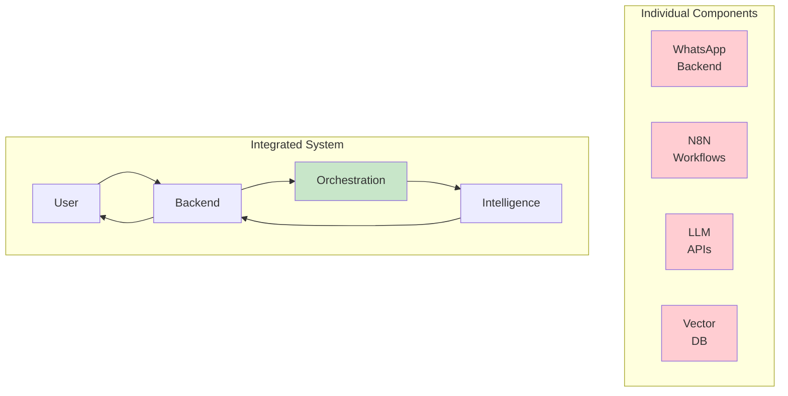
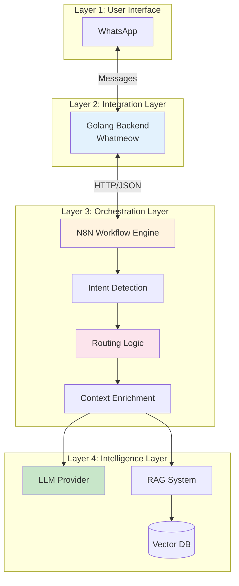
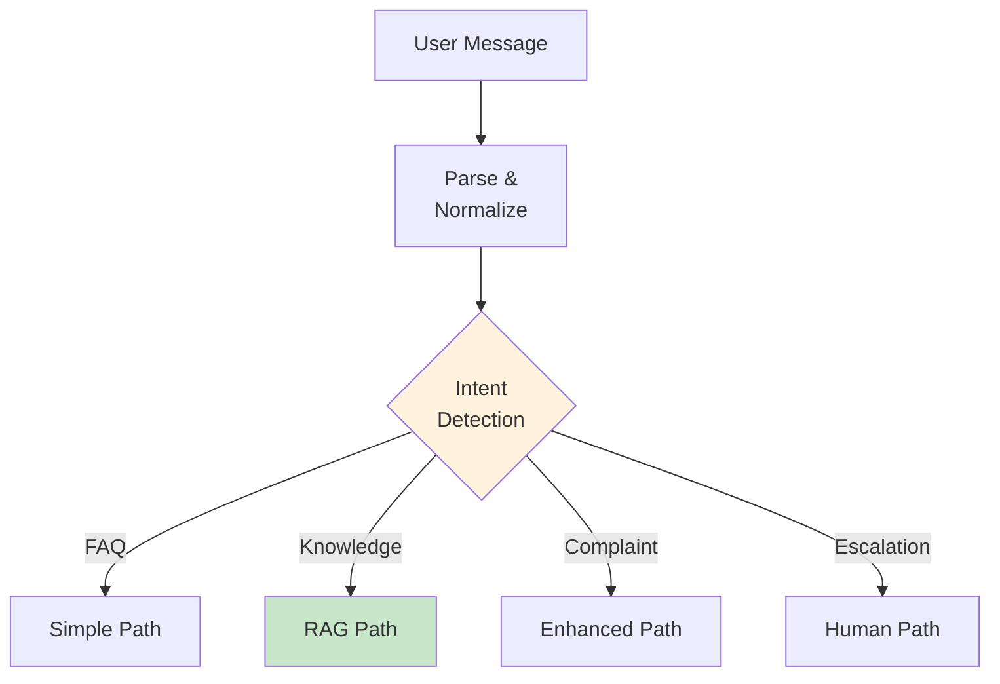
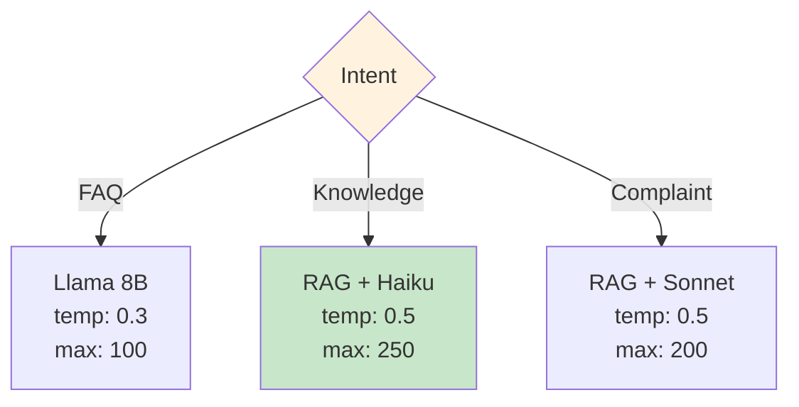
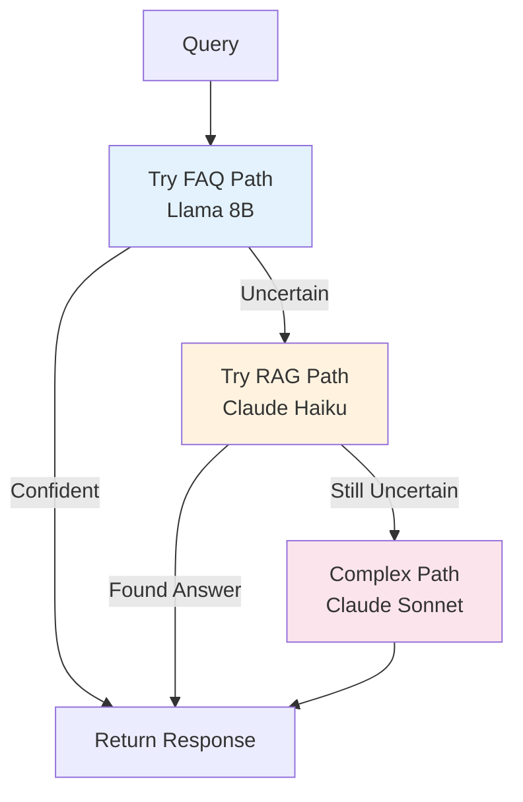
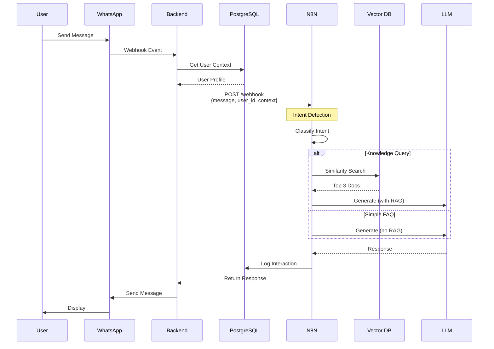
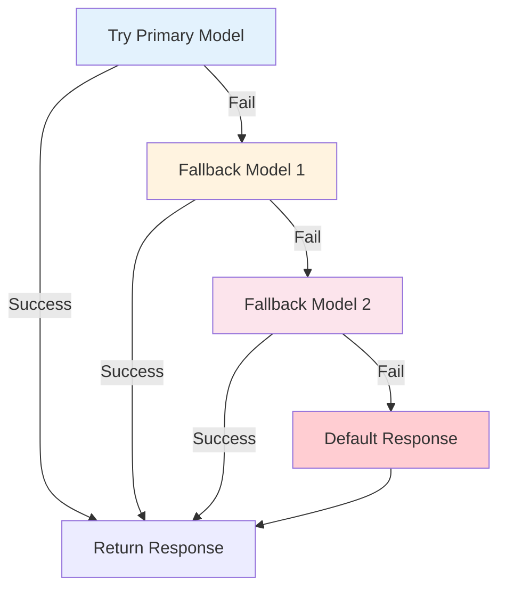

# Integration Patterns for GenAI Systems

**Module**: Phase 3
**Duration**: 12 minutes reading
**Purpose**: Understand component orchestration and integration patterns for production GenAI systems

---

## Table of Contents

- [Overview](#overview)
- [Integration Architecture](#integration-architecture)
- [Intent Detection Pattern](#intent-detection-pattern)
- [Routing Strategies](#routing-strategies)
- [Data Flow Orchestration](#data-flow-orchestration)
- [Error Handling Patterns](#error-handling-patterns)
- [Testing Integration](#testing-integration)

---

## Overview

**Integration**: Connecting independent components into a cohesive system

**Key Challenge**: Components built separately must work together seamlessly



---

## Integration Architecture

### Four-Layer Integration



---

### Integration Points

**Integration Point 1: WhatsApp ↔ Backend**
- **Protocol**: WhatsApp Web API (Whatmeow)
- **Data Format**: WhatsApp message objects
- **Direction**: Bidirectional

**Integration Point 2: Backend ↔ N8N**
- **Protocol**: HTTP/Webhook
- **Data Format**: JSON
- **Direction**: Request-response

**Integration Point 3: N8N ↔ LLM/RAG**
- **Protocol**: HTTP/REST APIs
- **Data Format**: JSON
- **Direction**: Request-response

**Integration Point 4: N8N ↔ Database**
- **Protocol**: PostgreSQL client
- **Data Format**: SQL queries
- **Direction**: Bidirectional

---

## Intent Detection Pattern

### Purpose

Route queries to appropriate handling strategy based on user intent

### Implementation



---

### Keyword-Based Detection

**Simple Implementation** (N8N Code Node):

```javascript
const message = $json.message.toLowerCase().trim();

// FAQ keywords
const faqKeywords = ['jam', 'hours', 'operasional', 'buka', 'tutup', 'kontak', 'alamat'];
if (faqKeywords.some(keyword => message.includes(keyword))) {
  return { intent: 'faq', confidence: 0.9 };
}

// Knowledge keywords
const knowledgeKeywords = ['cara', 'bagaimana', 'how to', 'prosedur', 'kebijakan', 'policy'];
if (knowledgeKeywords.some(keyword => message.includes(keyword))) {
  return { intent: 'knowledge', confidence: 0.85 };
}

// Complaint keywords
const complaintKeywords = ['komplain', 'complaint', 'masalah', 'error', 'rusak', 'kecewa'];
if (complaintKeywords.some(keyword => message.includes(keyword))) {
  return { intent: 'complaint', confidence: 0.9 };
}

// Escalation keywords
const escalationKeywords = ['kompensasi', 'refund', 'uang kembali', 'cancel', 'batal'];
if (escalationKeywords.some(keyword => message.includes(keyword))) {
  return { intent: 'escalation', confidence: 0.95 };
}

// Default: knowledge path (safest)
return { intent: 'knowledge', confidence: 0.5 };
```

---

### LLM-Based Detection

**When Keyword Method Fails**: Use LLM for classification

**Prompt**:
```
Classify the user's intent into one category:
- faq: Simple questions (hours, contact, location)
- knowledge: Requires knowledge base (procedures, policies)
- complaint: Issues, problems, dissatisfaction
- escalation: Requires human (refunds, legal, critical)

User message: "{{message}}"

Output JSON only:
{
  "intent": "string",
  "confidence": number (0-1),
  "reason": "brief explanation"
}
```

**Benefits**:
- More accurate for complex queries
- Handles edge cases better
- Can explain reasoning

**Trade-offs**:
- Adds latency (1-2 seconds)
- Costs money (LLM call)
- May still misclassify

---

### Hybrid Approach

**Best of Both Worlds**:

```javascript
// Step 1: Try keyword detection
const keywordResult = detectByKeywords(message);

if (keywordResult.confidence > 0.8) {
  // High confidence - use keyword result
  return keywordResult;
}

// Step 2: Low confidence - use LLM
const llmResult = await detectByLLM(message);
return llmResult;
```

**Cost Savings**: Only use LLM for ~20% of queries

---

## Routing Strategies

### Strategy 1: Simple Routing

**Pattern**: Route based on intent only



**N8N Implementation**: Switch node with 3-4 branches

---

### Strategy 2: Multi-Factor Routing

**Consider**: Intent + Complexity + User Tier

```javascript
function selectRoute(intent, message, userTier) {
  // VIP users always get best model
  if (userTier === 'vip') {
    return {
      path: 'rag',
      model: 'claude-3.5-sonnet',
      priority: 'high'
    };
  }

  // Simple FAQ
  if (intent === 'faq' && message.length < 50) {
    return {
      path: 'simple',
      model: 'llama-3.1-8b',
      priority: 'normal'
    };
  }

  // Complex knowledge query
  if (intent === 'knowledge' && message.length > 100) {
    return {
      path: 'rag',
      model: 'claude-haiku',
      priority: 'normal'
    };
  }

  // Default
  return {
    path: 'rag',
    model: 'gpt-3.5-turbo',
    priority: 'normal'
  };
}
```

---

### Strategy 3: Cascading Fallback

**Pattern**: Try simple first, escalate if needed



**Cost-Effective**: Most queries handled by cheap model

---

## Data Flow Orchestration

### End-to-End Flow



---

### Data Transformation

**At Each Integration Point**: Transform data format

#### Backend → N8N

**Backend Sends**:
```json
{
  "from": "6281234567890",
  "body": "Jam operasional?",
  "timestamp": 1701234567,
  "messageId": "ABC123"
}
```

**N8N Expects**:
```json
{
  "user_id": "6281234567890",
  "message": "Jam operasional?",
  "timestamp": "2025-11-30T10:30:00Z",
  "metadata": {
    "source": "whatsapp",
    "message_id": "ABC123"
  }
}
```

**Transform** (N8N Set Node):
```javascript
return {
  user_id: $json.from,
  message: $json.body,
  timestamp: new Date($json.timestamp * 1000).toISOString(),
  metadata: {
    source: 'whatsapp',
    message_id: $json.messageId
  }
};
```

---

#### N8N → LLM

**N8N Internal**:
```json
{
  "user_id": "6281234567890",
  "message": "Cara refund?",
  "intent": "knowledge",
  "rag_context": ["Doc 1...", "Doc 2...", "Doc 3..."]
}
```

**LLM API Expects**:
```json
{
  "model": "anthropic/claude-haiku",
  "messages": [
    {
      "role": "system",
      "content": "You are a customer service agent. Use the context provided to answer questions.\n\nContext:\nDoc 1...\nDoc 2...\nDoc 3..."
    },
    {
      "role": "user",
      "content": "Cara refund?"
    }
  ],
  "temperature": 0.5,
  "max_tokens": 250
}
```

**Transform** (N8N HTTP Request Node):
```javascript
{
  "model": "{{ $node['Router'].json.model }}",
  "messages": [
    {
      "role": "system",
      "content": "You are a customer service agent.\n\nContext:\n{{ $json.rag_context.join('\n\n') }}"
    },
    {
      "role": "user",
      "content": "{{ $json.message }}"
    }
  ],
  "temperature": 0.5,
  "max_tokens": 250
}
```

---

## Error Handling Patterns

### Pattern 1: Retry with Exponential Backoff

**Use Case**: Temporary failures (rate limits, timeouts)

```javascript
async function callWithRetry(fn, maxRetries = 3) {
  for (let attempt = 0; attempt < maxRetries; attempt++) {
    try {
      return await fn();
    } catch (error) {
      if (attempt === maxRetries - 1) throw error;

      // Exponential backoff: 1s, 2s, 4s
      const waitTime = Math.pow(2, attempt) * 1000;
      await new Promise(resolve => setTimeout(resolve, waitTime));
    }
  }
}
```

**N8N**: Enable "Retry On Fail" setting

---

### Pattern 2: Fallback Chain

**Use Case**: Model unavailable or fails



**Implementation**:
```javascript
const models = [
  'anthropic/claude-haiku',      // Primary
  'openai/gpt-3.5-turbo',        // Fallback 1
  'meta-llama/llama-3.1-8b'      // Fallback 2
];

for (const model of models) {
  try {
    const response = await callLLM(model, prompt);
    return response;
  } catch (error) {
    console.log(`${model} failed, trying next...`);
  }
}

// All failed
return "Maaf, sistem sedang mengalami gangguan. Silakan coba lagi.";
```

---

### Pattern 3: Circuit Breaker

**Use Case**: Prevent cascading failures

```javascript
class CircuitBreaker {
  constructor(threshold = 5, timeout = 60000) {
    this.failureCount = 0;
    this.threshold = threshold;
    this.timeout = timeout;
    this.state = 'CLOSED'; // CLOSED, OPEN, HALF_OPEN
    this.nextAttempt = Date.now();
  }

  async call(fn) {
    if (this.state === 'OPEN') {
      if (Date.now() < this.nextAttempt) {
        throw new Error('Circuit breaker is OPEN');
      }
      this.state = 'HALF_OPEN';
    }

    try {
      const result = await fn();
      this.onSuccess();
      return result;
    } catch (error) {
      this.onFailure();
      throw error;
    }
  }

  onSuccess() {
    this.failureCount = 0;
    this.state = 'CLOSED';
  }

  onFailure() {
    this.failureCount++;
    if (this.failureCount >= this.threshold) {
      this.state = 'OPEN';
      this.nextAttempt = Date.now() + this.timeout;
    }
  }
}

// Usage
const llmBreaker = new CircuitBreaker();

try {
  const response = await llmBreaker.call(() => callLLM(prompt));
} catch (error) {
  // Use cached response or fallback
}
```

---

## Testing Integration

### Test Scenarios

**Scenario 1: Happy Path**
- Input: "Jam operasional?"
- Expected: FAQ intent → Simple LLM → Response
- Verify: No RAG called, response < 2 seconds

**Scenario 2: RAG Path**
- Input: "Cara submit proposal riset?"
- Expected: Knowledge intent → RAG → LLM with context
- Verify: Vector search returns results, response uses context

**Scenario 3: Complaint Path**
- Input: "Saya komplain, sistem error"
- Expected: Complaint intent → RAG + Enhanced prompt
- Verify: Empathetic tone, logged to DB

**Scenario 4: Error Handling**
- Simulation: Disable LLM API
- Expected: Fallback model or default response
- Verify: System doesn't crash, user gets response

---

### Integration Test Checklist

```yaml
✓ User message reaches N8N
✓ Intent detection works correctly
✓ Routing logic selects correct path
✓ RAG retrieves relevant documents (similarity > 0.7)
✓ LLM generates appropriate response
✓ Response returns to backend
✓ User receives message on WhatsApp
✓ Interaction logged to database
✓ Error handling graceful (no crashes)
✓ Performance acceptable (< 5 seconds end-to-end)
```

---

## Key Takeaways

1. **Integration is Orchestration**: Coordinate independent components
2. **Intent Detection**: Route queries intelligently
3. **Data Transformation**: Each integration point needs format conversion
4. **Error Handling**: Retry, fallback, circuit breaker
5. **Test End-to-End**: Verify complete flow, not just components

**Remember**: Integration is where theory meets practice.

---

## Next Steps

- Build integration workflow in N8N
- Implement intent detection
- Test routing logic
- Add error handling

**Further Reading**:
- Integration Patterns (Enterprise Integration Patterns book)
- Circuit Breaker Pattern
- Microservices Design Patterns