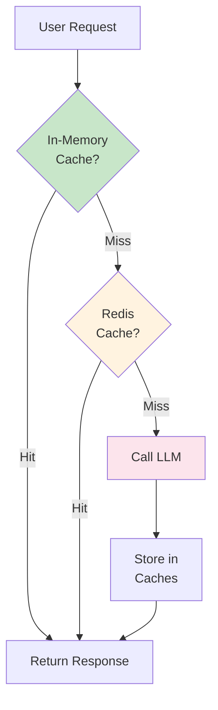
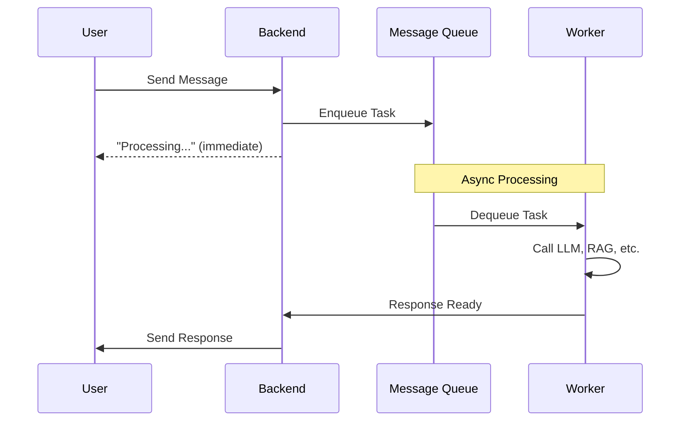
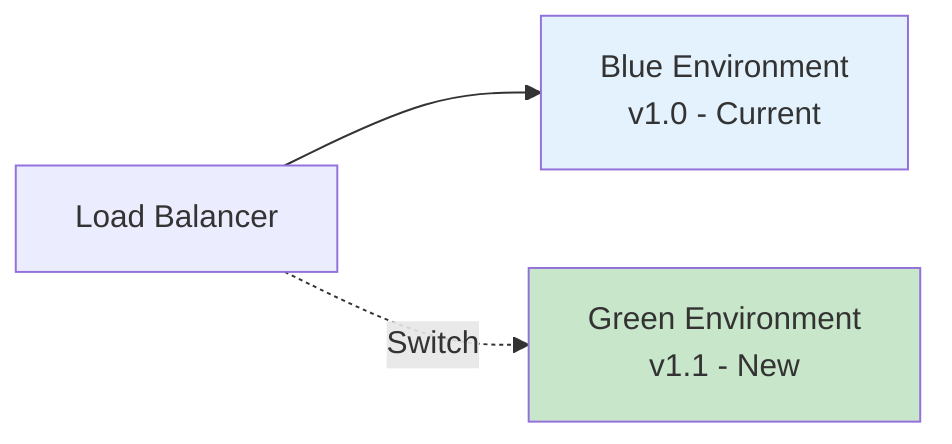
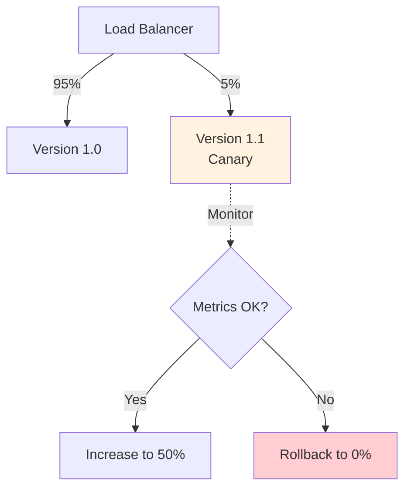

# Production Deployment Best Practices

**Module**: Phase 3
**Duration**: 15 minutes reading
**Purpose**: Understand production readiness requirements and deployment best practices for GenAI systems

---

## Table of Contents

- [Overview](#overview)
- [Pre-Deployment Checklist](#pre-deployment-checklist)
- [Security Best Practices](#security-best-practices)
- [Performance Optimization](#performance-optimization)
- [Monitoring and Observability](#monitoring-and-observability)
- [Cost Management](#cost-management)
- [Deployment Strategies](#deployment-strategies)
- [Operational Excellence](#operational-excellence)

---

## Overview

**Production vs Development**:

| Aspect | Development | Production |
|--------|------------|------------|
| **Users** | 1-5 developers | Hundreds/thousands |
| **Uptime** | Best effort | 99.9%+ required |
| **Security** | Relaxed | Critical |
| **Monitoring** | Optional | Mandatory |
| **Cost** | Negligible | Significant |
| **Error Handling** | Debug messages | Graceful degradation |

**Key Principle**: Production systems must be reliable, secure, observable, and cost-effective

---

## Pre-Deployment Checklist

### Phase 1: Functionality

```yaml
✓ All workflows tested individually
✓ End-to-end flow tested
✓ Error scenarios handled
✓ Edge cases considered
✓ Performance acceptable (< 5s response time)
✓ Quality meets requirements (>80% user satisfaction)
```

---

### Phase 2: Security

```yaml
✓ API keys stored in environment variables (not hardcoded)
✓ Input validation implemented
✓ Rate limiting configured
✓ Authentication/authorization in place
✓ PII data encrypted
✓ Audit logging enabled
✓ Secrets rotation plan established
```

---

### Phase 3: Reliability

```yaml
✓ Error handling for all external calls
✓ Retry logic with exponential backoff
✓ Fallback responses defined
✓ Circuit breakers implemented
✓ Database connection pooling configured
✓ Timeout limits set
```

---

### Phase 4: Observability

```yaml
✓ Logging infrastructure set up
✓ Metrics collection configured
✓ Alerting rules defined
✓ Dashboards created
✓ Health check endpoints implemented
```

---

### Phase 5: Operations

```yaml
✓ Deployment runbook documented
✓ Rollback procedure tested
✓ Backup strategy implemented
✓ On-call rotation established
✓ Incident response plan created
```

---

## Security Best Practices

### 1. API Key Management

**❌ Never Do**:
```javascript
// BAD: Hardcoded key
const apiKey = "sk-or-v1-abc123...";

// BAD: Committed to Git
// .env file in repository
```

**✅ Best Practice**:
```javascript
// GOOD: Environment variable
const apiKey = process.env.OPENROUTER_API_KEY;

// .env file in .gitignore
// Keys managed via secrets manager
```

**Production Setup**:
```yaml
# Use secrets manager
AWS Secrets Manager
Google Secret Manager
HashiCorp Vault
Azure Key Vault

# Rotate keys monthly
- Set calendar reminder
- Update all environments
- Verify functionality
- Deactivate old keys
```

---

### 2. Input Validation

**Validate All User Input**:

```javascript
function validateInput(message) {
  // Check message exists
  if (!message || typeof message !== 'string') {
    throw new Error('Invalid message format');
  }

  // Check length
  if (message.length > 5000) {
    throw new Error('Message too long (max 5000 characters)');
  }

  // Check for suspicious patterns
  const suspiciousPatterns = [
    /ignore previous instructions/i,
    /system:.*role:.*admin/i,
    /prompt:.*override/i
  ];

  for (const pattern of suspiciousPatterns) {
    if (pattern.test(message)) {
      // Log potential prompt injection
      console.warn('Potential prompt injection detected', { message });
      throw new Error('Invalid message content');
    }
  }

  return message.trim();
}
```

---

### 3. Rate Limiting

**Prevent Abuse**:

```javascript
// Per-user rate limit
const userLimits = new Map();

function checkRateLimit(userId) {
  const now = Date.now();
  const userLimit = userLimits.get(userId) || { count: 0, resetAt: now + 60000 };

  if (now > userLimit.resetAt) {
    // Reset window
    userLimit.count = 0;
    userLimit.resetAt = now + 60000;
  }

  userLimit.count++;
  userLimits.set(userId, userLimit);

  // 10 requests per minute
  if (userLimit.count > 10) {
    throw new Error('Rate limit exceeded. Please try again later.');
  }
}
```

**N8N Implementation**:
- Use "Rate Limit" node
- Configure per-user or global limits
- Return appropriate error message

---

### 4. Data Privacy

**PII Handling**:

```javascript
// Mask sensitive data in logs
function sanitizeForLogging(data) {
  const sanitized = { ...data };

  // Mask phone numbers
  if (sanitized.phone) {
    sanitized.phone = sanitized.phone.replace(/\d(?=\d{4})/g, '*');
  }

  // Mask email
  if (sanitized.email) {
    const [user, domain] = sanitized.email.split('@');
    sanitized.email = `${user[0]}***@${domain}`;
  }

  return sanitized;
}

// Example
console.log(sanitizeForLogging({
  phone: '6281234567890',
  email: 'user@example.com',
  message: 'Hello'
}));
// Output: { phone: '628123456****', email: 'u***@example.com', message: 'Hello' }
```

**Database Encryption**:
```sql
-- Encrypt PII columns
CREATE EXTENSION IF NOT EXISTS pgcrypto;

-- Store encrypted
INSERT INTO users (phone, name)
VALUES (
  pgp_sym_encrypt('6281234567890', 'encryption-key'),
  'John Doe'
);

-- Retrieve decrypted
SELECT pgp_sym_decrypt(phone::bytea, 'encryption-key') as phone
FROM users;
```

---

## Performance Optimization

### 1. Caching Strategy

**Multi-Level Caching**:



**Implementation**:

```javascript
// Level 1: In-memory (fastest, smallest)
const memCache = new Map();

// Level 2: Redis (shared across instances)
const redis = require('redis').createClient();

async function getCachedResponse(query) {
  const cacheKey = hashQuery(query);

  // Check in-memory cache
  if (memCache.has(cacheKey)) {
    return { response: memCache.get(cacheKey), source: 'memory' };
  }

  // Check Redis cache
  const cached = await redis.get(cacheKey);
  if (cached) {
    const response = JSON.parse(cached);
    memCache.set(cacheKey, response); // Populate L1
    return { response, source: 'redis' };
  }

  // Cache miss - call LLM
  const response = await callLLM(query);

  // Store in both caches
  memCache.set(cacheKey, response);
  await redis.setex(cacheKey, 3600, JSON.stringify(response)); // 1 hour TTL

  return { response, source: 'llm' };
}
```

**Cache Invalidation**:
```javascript
// Invalidate when knowledge base updates
async function onKnowledgeBaseUpdate() {
  await redis.flushdb(); // Clear Redis
  memCache.clear();      // Clear memory
  console.log('Cache invalidated after KB update');
}
```

---

### 2. Connection Pooling

**Database Connections**:

```javascript
const { Pool } = require('pg');

// Connection pool (not individual connections)
const pool = new Pool({
  host: 'localhost',
  database: 'mydb',
  max: 20,              // Max connections
  idleTimeoutMillis: 30000,
  connectionTimeoutMillis: 2000,
});

// Good: Reuse connection from pool
async function query(sql, params) {
  const client = await pool.connect();
  try {
    return await client.query(sql, params);
  } finally {
    client.release(); // Return to pool
  }
}
```

---

### 3. Async Processing

**Don't Block User**:



**Implementation** (with Redis Queue):
```javascript
const Queue = require('bull');
const messageQueue = new Queue('messages');

// Enqueue
app.post('/message', async (req, res) => {
  const { userId, message } = req.body;

  await messageQueue.add({
    userId,
    message,
    timestamp: Date.now()
  });

  res.json({ status: 'processing' });
});

// Worker
messageQueue.process(async (job) => {
  const { userId, message } = job.data;

  const response = await processMessage(message);

  await sendToUser(userId, response);
});
```

---

## Monitoring and Observability

### 1. Logging

**Structured Logging**:

```javascript
const winston = require('winston');

const logger = winston.createLogger({
  format: winston.format.json(),
  transports: [
    new winston.transports.File({ filename: 'error.log', level: 'error' }),
    new winston.transports.File({ filename: 'combined.log' })
  ]
});

// Log with context
logger.info('Message processed', {
  user_id: userId,
  intent: 'knowledge',
  model: 'claude-haiku',
  tokens: 250,
  latency_ms: 2341,
  timestamp: new Date().toISOString()
});
```

**What to Log**:
```yaml
✓ All user queries (sanitized)
✓ Intent detection results
✓ Model selection decisions
✓ LLM API calls (model, tokens, latency)
✓ RAG retrieval (similarity scores)
✓ Errors and exceptions
✓ Performance metrics
```

---

### 2. Metrics

**Key Metrics to Track**:

```yaml
# Availability
- uptime_percentage
- error_rate (errors / total requests)

# Performance
- response_latency_p50, p95, p99
- llm_api_latency
- vector_search_latency

# Business
- queries_per_day
- unique_users_per_day
- user_satisfaction_score

# Cost
- llm_tokens_used_daily
- estimated_cost_daily
- cost_per_query

# Quality
- intent_detection_accuracy
- rag_retrieval_relevance
- escalation_rate
```

**Prometheus Example**:
```javascript
const prometheus = require('prom-client');

// Define metrics
const httpRequestDuration = new prometheus.Histogram({
  name: 'http_request_duration_seconds',
  help: 'Duration of HTTP requests in seconds',
  labelNames: ['method', 'route', 'status_code']
});

const llmTokens = new prometheus.Counter({
  name: 'llm_tokens_total',
  help: 'Total LLM tokens used',
  labelNames: ['model', 'intent']
});

// Record
httpRequestDuration.labels('POST', '/webhook', '200').observe(2.341);
llmTokens.labels('claude-haiku', 'knowledge').inc(250);
```

---

### 3. Alerting

**Alert Rules**:

```yaml
alerts:
  - name: HighErrorRate
    condition: error_rate > 0.05  # 5%
    duration: 5m
    severity: critical
    action: page_oncall

  - name: SlowResponses
    condition: response_latency_p95 > 10s
    duration: 5m
    severity: warning
    action: notify_slack

  - name: HighCost
    condition: daily_cost > $100
    severity: warning
    action: email_team

  - name: ServiceDown
    condition: uptime == 0
    duration: 1m
    severity: critical
    action: page_oncall + escalate
```

---

### 4. Dashboards

**Essential Dashboards**:

**Dashboard 1: System Health**
```
┌─────────────────────────────────────┐
│ Uptime: 99.95% (last 30 days)      │
│ Error Rate: 0.3%                    │
│ Avg Response Time: 2.4s             │
└─────────────────────────────────────┘

[Graph: Response Time (p50, p95, p99)]
[Graph: Error Rate Over Time]
[Graph: Requests Per Minute]
```

**Dashboard 2: Cost & Usage**
```
┌─────────────────────────────────────┐
│ Today's Cost: $12.34                │
│ MTD Cost: $234.56                   │
│ Tokens Used: 1.2M                   │
└─────────────────────────────────────┘

[Graph: Cost by Model]
[Graph: Daily Token Usage]
[Pie Chart: Queries by Intent]
```

**Dashboard 3: Quality**
```
┌─────────────────────────────────────┐
│ User Satisfaction: 87%              │
│ Escalation Rate: 8%                 │
│ RAG Relevance: 0.82                 │
└─────────────────────────────────────┘

[Graph: Satisfaction Trend]
[Graph: Intent Detection Accuracy]
```

---

## Cost Management

### 1. Budget Alerts

```javascript
// Daily cost tracker
let dailyCost = 0;
const DAILY_BUDGET = 50; // $50/day

function trackCost(tokens, modelCost) {
  const cost = (tokens / 1000000) * modelCost;
  dailyCost += cost;

  if (dailyCost > DAILY_BUDGET * 0.8) {
    sendAlert(`80% of daily budget used: $${dailyCost.toFixed(2)}`);
  }

  if (dailyCost > DAILY_BUDGET) {
    sendCriticalAlert(`Daily budget exceeded: $${dailyCost.toFixed(2)}`);
    // Consider throttling or using cheaper models
  }
}
```

---

### 2. Cost Optimization Tactics

**Tactic 1: Aggressive Caching**
```
Cache Hit Rate: 60%
Savings: 60% of LLM calls eliminated
Example: 1000 queries/day → 400 LLM calls → $2 instead of $5
```

**Tactic 2: Smart Model Routing**
```javascript
function selectCostEffectiveModel(intent, complexity) {
  if (intent === 'faq' && complexity < 0.3) {
    return 'meta-llama/llama-3.1-8b-instruct'; // $0.10/1M
  }

  if (dailyCost > DAILY_BUDGET * 0.9) {
    // Near budget limit - use cheaper models
    return 'google/gemini-flash'; // $0.02/1M
  }

  // Normal routing
  return selectOptimalModel(intent, complexity);
}
```

**Tactic 3: Dynamic max_tokens**
```javascript
function calculateMaxTokens(query, intent) {
  // Simple queries need fewer tokens
  if (intent === 'faq') return 100;

  // Adjust based on query length
  const queryTokens = estimateTokens(query);
  return Math.min(queryTokens * 3, 500);
}
```

---

## Deployment Strategies

### Strategy 1: Blue-Green Deployment

**Zero-Downtime Updates**:



**Process**:
1. Deploy new version to Green environment
2. Test Green environment
3. Switch load balancer to Green
4. Monitor for issues
5. If problems: Switch back to Blue
6. If stable: Decommission Blue

---

### Strategy 2: Canary Deployment

**Gradual Rollout**:



**Steps**:
1. Deploy new version
2. Route 5% traffic to new version
3. Monitor metrics (errors, latency, quality)
4. If good: Increase to 25%, 50%, 100%
5. If bad: Rollback immediately

---

### Strategy 3: Feature Flags

**Gradual Feature Rollout**:

```javascript
const features = {
  'enhanced-rag': {
    enabled: true,
    rollout: 0.2 // 20% of users
  },
  'multi-model-routing': {
    enabled: true,
    rollout: 0.5 // 50% of users
  }
};

function isFeatureEnabled(feature, userId) {
  const config = features[feature];
  if (!config || !config.enabled) return false;

  // Deterministic hash-based rollout
  const hash = hashUserId(userId);
  return (hash % 100) < (config.rollout * 100);
}

// Usage
if (isFeatureEnabled('enhanced-rag', userId)) {
  // Use new RAG implementation
} else {
  // Use old implementation
}
```

---

## Operational Excellence

### 1. Runbooks

**Document Common Operations**:

**Runbook: Deploy New Version**
```markdown
1. Pre-deployment
   - [ ] Run tests: `npm test`
   - [ ] Build Docker image: `docker build -t app:v1.1 .`
   - [ ] Push to registry: `docker push app:v1.1`

2. Deployment
   - [ ] Update docker-compose.yaml
   - [ ] Pull new image: `docker-compose pull`
   - [ ] Start new containers: `docker-compose up -d`

3. Verification
   - [ ] Check health: `curl http://localhost/health`
   - [ ] Check logs: `docker-compose logs -f`
   - [ ] Run smoke tests

4. Rollback (if issues)
   - [ ] Revert docker-compose.yaml
   - [ ] Restart: `docker-compose up -d`
```

---

**Runbook: High Error Rate**
```markdown
1. Identify
   - Check dashboard: Which component is failing?
   - Check logs: What errors are occurring?

2. Triage
   - Is it LLM API down? → Switch to fallback model
   - Is it database down? → Check connection pool
   - Is it N8N down? → Restart service

3. Mitigate
   - If LLM API issue: Enable fallback responses
   - If database issue: Switch to read replica
   - If N8N issue: Restart workflow engine

4. Communicate
   - Update status page
   - Notify team on Slack
   - If major: Email users

5. Resolve
   - Fix root cause
   - Deploy fix
   - Monitor recovery

6. Post-mortem
   - Document what happened
   - Identify prevention measures
   - Update runbooks
```

---

### 2. Backup and Recovery

**Backup Strategy**:

```yaml
# Database backups
PostgreSQL:
  Full Backup: Daily at 2 AM
  Retention: 30 days
  Storage: S3 bucket
  Command: pg_dump -F c -b -v -f backup.dump

# Workflow backups
N8N Workflows:
  Export: After every change
  Version Control: Git repository
  Command: n8n export:workflow --all --output=workflows/

# Configuration backups
Environment Variables:
  Backup: Weekly
  Storage: Encrypted S3
  Restore Procedure: Documented in wiki
```

**Recovery Procedure**:
```markdown
1. Restore database
   ```bash
   pg_restore -d mydb backup.dump
   ```

2. Import workflows
   ```bash
   n8n import:workflow --input=workflows/*.json
   ```

3. Restore environment variables
   ```bash
   cp .env.backup .env
   ```

4. Restart services
   ```bash
   docker-compose restart
   ```

5. Verify functionality
   - Test each workflow
   - Check database connections
   - Run smoke tests
```

---

## Key Takeaways

1. **Security First**: API keys, input validation, rate limiting, encryption
2. **Monitor Everything**: Logs, metrics, alerts, dashboards
3. **Optimize Performance**: Caching, connection pooling, async processing
4. **Manage Costs**: Budget alerts, smart routing, efficient caching
5. **Deploy Safely**: Blue-green, canary, feature flags
6. **Document Operations**: Runbooks, backup procedures, incident response

**Remember**: Production is not development. Plan for failures, monitor constantly, optimize continuously.

---

## Next Steps

- Complete pre-deployment checklist
- Set up monitoring infrastructure
- Create runbooks for common scenarios
- Test disaster recovery procedures
- Conduct load testing

**Further Reading**:
- [The Site Reliability Workbook](https://sre.google/workbook/table-of-contents/)
- [Production-Ready Microservices](https://www.oreilly.com/library/view/production-ready-microservices/9781491965962/)
- [Observability Engineering](https://www.oreilly.com/library/view/observability-engineering/9781492076438/)