# BRIN GenAI Workshop: AI-Powered Customer Service Automation - Technical Specification

**Document ID**: 202511301430-brin-genai-workshop
**Author**: Claude Code
**Date**: 2025-11-30
**Status**: Planning
**Target Audience**: BRIN Mid-Level Developers (39 participants)
**Duration**: 2.5 hours
**Level**: Intermediate (AI-aware, GenAI beginners)

---

## Table of Contents

- [Problem Statement](#problem-statement)
- [Audience Analysis](#audience-analysis)
- [Core Requirements](#core-requirements)
- [Workshop Design Philosophy](#workshop-design-philosophy)
- [Technical Architecture Overview](#technical-architecture-overview)
- [Workshop Structure](#workshop-structure)
  - [Phase 1: Foundation & Context (30 min)](#phase-1-foundation--context-30-min)
  - [Phase 2: Hands-On Core Implementation (90 min)](#phase-2-hands-on-core-implementation-90-min)
  - [Phase 3: Integration & Demo (30 min)](#phase-3-integration--demo-30-min)
- [Hands-On Exercise Design](#hands-on-exercise-design)
- [Technical Stack & Prerequisites](#technical-stack--prerequisites)
- [Decision Log](#decision-log)
- [Success Criteria](#success-criteria)
- [Risk Mitigation](#risk-mitigation)

---

## Problem Statement

**Context**: BRIN developers need practical GenAI implementation skills to build tools that improve customer service efficiency, particularly for handling repetitive tasks and customer complaints.

**Challenge**: The audience (39 mid-level developers) has conceptual AI knowledge but lacks hands-on experience with:
- Generative AI integration
- Workflow automation tools (N8N)
- Production-ready prompt engineering
- RAG (Retrieval-Augmented Generation) implementation

**Constraint**: Must deliver practical, implementable knowledge in 2-3 hours with hands-on exercises suitable for a large group.

**Goal**: Enable BRIN developers to independently build and deploy AI-powered customer service automation systems using Golang, WhatsApp (Whatmeow), N8N, and modern LLM providers.

---

## Audience Analysis

### BRIN Organizational Context

**Research Insights**:
- BRIN is Indonesia's cabinet-level research and innovation agency
- Focus on **practical AI applications** for national impact (agriculture, energy, cybersecurity)
- Leading partnerships with Microsoft, Nvidia, OpenAI, and Cisco
- Culture emphasizes real-world solutions over academic theory
- 12 Research Organizations, 85 Research Centers - structured, systematic approach

### Developer Profile

**Technical Level**:
- ✅ Mid-level developers (comfortable with Golang, databases, APIs)
- ✅ Familiar with AI concepts (LLM, prompts, basic ML)
- ❌ No hands-on GenAI implementation experience
- ❌ Limited or no N8N/automation tool experience

**Learning Preferences** (inferred from BRIN culture):
- Practical, hands-on over theoretical
- Real-world use cases with measurable impact
- Systematic, structured learning
- Government/research focus: reproducible, documented processes

**Workshop Design Implications**:
- Skip AI/LLM basics → Jump to implementation
- Focus on architecture patterns and integration
- Provide reusable templates and workflows
- Emphasize production readiness and best practices

---

## Core Requirements

### Functional Requirements

**REQ-001**: Workshop must cover end-to-end GenAI CS automation system
- WhatsApp integration (Whatmeow) - pre-built backend provided
- N8N workflow automation
- LLM integration (OpenRouter)
- RAG for knowledge retrieval
- Database persistence (PostgreSQL + pgvector)

**REQ-002**: Hands-on exercises must be completable by 39 participants in 90 minutes
- Pre-configured environments/templates
- Clear step-by-step instructions
- Modular checkpoints (can complete partially if delayed)

**REQ-003**: Participants must build working components
- Functional N8N workflow
- Working prompt templates
- RAG query system
- End-to-end message flow

### Non-Functional Requirements

**REQ-004**: Materials must be reusable and extensible
- Documented code templates
- Architecture diagrams
- Decision frameworks (model selection, parameter tuning)

**REQ-005**: Workshop must align with BRIN's practical focus
- Real CS use cases (complaint handling, FAQ automation)
- Cost optimization strategies (model routing)
- Production deployment considerations

---

## Workshop Design Philosophy

### Principles

1. **80/20 Rule**: 80% hands-on implementation, 20% explanation
2. **Practical First**: Start with working examples, explain concepts after
3. **Modular Checkpoints**: Each section produces deployable component
4. **Scale-Friendly**: Exercises work for 1 or 39 participants
5. **BRIN-Aligned**: Focus on national impact use cases (government services, public infrastructure)

### Pedagogical Approach

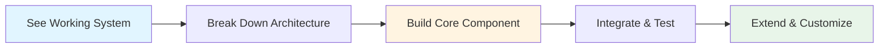

**Flow**:
1. **See**: Demo end-to-end system (5 min)
2. **Understand**: Architecture breakdown (10 min)
3. **Build**: Hands-on implementation (30-40 min per module)
4. **Integrate**: Connect components (15 min)
5. **Extend**: Customize for specific use cases (10 min)

---

## Technical Architecture Overview

### System Architecture

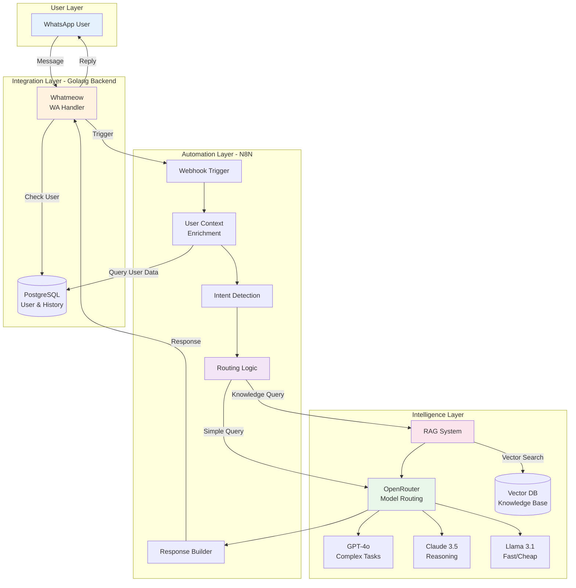

### Data Flow Sequence

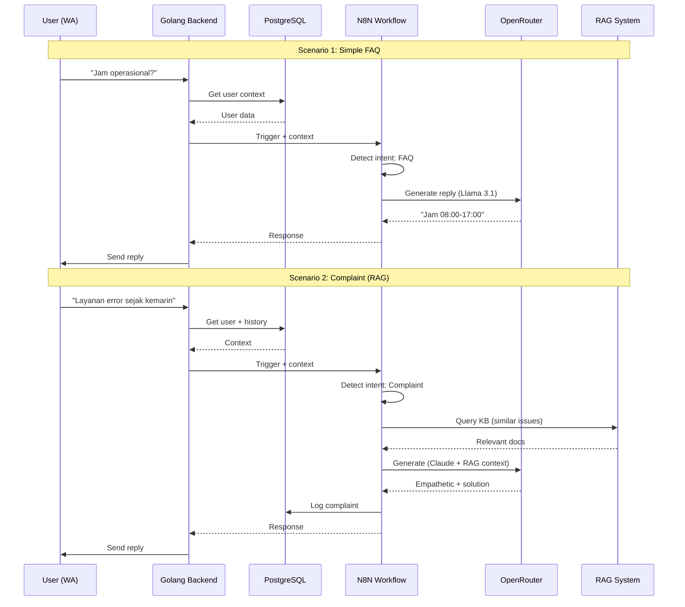

### Workshop Architecture (Simplified for Learning)

For the workshop, we'll use a **staged approach** to manage complexity:

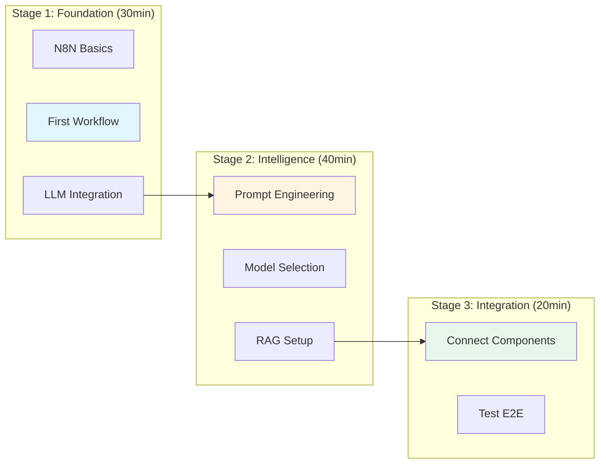

---

## Workshop Structure

### Overall Timeline (150 minutes)

```mermaid
gantt
    title Workshop Timeline
    dateFormat HH:mm
    axisFormat %H:%M

    section Phase 1
    Opening & Demo           :p1, 00:00, 10m
    GenAI Landscape          :p2, 00:10, 10m
    Architecture Overview    :p3, 00:20, 10m

    section Phase 2
    Module 1: N8N + LLM      :m1, 00:30, 30m
    Module 2: Prompt Eng     :m2, 01:00, 25m
    Module 3: RAG            :m3, 01:25, 35m

    section Phase 3
    Integration              :i1, 02:00, 20m
    Demo & Q&A               :i2, 02:20, 10m
```

---

## Phase 1: Foundation & Context (30 min)

### 1.1 Opening: AI → GenAI → Practical Impact (10 min)

**Objective**: Set context and motivate learning

**Content Structure**:

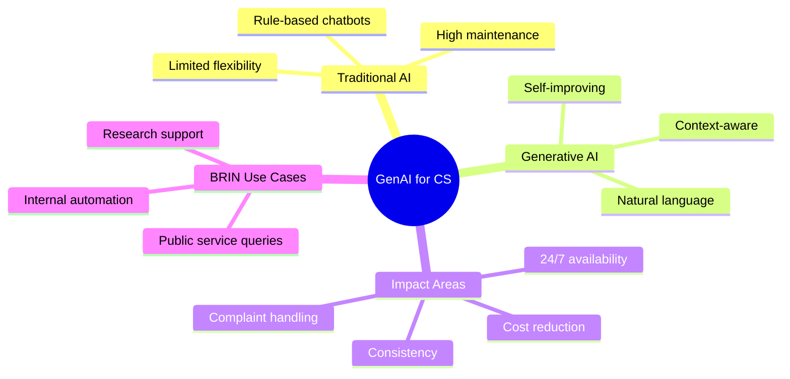

**Talking Points** (5 min presentation + 5 min live demo):
- Traditional CS automation limitations
- GenAI paradigm shift: Generate vs Retrieve
- Real-world impact: 70% ticket reduction (industry benchmark)
- **BRIN-specific**: Government service automation, multilingual support (Bahasa + English)
- **Live Demo**: Show working WhatsApp bot handling complaint

**No Hands-On** (just watching)

---

### 1.2 Architecture Overview (20 min)

**Objective**: Understand system components and integration points

**Content**:

#### Component Breakdown

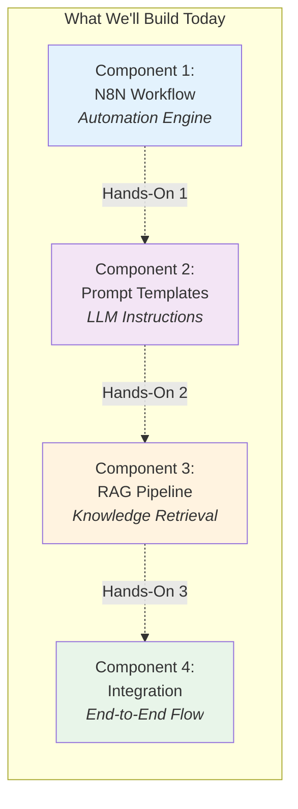

**Explanation** (10 min):
- Why N8N? (vs coding everything in Golang)
- Why OpenRouter? (multi-model, cost optimization)
- Why RAG? (company knowledge + up-to-date info)
- Architecture decisions (see Decision Log)

**Q&A** (5 min)

**Pre-Workshop Setup Check** (5 min):
- Verify Docker is installed and running
- Repository cloned
- OpenRouter API keys distributed
- Run `docker-compose up -d` - verify all services running

---

## Phase 2: Hands-On Core Implementation (90 min)

### Module 1: N8N Workflow + LLM Integration (30 min)

**Objective**: Build working N8N workflow that calls LLM

#### Learning Outcomes:
- Create N8N workflow from scratch
- Integrate OpenRouter API
- Handle webhook triggers
- Parse LLM responses

#### Exercise Structure

**Setup** (5 min):
- Open N8N instance
- Import starter template (basic webhook)

**Hands-On Task** (20 min):

Participants will build this workflow:

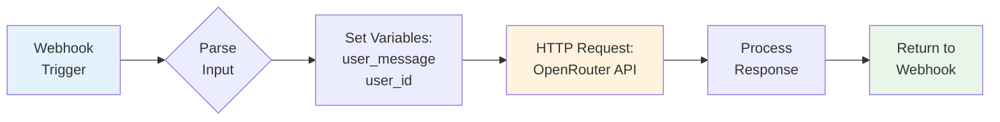

**Step-by-Step Guide** (provided as checklist):

1. ✅ Add Webhook node
2. ✅ Add "Set" node → Extract `message` and `user_id`
3. ✅ Add HTTP Request node
   - URL: `https://openrouter.ai/api/v1/chat/completions`
   - Method: POST
   - Headers: `Authorization: Bearer {{API_KEY}}`
   - Body: (template provided)
4. ✅ Test with Postman/curl
5. ✅ Add response formatter

**Testing** (5 min):
- Send test message
- Verify LLM response
- Debug common issues (API key, JSON format)

**Key Concepts Covered**:
- N8N node types
- API authentication
- JSON payload structure
- Error handling basics

---

### Module 2: Prompt Engineering (25 min)

**Objective**: Master prompt design for CS automation

#### Learning Outcomes:
- Structure effective prompts
- Use prompt templates
- Implement role-based prompting
- Apply constraints and output formatting

#### Exercise Structure

**Theory** (5 min):

Prompt Engineering Framework:

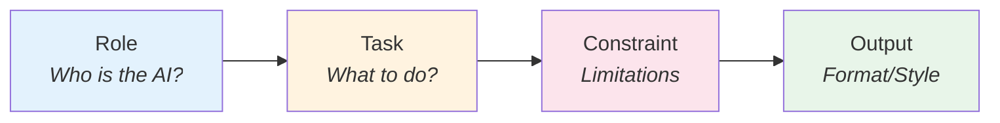

**Hands-On Task** (15 min):

Participants will create 3 prompt templates for different scenarios:

**Template Structure** (provided as starter):

```
Role: You are a customer service agent for [COMPANY]
Task: [SPECIFIC TASK]
Constraints:
- Respond in Bahasa Indonesia
- Keep responses under 100 words
- [SPECIFIC CONSTRAINTS]
Output: [FORMAT]

User Message: {{user_message}}
```

**Scenarios to Implement**:
1. **FAQ Handler**: Simple questions, friendly tone
2. **Complaint Handler**: Empathetic, solution-oriented
3. **Escalation**: Knows when to forward to human

**Testing** (5 min):
- Test each template in N8N
- Compare responses
- Iterate on prompts

**Advanced Techniques** (discussed, not hands-on):
- Chain-of-Thought (CoT)
- Few-shot examples
- ReAct prompting

---

### Module 3: RAG Implementation (35 min)

**Objective**: Build knowledge retrieval system

#### Learning Outcomes:
- Understand RAG concept
- Create vector embeddings
- Query vector database
- Integrate RAG into LLM workflow

#### RAG Concept Explanation (5 min)

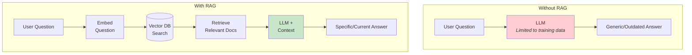

**Why RAG?**
- Company-specific knowledge
- Up-to-date information
- Grounded responses (reduces hallucination)

#### Hands-On Task (25 min)

**Phase A: Create Knowledge Base** (10 min)

Participants will:
1. Upload sample documents (FAQ, product docs)
2. Generate embeddings using OpenAI API
3. Store in PostgreSQL with pgvector extension

**Workflow**:

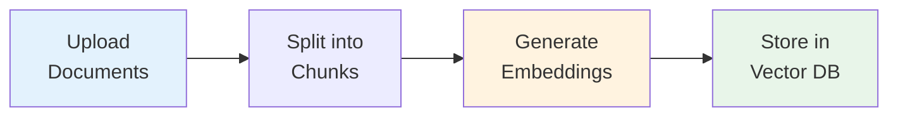

**Phase B: Query RAG System** (10 min)

Update N8N workflow to include RAG:

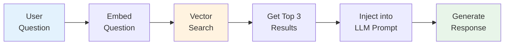

**N8N Implementation**:
1. Add "HTTP Request" node → Query vector DB
2. Add "Function" node → Format results
3. Update LLM prompt to include context

**Testing** (5 min):
- Query: "What's your refund policy?"
- Verify retrieval of correct document
- Check LLM uses retrieved context

---

### Module 4: Model Selection & Parameters (Integrated)

**Note**: This is taught contextually during Modules 1-3, not as standalone module

**Key Concepts** (explained as we implement):

#### Model Selection Decision Tree

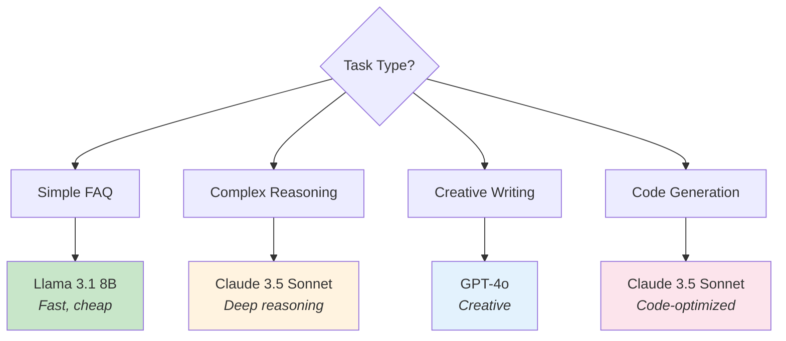

#### Parameter Tuning Guide

| Parameter | Range | Use Case |
|-----------|-------|----------|
| **temperature** | 0.0 - 1.0 | FAQ: 0.3, Creative: 0.8 |
| **top_p** | 0.1 - 1.0 | Focused: 0.5, Diverse: 0.9 |
| **max_tokens** | 50 - 4000 | Short answer: 150, Long: 1000 |
| **presence_penalty** | 0.0 - 2.0 | Avoid repetition: 0.6 |

**Practical Exercise** (embedded in Module 2):
- Test same prompt with different temperatures
- Observe output variation
- Choose optimal settings for CS use case

---

## Phase 3: Integration & Demo (30 min)

### 3.1 End-to-End Integration (20 min)

**Objective**: Connect all components into working system

#### Integration Architecture

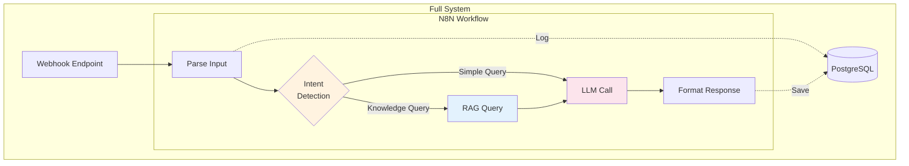

#### Hands-On Task (15 min)

Participants will:
1. ✅ Add intent detection logic (simple keyword matching)
2. ✅ Route to RAG or direct LLM
3. ✅ Log interactions to PostgreSQL
4. ✅ Test with multiple scenarios

**Test Scenarios**:
- FAQ: "Jam buka?"
- Knowledge: "Cara refund produk rusak?"
- Complaint: "Saya komplain, layanan error"

**Checkpoint** (5 min):
- Volunteers demo their working workflow
- Troubleshoot common issues

---

### 3.2 Demo & Closing (10 min)

**Live Demo** (5 min):
- Instructor shows Golang + Whatmeow integration
- Sends WhatsApp messages to N8N workflow
- Demonstrates full end-to-end flow

**Closing** (5 min):
- Key takeaways
- Resources for continued learning
- Next steps: Deploy to production
- **BRIN-specific**: How this applies to government services

---

## Hands-On Exercise Design

### Exercise Delivery Format

To manage 39 participants effectively:

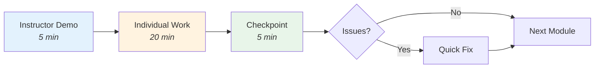

### Individual Workstation Setup
- **39 participants** → **39 individual laptops**
- Each participant runs their own complete stack via Docker
- All services self-contained: `docker-compose up -d`
- Participants can take the project home and continue learning

### Docker-Based Architecture

**One-Command Setup Philosophy**:
```bash
# Clone repository
git clone <repo-url>
cd workshop-brin

# Start entire stack
docker-compose up -d

# Verify services
docker-compose ps
```

**Docker Services**:
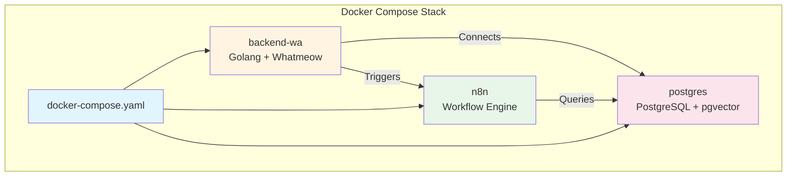

### Pre-Configured Resources

**Project Structure** (provided as template):
```
workshop-brin/
├── backend/              # Golang WhatsApp service (pre-built)
│   ├── main.go
│   ├── handlers/
│   └── Dockerfile
├── docs/                 # Architecture documentation
│   ├── architecture.md
│   └── setup-guide.md
├── n8n-workflows/       # Importable N8N workflows
│   ├── 01-basic-llm.json
│   ├── 02-with-prompts.json
│   └── 03-with-rag.json
├── scripts/             # Database initialization
│   ├── init-db.sql
│   ├── seed-data.sql
│   └── setup-pgvector.sql
├── prompt-templates/    # Copy-paste ready prompts
│   ├── faq-handler.txt
│   ├── complaint-handler.txt
│   └── escalation.txt
├── knowledge-base/      # Sample data
│   ├── sample-faqs.json
│   └── product-docs.json
├── docker-compose.yaml  # Complete stack definition
└── .env.example        # Environment variables template
```

**Docker Compose Configuration**:
```yaml
# docker-compose.yaml structure (simplified)
services:
  backend-wa:
    build: ./backend
    ports: ["8080:8080"]
    depends_on: [postgres]

  n8n:
    image: n8nio/n8n
    ports: ["5678:5678"]
    depends_on: [postgres]

  postgres:
    image: pgvector/pgvector:pg16
    ports: ["5432:5432"]
    volumes: ["./scripts:/docker-entrypoint-initdb.d"]
```

### Minimal Dependency Requirements

**Zero OS Dependencies** - Only Docker required:
- ✅ No Golang installation needed (runs in container)
- ✅ No PostgreSQL installation (runs in container)
- ✅ No N8N installation (runs in container)
- ✅ Works on Windows, macOS, Linux identically
- ✅ Complete environment teardown: `docker-compose down`

**Prerequisites**:
1. Docker Desktop installed (verified 1 week before workshop)
2. Git installed
3. 8GB RAM minimum
4. 10GB disk space

### Scalability Considerations

**For 39 Individual Participants**:
- ✅ Self-hosted N8N (localhost:5678)
- ✅ Individual OpenRouter API keys (provided)
- ✅ Instructor + 2-3 teaching assistants (1:13-1:20 ratio)
- ✅ Slack channel for live Q&A
- ✅ Checkpoints to re-sync group
- ✅ Pre-tested Docker images (reduce download time)
- ✅ Offline fallback: USB drives with Docker images

---

## Technical Stack & Prerequisites

### Technology Stack

| Component | Technology | Purpose | Deployment |
|-----------|-----------|---------|------------|
| **Backend** | Golang + Whatmeow | WhatsApp integration | Docker (pre-built) |
| **Automation** | N8N (self-hosted) | Workflow orchestration | Docker |
| **Database** | PostgreSQL 16 | User data, logs | Docker |
| **Vector Extension** | pgvector | RAG knowledge base | Docker (PostgreSQL extension) |
| **LLM Provider** | OpenRouter | Multi-model API gateway | Cloud API |
| **Embeddings** | OpenAI text-embedding-3-small | Document/query embeddings | Cloud API |
| **Containerization** | Docker Compose | Orchestration | Required |

### Prerequisites

**Participant Requirements**:
- ✅ Laptop: Windows 10+, macOS 11+, or Linux
- ✅ **Docker Desktop** installed and running (mandatory)
- ✅ Git installed
- ✅ 8GB RAM minimum (16GB recommended)
- ✅ 10GB free disk space
- ✅ Internet connection (for API calls)
- ✅ Web browser (Chrome/Firefox)
- ✅ Basic understanding of APIs and JSON

**Pre-Workshop Setup Checklist** (sent 1 week before):
```bash
# 1. Install Docker Desktop
# - Windows: https://docs.docker.com/desktop/install/windows-install/
# - macOS: https://docs.docker.com/desktop/install/mac-install/
# - Linux: https://docs.docker.com/desktop/install/linux-install/

# 2. Verify Docker installation
docker --version
docker-compose --version

# 3. Clone workshop repository
git clone https://github.com/[org]/workshop-brin
cd workshop-brin

# 4. Copy environment template
cp .env.example .env

# 5. Test Docker setup
docker-compose up -d
docker-compose ps  # Should show all services running
docker-compose down
```

**Distributed Materials**:
- OpenRouter API keys (individual, pre-funded)
- Workshop repository URL
- Setup verification guide
- USB drives with Docker images (offline fallback)

---

## Decision Log

### D-001: Why N8N over Custom Golang Code?

**Decision**: Use N8N for workflow automation instead of coding everything in Golang

**Rationale**:
- **Learning Curve**: N8N is visual and intuitive for developers new to GenAI
- **Rapid Prototyping**: Build and test workflows 10x faster
- **Workshop Time**: Coding from scratch would exceed 2-3 hours
- **Production Viability**: N8N is production-ready and widely used
- **Flexibility**: Easy to modify workflows without code deployment

**Alternatives Considered**:
- Pure Golang implementation (too time-consuming for workshop)
- Zapier (less developer-friendly, limited AI integrations)
- LangChain (Python-based, conflicts with Golang stack)

**Trade-offs**:
- ➕ Faster development and learning
- ➖ Additional infrastructure dependency
- ➖ Less control over low-level implementation

---

### D-002: Why OpenRouter over Direct LLM APIs?

**Decision**: Use OpenRouter as unified LLM gateway

**Rationale**:
- **Multi-Model Access**: Single API for GPT, Claude, Llama, Mistral
- **Cost Optimization**: Route tasks to most cost-effective model
- **Fallback Strategy**: Automatic failover if one provider is down
- **Simplified Management**: One API key instead of multiple provider keys
- **Workshop Simplicity**: Easier to demonstrate model comparison

**Alternatives Considered**:
- Direct OpenAI API (vendor lock-in)
- Direct Anthropic API (limited model variety)
- Azure OpenAI (complex setup)

**Trade-offs**:
- ➕ Flexibility and cost control
- ➕ Easy model experimentation
- ➖ Additional abstraction layer
- ➖ Slight latency overhead

---

### D-003: RAG with PostgreSQL pgvector vs Dedicated Vector DB

**Decision**: Use PostgreSQL with pgvector extension instead of dedicated vector databases

**Rationale**:
- **Unified Database**: User data + vectors in same PostgreSQL instance
- **Docker Simplicity**: Single postgres container with pgvector pre-installed
- **Zero Cost**: No separate vector DB subscription or cloud service
- **Performance**: Sufficient for workshop scale and most production use cases
- **Postgres Familiarity**: BRIN developers already know PostgreSQL
- **Self-Hosted**: Complete control, runs entirely on participant laptops

**Alternatives Considered**:
- Pinecone (cloud-only, additional cost, requires API keys)
- Weaviate (complex setup, resource-intensive)
- Chroma (limited production readiness)
- Qdrant (good option but adds another service)

**Trade-offs**:
- ➕ Simplified architecture (one less service)
- ➕ Lower operational overhead
- ➕ Works offline after initial setup
- ➖ May not scale to millions of vectors (not a concern for workshop/CS use case)
- ➖ Less specialized than dedicated vector DBs

---

### D-004: Workshop Duration: 2.5 hours vs 3 hours

**Decision**: Target 2.5 hours (150 minutes) with buffer

**Rationale**:
- **Realistic Timing**: Accounts for delays, questions, technical issues
- **Attention Span**: 2.5 hours is optimal for hands-on learning
- **Buffer**: Allows flexibility without feeling rushed
- **Modular Design**: Can skip advanced topics if running late

**Structure**:
- Core content: 120 minutes
- Buffer: 30 minutes (Q&A, troubleshooting, extended demo)

---

### D-005: Individual Workstations vs Shared Environments

**Decision**: Each participant runs complete stack on their own laptop via Docker

**Rationale**:
- **Ownership**: Participants own their complete environment
- **Portability**: Can take project home and continue learning
- **Production Reality**: Mirrors real development workflow
- **No Dependencies**: Works offline after initial Docker image download
- **Reproducibility**: Identical environment across all OSes (Windows/Mac/Linux)
- **Learning Depth**: Participants learn full stack, not just one component

**Alternatives Considered**:
- Pair programming with shared instances (resource-efficient but limited ownership)
- Cloud-based environments (requires internet, no post-workshop access)
- Hybrid approach (some local, some cloud - adds complexity)

**Trade-offs**:
- ➕ Complete learning experience
- ➕ Post-workshop continuation
- ➕ Real-world deployment skills
- ➖ Higher support load (1:13-1:20 ratio vs 1:20-1:26 with pairs)
- ➖ Requires Docker pre-installation
- ➖ More resource-intensive (each laptop runs 3 containers)

**Mitigation for Higher Support Load**:
- 2-3 teaching assistants (vs 2 with pair programming)
- Pre-tested Docker images
- Comprehensive setup guide sent 1 week ahead
- Slack channel for async troubleshooting

---

## Success Criteria

### Participant Outcomes

**By the end of the workshop, participants will be able to**:

✅ **Build**: Create N8N workflow with LLM integration from scratch
✅ **Design**: Write effective prompts for CS automation scenarios
✅ **Implement**: Set up basic RAG system with vector database
✅ **Integrate**: Connect workflow to WhatsApp via Golang backend
✅ **Deploy**: Understand production deployment considerations
✅ **Optimize**: Choose appropriate models and parameters for different tasks

### Measurable Success Metrics

**During Workshop**:
- ✅ 90%+ of participants complete Module 1 (N8N + LLM)
- ✅ 80%+ complete Module 2 (Prompt Engineering)
- ✅ 70%+ complete Module 3 (RAG)
- ✅ 100% see working end-to-end demo

**Post-Workshop** (1 week follow-up survey):
- ✅ 80%+ report confidence in building similar systems
- ✅ 50%+ have started implementing in their projects
- ✅ 90%+ found workshop practical and applicable

### Deliverables

**Participant Deliverables**:
- Working N8N workflow (exportable JSON)
- 3 prompt templates for different scenarios
- RAG-enabled knowledge base
- Documentation of their implementation

**Workshop Materials**:
- Complete slide deck
- Hands-on exercise guides
- Code templates and samples
- Reference architecture diagrams
- Post-workshop resources list

---

## Risk Mitigation

### Identified Risks

**R-001: Docker Setup Issues**
**Risk**: Participants struggle with Docker installation or image downloads
**Mitigation**:
- Send detailed Docker setup guide 1 week before workshop
- Require participants to verify Docker setup before workshop day
- Provide USB drives with pre-downloaded Docker images (offline fallback)
- Teaching assistants verify Docker running during opening session
- Have pre-built Docker Compose stack ready for quick deployment

**R-002: Skill Level Variance**
**Risk**: Some participants finish quickly, others fall behind
**Mitigation**:
- Modular checkpoints (can skip ahead or repeat)
- Provide "Extension Challenges" for fast finishers
- Teaching assistants prioritize struggling participants
- Optional advanced modules for early finishers (e.g., custom embeddings, multi-model routing)

**R-003: Time Overrun**
**Risk**: Exercises take longer than planned
**Mitigation**:
- Pre-built templates to reduce typing time
- Clear prioritization: Core (must complete) vs Optional (nice-to-have)
- Flexible agenda: Can skip advanced topics if needed
- Buffer time built into schedule

**R-004: API Rate Limits/Outages**
**Risk**: OpenRouter becomes unavailable or rate-limited
**Mitigation**:
- Distribute individual OpenRouter API keys with sufficient credits (pre-funded)
- Have backup API keys pool ready
- Prepare fallback to direct OpenAI/Anthropic APIs if needed
- Recorded demo as fallback
- Mock API responses for offline testing scenarios

**R-005: Large Group Management**
**Risk**: Hard to support 39 individual participants simultaneously
**Mitigation**:
- Slack channel for async Q&A and real-time troubleshooting
- 1 instructor + 2-3 teaching assistants (1:13-1:20 ratio)
- Checkpoints to identify and batch-solve common issues
- Pre-recorded troubleshooting videos for common Docker/N8N issues
- Encourage peer support (participants help each other)

---

## Appendix: Resources

### For Participants

**During Workshop**:
- GitHub repository: `github.com/[org]/brin-genai-workshop`
- Slack channel: `#brin-workshop-2025`
- Local N8N: `http://localhost:5678` (self-hosted)
- Local Backend: `http://localhost:8080`
- PostgreSQL: `localhost:5432`
- OpenRouter API keys: (distributed individually)

**Post-Workshop**:
- **Documentation**: Complete setup guide for production deployment
- **Video Recordings**: Key modules recorded and shared
- **Extended Reading**:
  - OpenAI Prompt Engineering Guide
  - N8N GenAI Cookbook
  - RAG Best Practices
- **Community**: Ongoing support channel

### For Instructors

**Preparation Checklist** (1 week before):
- [ ] Finalize Docker Compose configuration and test on all OSes
- [ ] Build and test all Docker images (backend, n8n, postgres)
- [ ] Generate and distribute individual OpenRouter API keys (39 keys)
- [ ] Prepare sample knowledge base and pre-generate embeddings
- [ ] Test full end-to-end flow on fresh Docker environment
- [ ] Send pre-workshop Docker setup instructions to participants
- [ ] Create USB drives with pre-downloaded Docker images (offline fallback)
- [ ] Prepare backup API keys and troubleshooting videos

**Day-of Checklist**:
- [ ] Verify all participants have Docker running (`docker ps` works)
- [ ] Verify all participants have cloned repository
- [ ] Distribute OpenRouter API keys securely
- [ ] Test internet connectivity and projection
- [ ] Start Slack channel and pin key resources (repo URL, API keys, troubleshooting guide)
- [ ] Assign teaching assistants to monitoring zones (rows/tables)
- [ ] Have backup USB drives ready for Docker image distribution
- [ ] Have backup demo video ready
- [ ] Test instructor's live demo environment

---

## Conclusion

This workshop is designed to give BRIN developers **practical, immediately applicable skills** in building GenAI-powered customer service automation. By focusing on hands-on implementation over theory, using production-ready tools, and aligning with BRIN's mission of practical innovation, participants will leave with both working code and the confidence to extend these systems for their specific use cases.

The Docker-based approach ensures participants own their complete development environment, can continue learning post-workshop, and gain real-world deployment experience. The modular structure ensures that even if time runs short, core learning objectives are met.

**Next Steps After Specification Approval**:
1. Create detailed slide deck (Indonesian/English)
2. Build Docker Compose stack with all services
3. Build N8N workflow templates (importable JSON)
4. Prepare PostgreSQL initialization scripts (schema + pgvector setup)
5. Create hands-on exercise guides (step-by-step)
6. Prepare sample knowledge base and embeddings
7. Generate OpenRouter API keys (39 individual keys)
8. Create Docker setup guide and troubleshooting videos
9. Conduct dry run with teaching assistants on fresh environment
10. Prepare USB drives with Docker images for offline deployment

---

**Sources**:
- [BRIN - Badan Riset dan Inovasi Nasional](https://www.brin.go.id/en)
- [National Research and Innovation Agency - Wikipedia](https://en.wikipedia.org/wiki/National_Research_and_Innovation_Agency)
- [BRIN: AI and Blockchain as Keys to National Digital Transformation](https://www.brin.go.id/en/news/124783/brin-ai-and-blockchain-as-a-keys-to-national-digital-transformation)
- [Indonesia's AI efforts led by BRIN](https://restofworld.org/2024/indonesia-ai-tools-brin-government-agency/)